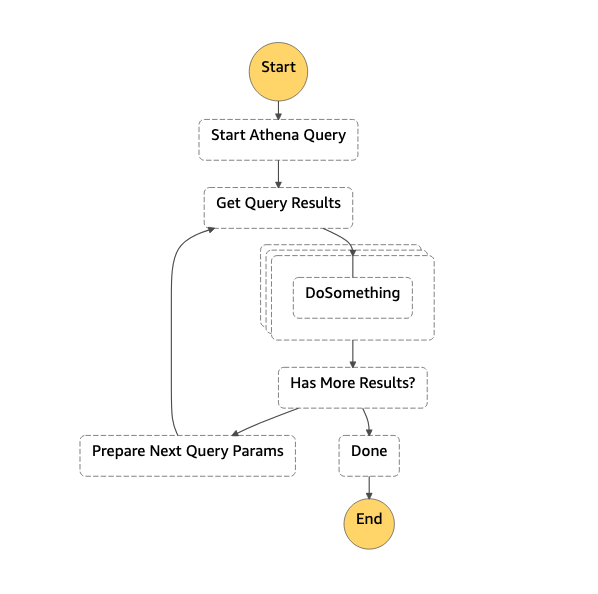
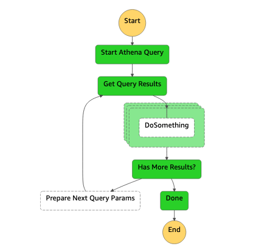

# AWS Step Functions Standard Workflow to Amazon Athena

This sample project demonstrates how to use an AWS Step Functions state machine to query Athena and get the results. This pattern is leveraging the native integration between these 2 services which means only JSON-based, structured language is used to define the implementation.

With Amazon Athena you can get [up to 1000 results](https://docs.aws.amazon.com/athena/latest/APIReference/API_GetQueryResults.html) per invocation of the `GetQueryResults` method and this is the reason why the Step Function has a loop to get more results. The results are sent to a `Map` which can be configured to handle (the `DoSomething` state) the items in parallel or one by one by modifying the `max_concurrency` parameter.



This pattern deploys one Step Functions, two S3 Buckets, one Glue table and one Glue database.


Learn more about this pattern at: https://serverlessland.com/patterns/sfn-athena-cdk-python

Important: this application uses various AWS services and there are costs associated with these services after the Free Tier usage - please see the AWS Pricing page for details. You are responsible for any AWS costs incurred. No warranty is implied in this example.

## Requirements

* [Create an AWS account](https://portal.aws.amazon.com/gp/aws/developer/registration/index.html) if you do not already have one and log in. The IAM user that you use must have sufficient permissions to make necessary AWS service calls and manage AWS resources.
* [AWS CLI](https://docs.aws.amazon.com/cli/latest/userguide/install-cliv2.html) installed and configured
* [Git Installed](https://git-scm.com/book/en/v2/Getting-Started-Installing-Git)
* [AWS Cloud Development Kit](https://docs.aws.amazon.com/cdk/v2/guide/getting_started.html) (AWS CDK >= 2.2.0) Installed

## Language

Python

## Framework

CDK

## Services From/To

AWS Step Functions to Amazon Athena

## Deployment Instructions

1. Create a new directory, navigate to that directory in a terminal and clone the GitHub repository:
    ```bash
    git clone https://github.com/aws-samples/serverless-patterns
    ```
1. Change directory to the pattern directory:
    ```bash
    cd sfn-athena-cdk-python
    ```
1. Create a virtual environment for python:
    ```bash
    python3 -m venv .venv
    ```
1. Activate the virtual environment:
    ```bash
    source .venv/bin/activate
    ```

    If you are in Windows platform, you would activate the virtualenv like this:

    ```
    % .venv\Scripts\activate.bat
    ```

1. Install python modules:
    ```bash
    python3 -m pip install -r requirements.txt
    ```
1. From the command line, use CDK to synthesize the CloudFormation template and check for errors:

    ```bash
    cdk synth
    ```
1. From the command line, use CDK to deploy the stack:

    ```bash
    cdk deploy
    ```

    Expected result:

    ```bash
    SfnInsideSfnCdkStack

    Outputs:
    SfnAthenaCdkPythonStack.Logs = sfnathenacdkpythonstack-logbucketcc3b17e8-h43l3gtqmcp
    SfnAthenaCdkPythonStack.SFArn = arn:aws:states:us-east-1:867201269000:stateMachine:AthenaQuery77DE1436-tmS0WHKnGQwA
    SfnAthenaCdkPythonStack.SFName = AthenaQuery77DE1436-tmS0WHKnGQwA
    ```

1. Note the outputs from the CDK deployment process. These contain the resource names and/or ARNs which are used for testing.

### Testing

The Athena table created by the pattern is configured using [CloudFront Logs](https://docs.aws.amazon.com/athena/latest/ug/cloudfront-logs.html). Feel free to modify based on your requirements.

1. Start execution of the Step Function, using the Step Function Arn from the AWS CDK deployment outputs:

    ```bash
    aws stepfunctions start-execution --state-machine-arn ENTER_YOUR_STEP_FUNCTION_ARN --input "{ \"Input\": \"test\" }"
    ```

    Expected result:

    ```json
    {
        "executionArn": "arn:aws:states:us-east-1:xxxxxxx:execution:AthenaQuery77DE1436-tmS0WHKnGQwA:685bbd06-94be-4e3a-bb94-d4e51dd7be80",
        "startDate": "2022-02-04T11:10:46.670000+01:00"
    }
    ```

1. Check the execution status of the Step Function using the executionArn from previous step:

    ```bash
    aws stepfunctions describe-execution --execution-arn ENTER_YOUR_STEP_FUNCTION_EXECUTION_ARN
    ```

    Expected result:

    ```json
    {
    "executionArn": "arn:aws:states:us-east-1:xxxxxxx:execution:AthenaQuery77DE1436-tmS0WHKnGQwA:685bbd06-94be-4e3a-bb94-d4e51dd7be80",
    "stateMachineArn": "arn:aws:states:us-east-1:xxxxxxx:stateMachine:AthenaQuery77DE1436-tmS0WHKnGQwA",
    "name": "685bbd06-94be-4e3a-bb94-d4e51dd7be80",
    "status": "SUCCEEDED",
    "startDate": "2022-02-04T11:10:46.670000+01:00",
    "stopDate": "2022-02-04T11:11:43.094000+01:00",
    "input": "{ \"Input\": \"test\" }",
    "inputDetails": {
        "included": true
    },
    "output": "{\"QueryExecution\":{\"EngineVersion\":{\"EffectiveEngineVersion\":\"Athena engine version 2\",\"SelectedEngineVersion\":\"AUTO\"},\"Query\":\"SELECT uri FROM cf_access_logs limit 11\",\"QueryExecutionContext\":{\"Database\":\"serverlessland_database\"},\"QueryExecutionId\":\"4b118bfa-39eb-4e94-830b-1dc50c3e176f\",\"ResultConfiguration\":{\"OutputLocation\":\"s3://sfnathenacdkpythonstack-athenaresultsbucket879938-17n93p2es7wh3/results/4b118bfa-39eb-4e94-830b-1dc50c3e176f.csv\"},\"StatementType\":\"DML\",\"Statistics\":{\"DataScannedInBytes\":0,\"EngineExecutionTimeInMillis\":499,\"QueryPlanningTimeInMillis\":86,\"QueryQueueTimeInMillis\":123,\"ServiceProcessingTimeInMillis\":40,\"TotalExecutionTimeInMillis\":662},\"Status\":{\"CompletionDateTime\":1643969447472,\"State\":\"SUCCEEDED\",\"SubmissionDateTime\":1643969446810},\"WorkGroup\":\"primary\"},\"GetQueryResults\":{\"ResultSet\":{\"ResultSetMetadata\":{\"ColumnInfo\":[{\"CaseSensitive\":true,\"CatalogName\":\"hive\",\"Label\":\"uri\",\"Name\":\"uri\",\"Nullable\":\"UNKNOWN\",\"Precision\":2147483647,\"Scale\":0,\"SchemaName\":\"\",\"TableName\":\"\",\"Type\":\"varchar\"}]},\"Rows\":[{\"Data\":[{\"VarCharValue\":\"uri\"}]}]},\"UpdateCount\":0}}",
    "outputDetails": {
        "included": true
    }
}
    ```

1. Note the input and the output.

1. On the AWS Console, check the input and the output of each state of the Step Function:

    Expected result:

    

## Cleanup

1. Delete the stack
    ```bash
    cdk destroy
    ```

## Tutorial

See [this useful workshop](https://cdkworkshop.com/30-python.html) on working with the AWS CDK for Python projects.

## Useful commands

 * `cdk ls`          list all stacks in the app
 * `cdk synth`       emits the synthesized CloudFormation template
 * `cdk deploy`      deploy this stack to your default AWS account/region
 * `cdk diff`        compare deployed stack with current state
 * `cdk docs`        open CDK documentation


Enjoy!
