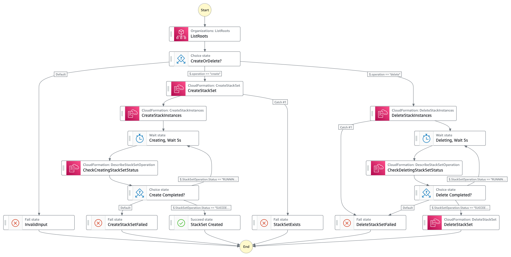
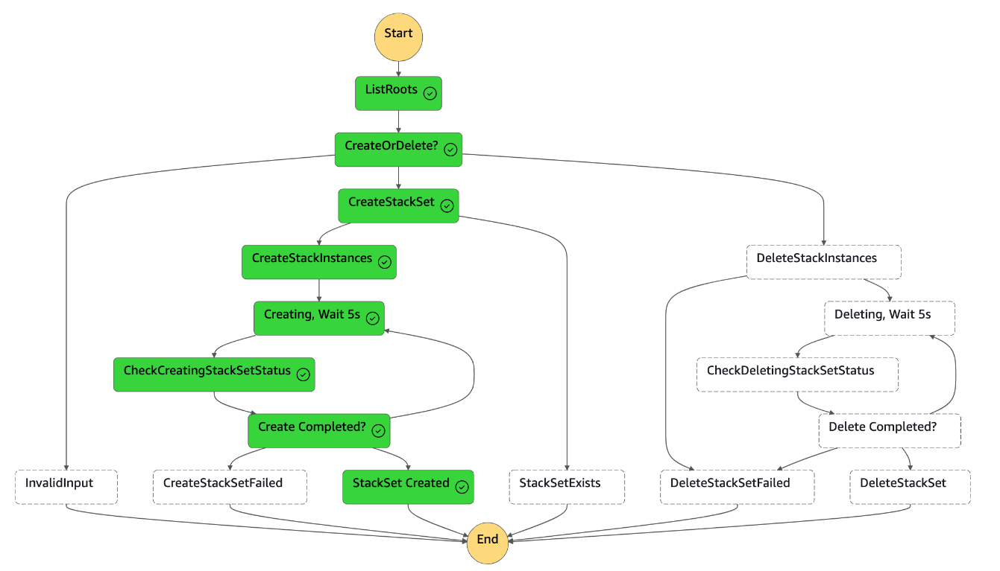
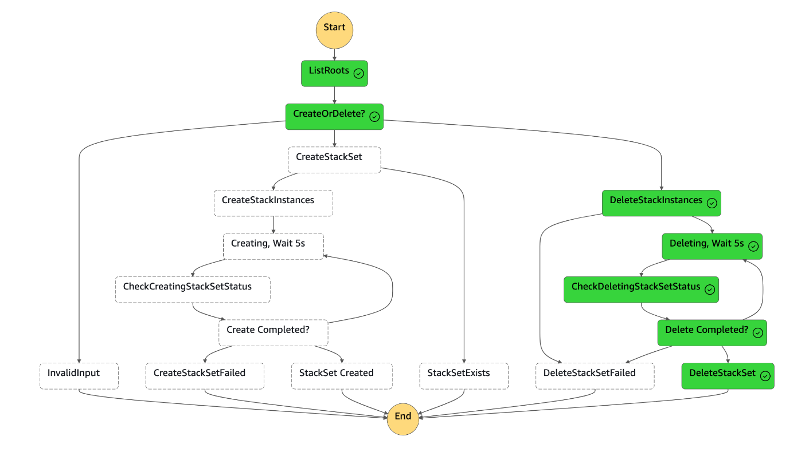

# AWS Step Functions Standard Workflow to create AWS Cloudformation StackSets

This pattern demonstrates how to use a AWS Step Functions standard workflow to create AWS Cloudformation StackSets in the AWS Organization's linked member accounts. This pattern leverages the native AWS SDK integrations in AWS Step Functions to interact with AWS Cloudformation StackSets which means only JSON-based, structured language is used to define the implementation.

The CDK application deploys a Step Functions workflow that takes in a user input, and creates/deletes the StackSets instances in all the linked AWS Accountes for the root Organizational Unit (OU). Additionally, this worflow also creates/deletes the StackSet itself in the management account. This Step Function workflow should be executed from a Management account. The CDK application contains the minimum IAM resources required to run the application.

NOTE: Running a stack set does not execute the stack on the management account itself, it will only run on all child accounts. To create the stack on management account, run the Cloudformation template as a standalone stack in the Management account directly.
 
Learn more about this pattern at Serverless Land Patterns: [ https://serverlessland.com/patterns/sfn-cfn-stacksets-cdk](https://serverlessland.com/patterns/sfn-cfn-stacksets-cdk)

Important: this application uses various AWS services and there are costs associated with these services after the Free Tier usage - please see the [AWS Pricing page](https://aws.amazon.com/pricing/) for details. You are responsible for any AWS costs incurred. No warranty is implied in this example.

## Requirements

* [Create an AWS account](https://portal.aws.amazon.com/gp/aws/developer/registration/index.html) if you do not already have one and log in. The IAM user that you use must have sufficient permissions to make necessary AWS service calls and manage AWS resources.
* [AWS CLI](https://docs.aws.amazon.com/cli/latest/userguide/install-cliv2.html) installed and configured
* [Git Installed](https://git-scm.com/book/en/v2/Getting-Started-Installing-Git)
* [AWS Cloud Development Kit CLI (v2)](https://docs.aws.amazon.com/cdk/v2/guide/getting_started.html) (AWS CDK v2) installed

## Deployment Instructions

1. Create a new directory, navigate to that directory in a terminal and clone the GitHub repository:
    ``` 
    git clone https://github.com/aws-samples/serverless-patterns
    ```
1. Change directory to the pattern directory:
    ```
    cd sfn-cfn-stacksets-cdk
    ```
1. Create a virtual environment for python:
    ```bash
    python3 -m venv .venv
    ```
1. Activate the virtual environment:
    ```bash
    source .venv/bin/activate
    ```

    If you are in Windows platform, you would activate the virtualenv like this:

    ```
    % .venv\Scripts\activate.bat
    ```

1. Install python modules:
    ```bash
    python3 -m pip install -r requirements.txt
    ```
1. From the command line, use CDK to synthesize the CloudFormation template and check for errors:

    ```bash
    cdk synth
    ```
    
    NOTE: You may need to perform a one time cdk bootstraping using the following command. See [CDK Bootstrapping](https://docs.aws.amazon.com/cdk/v2/guide/bootstrapping.html) for more details.
    ```bash
    cdk bootstrap aws://<ACCOUNT-NUMBER-1>/<REGION-1>
    ```
1. From the command line, use CDK to deploy the stack:

    ```bash
    cdk deploy
    ```

Expected result:
```bash
(.venv) bash-3.2$ cdk deploy

 ✅  SfnCfnStacksetsPatternStack

Outputs:
SfnCfnStacksetsPatternStack.SFArn = arn:aws:states:us-east-1:XXXXXXXXX:stateMachine:SFNCFNStackSetsPattern82080000-0000yHBc0000
SfnCfnStacksetsPatternStack.SFName = SFNCFNStackSetsPattern82080000-0000yHBc0000
Stack ARN:
arn:aws:cloudformation:us-east-1:XXXXXXXXX:stack/SfnCfnStacksetsPatternStack/b6950660-0000-00000-0000-129a13105fd9
```

## How it works

Once the CDK stack is deployed successfully, a Step Function workflow is created in the account & region provided during the bootstrap step. Go to AWS Step Functon Console to understand the basic state machine created. 



There are two main flows - to create a StackSet or to delete a StackSet. Each flow also creates or deletes the StackSet instances, checks the progress of stackset instance operations and retries until stackset instances are created/deleted successfully. 

The Step Function workflow requires the following input parameters when triggerring the execution: 
```bash
{
    "operation": "create"|"delete",
    "managementAccountId": "XXXXXXXXXXXX",
    "templateURL": "<The location of the tempalte file in an Amazon S3 bucket>"
}
```

The `operation` parameter defines whether to create or delete the StackSets

The `managementAccountId` parameter identifies the management account so that the proper IAM sts assume-role calls can be made in the linked accounts. 

The `templateURL` parameter provides the location of the cloudformation template file in an Amazon S3 bucket. You should update the `sfn_cfn_stacksets_pattern/sfn_cfn_stacksets_pattern_stack.py` file to provide the S3 bucket name where the CloudFormation StackSets template to use is saved. The template should be in the same account and region where this Step Function will be exeucted from. The `cdk deploy` step will create the appropriate read-only permissions for the Step Functions to read the template from the S3 bucket. 

When the CDK is deployed, it will create an IAM role for the Step Function with the following required permissions: 
```bash
cloudformation:createStackInstances        
cloudformation:createStackSet              
cloudformation:deleteStackInstances        
cloudformation:deleteStackSet              
cloudformation:describeStackSetOperation   
organizations:listRoots             
 ```

NOTE: This StackSet will be created only in one region `us-east-1` and for all accounts linked to the root OU. To create the stackset in several regions, users can modify the relevant tasks in the StepFunction workflow. The Cloudformation uses a Service Managed role to deploy the stacksets in the linked accounts. 


## Testing

Go to the AWS Step Functions Console and select the Step Function created by CDK (look for a name starting with `SFNCFNStackSetsPattern`). Execute the step function workflow and provide the input parameters as described above. 
```bash
{
    "operation": "create"|"delete",
    "managementAccountId": "XXXXXXXXXXXX",
    "templateURL": "<The location of the tempalte file in an Amazon S3 bucket>"
}
```

Wait for the Step Function workflow to complete. You can check the progress of the execution steps under the Executions section. 

The following images show the expected results:

#### Create StackSets Workflow


#### Delete StackSets Workflow



## Cleanup
1. Delete the stack
    ```bash
    cdk destroy
    ```

## Tutorial

See [this useful workshop](https://cdkworkshop.com/30-python.html) on working with the AWS CDK for Python projects.

## Useful commands

 * `cdk ls`          list all stacks in the app
 * `cdk synth`       emits the synthesized CloudFormation template
 * `cdk deploy`      deploy this stack to your default AWS account/region
 * `cdk diff`        compare deployed stack with current state
 * `cdk docs`        open CDK documentation


Enjoy!
----
Copyright 2024 Amazon.com, Inc. or its affiliates. All Rights Reserved.

SPDX-License-Identifier: MIT-0