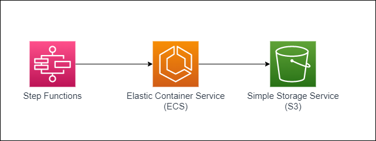

# Serverless example to process files from multiple buckets in S3 in parallel using Step Functions and ECS-Fargate. 



This serverless pattern uses Step Functions to trigger multiple ECS tasks on Fargate in parallel, each task peeking into one S3 bucket each for files and reading them. 
These ECS tasks can be extended to insert the data to a database, thus speeding up the process of loading data from S3 to a database.. 

This application pattern can be extended to 
1. Process multiple files from a single bucket in parallel
2. Perform long running tasks not suited for Lambda processing in parallel 

Learn more about this pattern at Serverless Land Patterns: https://serverlessland.com/patterns/sfn-ecs-sam

Important: this application uses various AWS services and there are costs associated with these services after the Free Tier usage - please see the [AWS Pricing page](https://aws.amazon.com/pricing/) for details. You are responsible for any AWS costs incurred. No warranty is implied in this example.

## Requirements

* [Create an AWS account](https://portal.aws.amazon.com/gp/aws/developer/registration/index.html) if you do not already have, create them and log in. The IAM user that you use must have sufficient permissions to make necessary AWS service calls and manage AWS resources.
* [AWS CLI](https://docs.aws.amazon.com/cli/latest/userguide/install-cliv2.html) installed and configured
* [Git Installed](https://git-scm.com/book/en/v2/Getting-Started-Installing-Git)
* [AWS Serverless Application Model](https://docs.aws.amazon.com/serverless-application-model/latest/developerguide/serverless-sam-cli-install.html) (AWS SAM) installed

## Deployment Instructions

1. Configure AWS CLI to the account and region you want to deploy the application to.

1. Create a new directory, navigate to that directory in a terminal and clone the GitHub repository:
    ``` 
    git clone https://github.com/aws-samples/serverless-patterns
    ```
1. Change directory to the pattern directory:
    ```
    cd serverless-patterns/sfn-ecs-sam
    ```
1. Do the following to setup ECS (example scripts and roles to create can be found in the 'src/ecs' and 'src/ecs/roles' folders in the downloaded code)
    * Create the ECR Repository
    * Create the task image and push it to the repository  
    * Create the required roles for executing the ECS tasks
    * Create the ECS Cluster and the task definition for running the task
    * Note the ARNs of the ECS Cluster, the Task Definition, the task role and the task execution roles. Also note the image name for the task. These are the ARNs and image name which will be used for testing and are required to be passed to the sam deploy process to deploy the statemachine..

1. From the command line, use AWS SAM to deploy the AWS resources for the pattern as specified in the template.yml file:
    ```
    sam deploy --guided
    ```
1. During the prompts:
    * Enter a stack name
    * Enter the cluster arn
    * Enter the task definition arn
    * Enter the task image name
    * Enter the ECS Task Execution Role arn
    * Enter the ECS Task Role arn
    * Enter the subnet to run the VPC (Note: You can edit the statemachine definition after it is created to specify an array of subnets, if required)
    * Allow SAM CLI to create IAM roles with the required permissions
   Once you have run sam deploy -guided mode once and saved arguments to a configuration file (samconfig.toml), you can use sam deploy in the future to use these defaults.
1. Note the outputs from the SAM deployment process. These contain the resource names and/or ARNs which are used for testing.i
 
## Testing

1. Use the following dummy JSON payload to run your Step function execution:
    ```JSON
    {
        "bucketArray": ["value1","value2","value3"]
    }
    ```
2. Observe the state of the step function execution and the input and output variables of the steps to verify if all the tasks were successful. The results are provided per bucket.

## Cleanup

 1. For deleting the step function and the IAM roles associated with it you can use sam delete from SAM CLI -
    ```
    sam delete
    ```
 1. Use the AWS CLI or the AWS Console to remove the roles, task definitions and the ECS Cluster created for this pattern.

----
Copyright 2021 Amazon.com, Inc. or its affiliates. All Rights Reserved.

SPDX-License-Identifier: MIT-0
