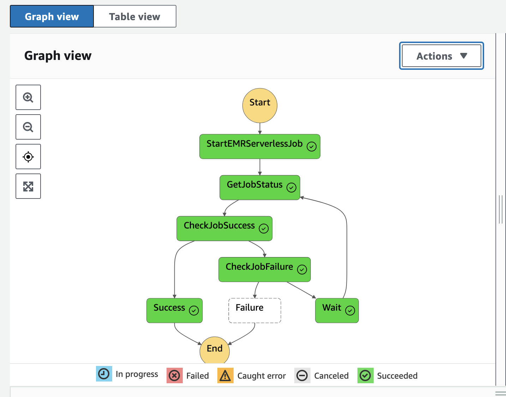

# AWS Step Functions to Amazon EMR Serverless

This pattern has a AWS Step Functions State Machine which will provide a workflow with the capability to run a job on Amazon EMR Serverless. It provisions all the required resources using Terraform for Infrastructure as Code (IaC).

Learn more about this pattern at Serverless Land Patterns: [serverlessland.com/patterns/sfn-emrserverless-terraform](https://serverlessland.com/patterns/sfn-emrserverless-terraform)

Important: this application uses various AWS services and there are costs associated with these services after the Free Tier usage - please see the [AWS Pricing page](https://aws.amazon.com/pricing/) for details. You are responsible for any AWS costs incurred. No warranty is implied in this example.

## Requirements

* [Create an AWS account](https://portal.aws.amazon.com/gp/aws/developer/registration/index.html) if you do not already have one and log in. The IAM user that you use must have sufficient permissions to make necessary AWS service calls and manage AWS resources.
* [AWS CLI](https://docs.aws.amazon.com/cli/latest/userguide/install-cliv2.html) installed and configured
* [Git Installed](https://git-scm.com/book/en/v2/Getting-Started-Installing-Git)
* [Terraform](https://learn.hashicorp.com/tutorials/terraform/install-cli) with version 1.x installed (this pattern has been tested with version 1.2.5)

## Deployment Instructions

1. Create a new directory, navigate to that directory in a terminal and clone the GitHub repository:
    ``` 
    git clone https://github.com/aws-samples/serverless-patterns
    ```
2. Change directory to the pattern directory:
    ```
    cd sfn-emrserverless-terraform
    ```
3. From the command line, use Terraform to deploy the AWS resources for the pattern as specified in the main.tf file:
    ```
    terraform init
    terraform apply --auto-approve
    ```
4. Review the output from the Terraform deployment process to ensure there are no errors. 

## How it works

When the Step Functions State Machine is run using a sample input like below.
```json
{
    "Comment": "Insert your JSON here"
}
```

This will kick-off the workflow which in turn will submit your job configured to EMR Serverless application.

## Testing

You can visit the AWS Step Functions on the AWS Console and go to your state machine and trigger a new execution by clicking on "Start Execution" and then verify the input and click on "Start Execution". This will start the state machine workflow will submit your job to EMR Serverless.



To verify more details about the EMR job and to track the status of the execution, visit EMR Serverless on your AWS Console.

## Cleanup
 
1. Delete the stack
    ```bash
    terraform destroy --auto-approve
----
Copyright 2023 Amazon.com, Inc. or its affiliates. All Rights Reserved.

SPDX-License-Identifier: MIT-0