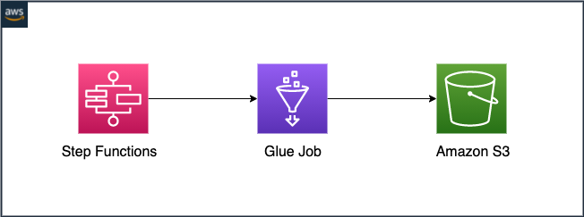

# AWS SAM Pattern: AWS Glue Job call from AWS Step Functions 
<<<<<<< HEAD
=======

>>>>>>> [chore] add glue to sf code

This patters deploys a Step Functions that includes a Glue Job as one of its steps. The Glue Job may be used to process data from S3 or other AWS storage services. 

The SAM template deploys:
    * A Step Functions State Machine
    * An EventBridge rule that triggers the Step Functions every 2 days
    * A Glue Job
    * IAM roles required to run the application.

<<<<<<< HEAD
## Download
1. Create a new directory, navigate to that directory in a terminal and clone the GitHub repository:
```bash
git clone https://github.com/NicoliAraujo/serverless-patterns.git
````

2. Change directory to the pattern directory:
```bash
cd sfn-glue-sam/
````

## Deploy

1. Copy glue job script and libs:

```bash
> aws s3 cp code/glue s3://<ARTIFACTS_BUCKET> --recursive
=======

## Deploy
1. Copy glue job script and libs:

```bash
> aws s3 cp code/glue s3://<ARTIFACTS_BUCKET>/glue --recursive
>>>>>>> [chore] add glue to sf code
```

2. Build and deploy stack: 

```bash
<<<<<<< HEAD
> sam build --template cloudformation/stack.yaml
=======
> sam build --template code/cloudformation/stack.yaml
>>>>>>> [chore] add glue to sf code
> sam deploy --guided
```

## Testing
In order to test, run the Step Functions:

```bash
aws stepfunctions start-execution --state-machine-arn "{STEP_FUNCTIONS_ARN}"
```

The output should be the description and status of Glue Job run:

```json
{
<<<<<<< HEAD
    "AllocatedCapacity":1,
    "Attempt":0,
    "CompletedOn":1637704189616,
    "ExecutionTime":16,
    "GlueVersion":"1.0",
    "Id":"jr_def6147313cc6a549c221b6fd438b396e52754e8d4247b05344ef95d3606aa75",
    "JobName":"Customers Feature Engineering",
    "JobRunState":"SUCCEEDED",
    "LastModifiedOn":1637704189616,
    "LogGroupName":"/aws-glue/python-jobs",
    "MaxCapacity":1.0,
    "PredecessorRuns":[],
    "StartedOn":1637704165982,
    "Timeout":2880}
  }
=======
  "glue_job_result": {
    "AllocatedCapacity": 1,
    "Attempt": 0,
    "CompletedOn": 1638296059130,
    "ExecutionTime": 49,
    "GlueVersion": "1.0",
    "Id": "jr_ee276c9398f2d981c850f79cb7b54a28b57d9f6484deb8a9051db4bcbbc12d1f",
    "JobName": "Feature Engineering",
    "JobRunState": "SUCCEEDED",
    "LastModifiedOn": 1638296059130,
    "LogGroupName": "/aws-glue/python-jobs",
    "MaxCapacity": 1,
    "PredecessorRuns": [],
    "StartedOn": 1638296005295,
    "Timeout": 2880
  }
}
>>>>>>> [chore] add glue to sf code
```

## Cleanup
1. Delete the stack: 
```bash
> aws cloudformation delete-stack --stack-name STACK_NAME
```
2. Confirm the stack has been deleted: 
```bash
> aws cloudformation list-stacks --query "StackSummaries[?contains(StackName,'STACK_NAME')].StackStatus"
```
