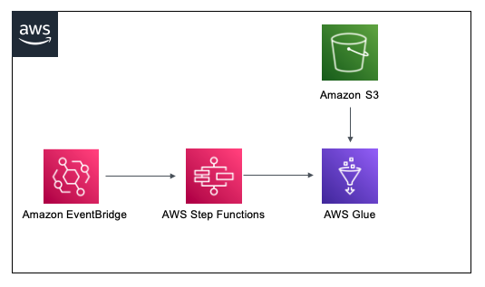

# AWS Step Functions to start a AWS Glue Job Through a Cloudwatch event rule

The Terraform template deploys a AWS Step Function, a AWS Glue Job, a Cloudwatch Event Rule, a Amazon S3 bucket and the minimum IAM resources required to run the application.

## Architecture


This pattern demonstrates the use of Terraform modules and deploys the below resources:
* Amazon S3 bucket and load the sample Python script as an object 
* Sample AWS Glue Job which executes the script in the S3 bucket
* AWS Step Function to invoke the AWS Glue Job synchronously. The Function will wait until the Job is completed
* Cloudwatch Event Rule which is configured to start the AWS Step Function evey 10 minutes


## How it works

The AWS Cloudwatch rule is configured to start a Step Function execution every 10 minutes. The Step function then invokes a AWS Glue Job with some default arguments and a test message.
The Arguments to the AWS Glue Job, the Python script and the CloudWatch event rule can be modified as per requirement.


Learn more about this pattern at Serverless Land Patterns: https://serverlessland.com/patterns/sfn-glue-terraform.

Important: this application uses various AWS services and there are costs associated with these services after the Free Tier usage - please see the [AWS Pricing page](https://aws.amazon.com/pricing/) for details. You are responsible for any AWS costs incurred. No warranty is implied in this example.

## Requirements

* [Create an AWS account](https://portal.aws.amazon.com/gp/aws/developer/registration/index.html) if you do not already have one and log in. The IAM user that you use must have sufficient permissions to make necessary AWS service calls and manage AWS resources.
* [AWS CLI](https://docs.aws.amazon.com/cli/latest/userguide/install-cliv2.html) installed and configured
* [Git Installed](https://git-scm.com/book/en/v2/Getting-Started-Installing-Git)
* [Terraform](https://learn.hashicorp.com/tutorials/terraform/install-cli?in=terraform/aws-get-started) installed

## Deployment Instructions

1. Create a new directory, navigate to that directory in a terminal and clone the GitHub repository:
    ``` 
    git clone https://github.com/aws-samples/serverless-patterns
    ```
1. Change directory to the pattern directory:
    ```
    cd sfn-glue-terraform
    ```
1. From the command line, initialize terraform to download and installs the providers defined in the configuration:
    ```
    terraform init
    ```
1. From the command line, apply the configuration in the main.tf file:
    ```
    terraform apply
    ```
1. During the prompts:
    * Enter yes
1. Note the outputs from the deployment process. These contain the resource names and/or ARNs which are used for testing.


## Testing

After deployment, go to the cloudwatch logs to check the event details.
## Cleanup

1. Change directory to the pattern directory:
    ```
    cd sfn-glue-terraform
    ```
1. Delete all created resources
    ```bash
    terraform apply -destroy
    ```
1. During the prompts:
    * Enter yes
1. Confirm all created resources has been deleted
    ```bash
    terraform show
    ```
    ```
----
Copyright 2021 Amazon.com, Inc. or its affiliates. All Rights Reserved.

SPDX-License-Identifier: MIT-0
