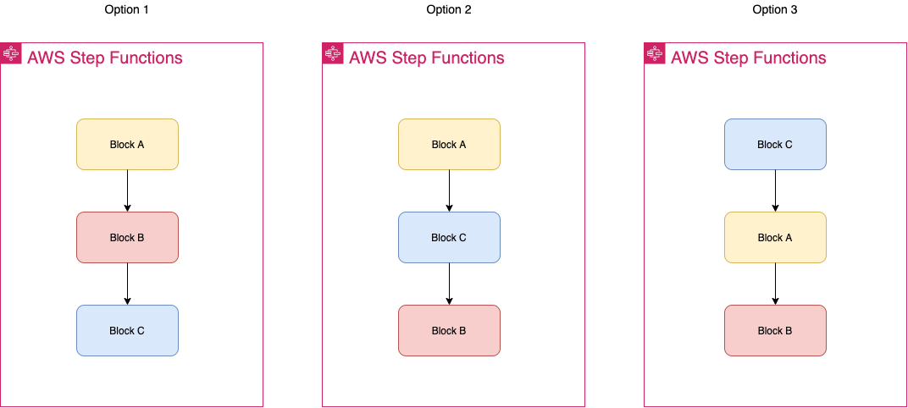
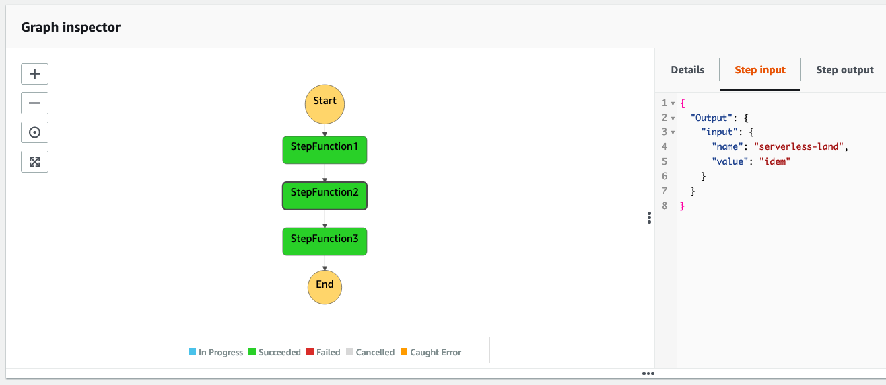

# Modular building system using AWS Step Functions

This sample project demonstrates how to use an AWS Step Functions state machine to build a modular system.

An outer Step Function is used to orchestrate several inner Step Functions. Each inner Step Function produces an output identical with the input and each one can be used to do a specific job (a synchronous or asynchronous job).

Having the output identical with the output makes it a interlocking block and allows to assemble multiple blocks together, in any order, to produce the required output like the 3 options showed in the image below.



To learn about how to embed an asynchronous process in a inner Step Function and make it a synchronous step for the outer Step Function, have a look at this [serverless pattern](https://serverlessland.com/patterns/step-function-callback-cdk-python).

This pattern deploys 4 AWS Step Functions.

The outer Step Function will trigger the inner Step Functions, one by one, and waits for each one to finish before continuing.
A sample inner Step Function is provided which has a single task of type [Pass](https://docs.aws.amazon.com/step-functions/latest/dg/amazon-states-language-pass-state.html). Replace it with your own Step Function.

Learn more about this pattern at: https://serverlessland.com/patterns/sfn-sfn-cdk

Important: this application uses various AWS services and there are costs associated with these services after the Free Tier usage - please see the AWS Pricing page for details. You are responsible for any AWS costs incurred. No warranty is implied in this example.

## Requirements

* [Create an AWS account](https://portal.aws.amazon.com/gp/aws/developer/registration/index.html) if you do not already have one and log in. The IAM user that you use must have sufficient permissions to make necessary AWS service calls and manage AWS resources.
* [AWS CLI](https://docs.aws.amazon.com/cli/latest/userguide/install-cliv2.html) installed and configured
* [Git Installed](https://git-scm.com/book/en/v2/Getting-Started-Installing-Git)
* [AWS Cloud Development Kit](https://docs.aws.amazon.com/cdk/v2/guide/getting_started.html) (AWS CDK >= 2.2.0) Installed

## Language

Python

## Framework

CDK

## Services From/To

AWS Step Functions

## Deployment Instructions

1. Create a new directory, navigate to that directory in a terminal and clone the GitHub repository:
    ```bash
    git clone https://github.com/aws-samples/serverless-patterns
    ```
1. Change directory to the pattern directory:
    ```bash
    cd sqs-lambda-cdk
    ```
1. Create a virtual environment for python:
    ```bash
    python3 -m venv .venv
    ```
1. Activate the virtual environment:
    ```bash
    source .venv/bin/activate
    ```

    If you are in Windows platform, you would activate the virtualenv like this:

    ```
    % .venv\Scripts\activate.bat
    ```

1. Install python modules:
    ```bash
    python3 -m pip install -r requirements.txt
    ```
1. From the command line, use CDK to synthesize the CloudFormation template and check for errors:

    ```bash
    cdk synth
    ```
1. From the command line, use CDK to deploy the stack:

    ```bash
    cdk deploy
    ```

    Expected result:

    ```bash
    SfnInsideSfnCdkStack

    Outputs:
    SfnInsideSfnCdkStack.StepFunctionArn = arn:aws:states:us-east-1:xxxxxxxxxx:stateMachine:OuterStepFunction0C0262E4-W34IrZoiJqEe
    ```

1. Note the outputs from the CDK deployment process. These contain the resource names and/or ARNs which are used for testing.

### Testing

This is the input we want send to our Step Function:

```json
{
    "name": "serverless-land",
    "value": "idem"
}
```

To make it work with the definition of our inner/outer Step Function we need to send our input with the following format:

```json
{
  "Output": {
    "input": {
      "name": "serverless-land",
      "value": "idem"
    }
  }
}
```

1. Start execution of the Step Function, using the Step Function Arn from the AWS CDK deployment outputs:

    ```bash
    aws stepfunctions start-execution --state-machine-arn ENTER_YOUR_STEP_FUNCTION_ARN --input "{ \"Output\": { \"input\": {\"name\" : \"serverless-pattern\", \"value\": \"block\" }}}"
    ```

    Expected result:

    ```json
    {
        "executionArn": "arn:aws:states:us-east-1:xxxxxxxxxx:execution:OuterStepFunction0C0262E4-W34IrZoiJqEe:c62465d7-6833-4560-af8b-3f1c7df7cf4b",
        "startDate": "2021-12-21T18:12:57.283000+01:00"
    }
    ```

1. Check the execution status of the Step Function using the executionArn from previous step:

    ```bash
    aws stepfunctions describe-execution --execution-arn ENTER_YOUR_STEP_FUNCTION_EXECUTION_ARN
    ```

    Expected result:

    ```json
    {
        "executionArn": "arn:aws:states:us-east-1:xxxxxxxxxx:execution:OuterStepFunction0C0262E4-W34IrZoiJqEe:c62465d7-6833-4560-af8b-3f1c7df7cf4b",
        "stateMachineArn": "arn:aws:states:us-east-1:xxxxxxxxxx:stateMachine:OuterStepFunction0C0262E4-W34IrZoiJqEe",
        "name": "c62465d7-6833-4560-af8b-3f1c7df7cf4b",
        "status": "SUCCEEDED",
        "startDate": "2021-12-21T18:12:57.283000+01:00",
        "stopDate": "2021-12-21T18:13:03.509000+01:00",
        "input": "{ \"Output\": { \"input\": {\"name\" : \"serverless-pattern\", \"value\": \"block\" }}}",
        "inputDetails": {
            "included": true
        },
        "output": "{\"Output\":{\"input\":{\"name\":\"serverless-pattern\",\"value\":\"block\"}}}",
        "outputDetails": {
            "included": true
        }
    }
    ```

1. Note the input and the output.

1. On the AWS Console, check the input and the output of each inner Step Function:

    Expected result:

    

## Cleanup

1. Delete the stack
    ```bash
    cdk destroy
    ```

## Tutorial

See [this useful workshop](https://cdkworkshop.com/30-python.html) on working with the AWS CDK for Python projects.

## Useful commands

 * `cdk ls`          list all stacks in the app
 * `cdk synth`       emits the synthesized CloudFormation template
 * `cdk deploy`      deploy this stack to your default AWS account/region
 * `cdk diff`        compare deployed stack with current state
 * `cdk docs`        open CDK documentation


Enjoy!
