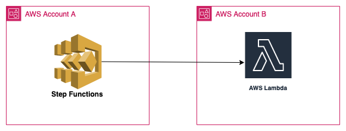

# Invoke cross account Step Function -> AWS Lambda Function
## Architecture
* Account Setup

    

This serverless pattern allows users to invoke their lambda functions present in cross account directly via step function. Step function can invoke and retrieve the desired results/details from the lambda function for the other account. 

Learn more about this pattern at Serverless Land Patterns: https://serverlessland.com/patterns/sfn-lambda-terraform

Important: this application uses various AWS services and there are costs associated with these services after the Free Tier usage - please see the [AWS Pricing page](https://aws.amazon.com/pricing/) for details. You are responsible for any AWS costs incurred. No warranty is implied in this example.

## Requirements
* [Create two AWS accounts for cross account setup](https://portal.aws.amazon.com/gp/aws/developer/registration/index.html) if you do not already have, create them and log in. The IAM user that you use must have sufficient permissions to make necessary AWS service calls and manage AWS resources.

* [AWS CLI](https://docs.aws.amazon.com/cli/latest/userguide/install-cliv2.html) iinstalled and configure two profiles with credentials for the individual accounts as below:
    ```
    [default]
    [crossaccount]
    ```
* [Git Installed](https://git-scm.com/book/en/v2/Getting-Started-Installing-Git)
* [Terraform](https://learn.hashicorp.cxom/tutorials/terraform/install-cli?in=terraform/aws-get-started) installed

## Deployment Instructions

1. Create a new directory, navigate to that directory in a terminal and clone the GitHub repository:
    ``` 
    git clone https://github.com/aws-samples/serverless-pattern
    ```
1. Change directory to the pattern directory:
    ```
    cd step-function-lambda-function-crossaccount-terraform
    ```
1. From the command line, initialize terraform to to downloads and installs the providers defined in the configuration:
    ```
    terraform init
    ```
1. From the command line, apply the configuration in the main.tf file:
    ```
    terraform apply
    ```

1. During the prompts
    #var.region
    - Enter a value: {enter the region for deployment}

    #var.prefix {enter any name to associate with resources}
    - Enter a value:

## Testing

1. You can start the execution of the Step Function using the following CLI command
    ```
    aws stepfunctions start-execution --state-machine-arn STATE_MACHINE_ARN --input "{ \"payload\": \"testing\"}"
    ```

1. You will find the STATE_MACHINE_ARN in the outputs of the SAM template.

## Cleanup
 
1. Change directory to the pattern directory:
    ```
    cd serverless-patterns/step-function-lambda-function-crossaccount-terraform
    ```
1. Delete all created resources
    ```
    terraform destroy
    ```
    
1. During the prompts:
    ```
    Enter all details as entered during creation.
    ```
1. Confirm all created resources has been deleted
    ```
    terraform show
    ```
----
Copyright 2022 Amazon.com, Inc. or its affiliates. All Rights Reserved.

SPDX-License-Identifier: MIT-0
