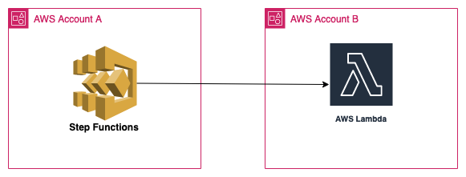

# Invoke cross account Step Function -> AWS Lambda Function
## Architecture
* Account Setup

    

This serverless pattern allows users to invoke their lambda functions present in cross account directly via step function. Step function can invoke and retrieve the desired results/details from the lambda function for the other account. 

Learn more about this pattern at Serverless Land Patterns: https://serverlessland.com/patterns/sfn-lambda-function-crossaccount

Important: this application uses various AWS services and there are costs associated with these services after the Free Tier usage - please see the [AWS Pricing page](https://aws.amazon.com/pricing/) for details. You are responsible for any AWS costs incurred. No warranty is implied in this example.

## Requirements
* [Create two AWS accounts for cross account setup](https://portal.aws.amazon.com/gp/aws/developer/registration/index.html) if you do not already have, create them and log in. The IAM user that you use must have sufficient permissions to make necessary AWS service calls and manage AWS resources.

* [AWS CLI](https://docs.aws.amazon.com/cli/latest/userguide/install-cliv2.html) iinstalled and configure two profiles with credentials for the individual accounts as below:
    ```
    [default]
    [crossaccount]
    ```
* [Git Installed](https://git-scm.com/book/en/v2/Getting-Started-Installing-Git)
* [SAM](https://docs.aws.amazon.com/serverless-application-model/latest/developerguide/serverless-sam-cli-install.html) installed

## Deployment Instructions

1. Create a new directory, navigate to that directory in a terminal and clone the GitHub repository:
    ``` 
    git clone https://github.com/aws-samples/serverless-pattern
    ```
1. Change directory to the pattern directory:
    ```
    cd sfn-lambda-function-crossaccount
    ```
1. From the command line, use AWS SAM to deploy the AWS resources for the pattern as specified in the template.yml file:
    ```
    sam deploy --guided --capabilities CAPABILITY_NAMED_IAM
    ```
1. During the prompts:

    #Stack name of your choice
    - Enter a stack name

    #Enter a name State machine 
    - Enter a StepFunctionName:

    #Enter a name for State machine role
    - Enter a StepFunctionRoleName:

    #Enter cross account Id to which you will deploy the Lambda function
    - Enter CrossAccountID: 

    #Enter the Lambda function that you deploy in other account
    - Enter LambdaFunctionName:

1. For cross account deployment of Lambda function
    - Once the above stack is deployed in first account, copy the StepFunctionRoleName and Accound Id from the output section and then use AWS SAM to deploy the function in the same region for the pattern as specified in the lambda-function.yaml file:
    ```
    sam deploy -t lambda-function.yaml --guided --profile crossaccount --capabilities CAPABILITY_NAMED_IAM
    ```

    - For SAM configuration environment, enter "cross". This will create a different configuration enviroment section in samconfig.toml file. 

    - Note: Cross region invocation of Lambda function won't work and result in "ResourceNotFoundException"

## Testing

1. You can start the execution of the Step Function using the following CLI command. Note: input should include 'payload' key as state machine is expecting key's value to be 'payload'
    ```
    aws stepfunctions start-execution --state-machine-arn STATE_MACHINE_ARN --input "{ \"payload\": \"testing\"}"
    ```

1. You will find the STATE_MACHINE_ARN in the outputs of the SAM template.

## Cleanup
 
1. Change directory to the pattern directory:
    ```
    cd serverless-patterns/sfn-lambda-function-crossaccount
    ```
1. Delete all created resources in same account.
    ```
    sam delete --stack-name <stackname>
    ```
    
1. If API is deployed in cross account then run the same command again with the stackname that is deployed in different account along with --profile crossaccount
    ```
    sam delete --stack-name <stackname> --profile crossaccount --config-env cross

1. During the prompts:
    * Enter all details as per requirement.
----
Copyright 2022 Amazon.com, Inc. or its affiliates. All Rights Reserved.

SPDX-License-Identifier: MIT-0
