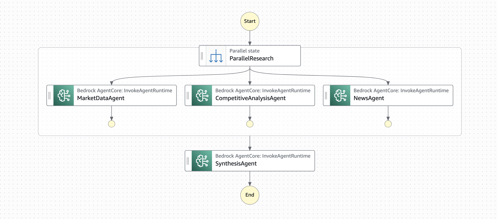

# Multi-agent orchestration with AWS Step Functions and Amazon Bedrock AgentCore

This pattern deploys an AWS Step Functions workflow that orchestrates multiple specialized AI agents running on Amazon Bedrock AgentCore. Using the native Step Functions SDK integration for Bedrock AgentCore, a Parallel state fans out three branches simultaneously, each invoking a specialized AgentCore runtime built with the Strands Agents SDK. When all branches complete, a synthesis agent combines the findings into a single result.

Learn more about this pattern at Serverless Land Patterns: [https://serverlessland.com/patterns/sfn-parallel-bedrock-agentcore-multi-agent-cdk](https://serverlessland.com/patterns/sfn-parallel-bedrock-agentcore-multi-agent-cdk)

Important: this application uses various AWS services and there are costs associated with these services after the Free Tier usage - please see the [AWS Pricing page](https://aws.amazon.com/pricing/) for details. You are responsible for any AWS costs incurred. No warranty is implied in this example.

## Requirements

* [Create an AWS account](https://portal.aws.amazon.com/gp/aws/developer/registration/index.html) if you do not already have one and log in. The IAM user that you use must have sufficient permissions to make necessary AWS service calls and manage AWS resources.
* [AWS CLI v2](https://docs.aws.amazon.com/cli/latest/userguide/install-cliv2.html) (latest available version) installed and configured
* [Git Installed](https://git-scm.com/book/en/v2/Getting-Started-Installing-Git)
* [AWS CDK](https://docs.aws.amazon.com/cdk/latest/guide/getting_started.html) (version 2.221.0 or later) installed and configured
* [Node.js 22.x](https://nodejs.org/) installed
* [Finch](https://runfinch.com/), [Docker](https://www.docker.com/products/docker-desktop/) or a compatible tool (required to build the agent container image)

## Deployment Instructions

1. Create a new directory, navigate to that directory in a terminal and clone the GitHub repository:

    ```bash
    git clone https://github.com/aws-samples/serverless-patterns
    ```

1. Change directory to the pattern directory:

    ```bash
    cd sfn-parallel-bedrock-agentcore-multi-agent-cdk
    ```

1. Install the project dependencies:

    ```bash
    npm install
    ```

1. Deploy the CDK stacks:

    ```bash
    cdk deploy --all
    ```

    Note: This deploys two stacks — `MultiAgentCoreStack` (the agent runtimes) and `MultiAgentOrchestratorStack` (the Step Functions workflow). Deploy to your default AWS region. Please refer to the [AWS capabilities explorer](https://builder.aws.com/build/capabilities/explore) for feature availability in your desired region.

1. Note the outputs from the CDK deployment process. These contain the resource ARNs used for testing.

## How it works

This pattern creates two stacks:



1. **MultiAgentOrchestratorStack** — Deploys a Step Functions state machine that orchestrates the multi-agent workflow using the native [AWS SDK integration for Bedrock AgentCore](https://aws.amazon.com/about-aws/whats-new/2026/03/aws-step-functions-sdk-integrations/) (`aws-sdk:bedrockagentcore:invokeAgentRuntime`):
   - A **Parallel** state fans out three branches simultaneously
   - Each branch includes built-in retries (2 attempts with exponential backoff) for fault tolerance
   - A **SynthesisAgent** Task state combines the three research outputs into a synthesis prompt, invokes the synthesis runtime, and formats the final output

2. **MultiAgentCoreStack** — Deploys two containerized Python agent runtimes on Amazon Bedrock AgentCore using the Strands Agents SDK:
   - A **research runtime** that handles three specialized roles (market data, competitive analysis, and news) based on the `role` field in the payload
   - A **synthesis runtime** that combines research findings into a cohesive executive report

## Testing

After deployment, start an execution using the AWS CLI or from the AWS Console.

### Start an execution

Use the state machine ARN from the CDK output (`StateMachineArn`):

```bash
aws stepfunctions start-execution \
  --state-machine-arn <StateMachineArn> \
  --input '{"prompt": "What is the current state of the electric vehicle market in Europe?"}' \
  --query 'executionArn' --output text
```

### Check execution status

```bash
aws stepfunctions describe-execution \
  --execution-arn <executionArn> \
  --query '{status: status, output: output}'
```

### Expected Output

Once the execution completes (typically 60–90 seconds), the output contains:

```json
{
  "question": "What is the current state of the electric vehicle market in Europe?",
  "report": "{\"role\": \"synthesis\", \"answer\": \"# Executive Research Report: European EV Market\\n\\n## Key Findings\\n...\"}",
  "timestamp": "2026-03-27T22:09:46.253Z"
}
```

The three research agents run in parallel, and the synthesis agent produces a unified report combining market data, competitive intelligence, and recent news.

## Cleanup

1. Delete the stacks:

    ```bash
    cdk destroy --all
    ```

1. Confirm the stacks have been deleted by checking the AWS CloudFormation console or running:

    ```bash
    aws cloudformation list-stacks --stack-status-filter DELETE_COMPLETE
    ```

----
Copyright 2026 Amazon.com, Inc. or its affiliates. All Rights Reserved.

SPDX-License-Identifier: MIT-0
