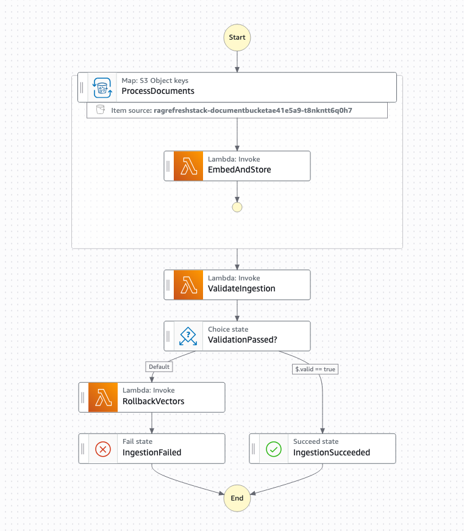

# Knowledge base refresh pipeline with AWS Step Functions and Amazon S3 Vectors

This pattern deploys an AWS Step Functions workflow that automates the ingestion of new documents into an Amazon S3 Vectors knowledge base so AI agents always answer from up-to-date information. When new documents land in S3, the workflow fans out via Distributed Map to generate vector embeddings using Amazon Bedrock and store them with `PutVectors` in parallel. After ingestion, `QueryVectors` validates that the new content is searchable, and a Choice state either confirms success or rolls back by deleting the newly added vectors if validation fails.

Learn more about this pattern at Serverless Land Patterns: [https://serverlessland.com/patterns/sfn-s3vectors-rag-refresh-cdk](https://serverlessland.com/patterns/sfn-s3vectors-rag-refresh-cdk)

Important: this application uses various AWS services and there are costs associated with these services after the Free Tier usage - please see the [AWS Pricing page](https://aws.amazon.com/pricing/) for details. You are responsible for any AWS costs incurred. No warranty is implied in this example.

## Requirements

* [Create an AWS account](https://portal.aws.amazon.com/gp/aws/developer/registration/index.html) if you do not already have one and log in. The IAM user that you use must have sufficient permissions to make necessary AWS service calls and manage AWS resources.
* [AWS CLI v2](https://docs.aws.amazon.com/cli/latest/userguide/install-cliv2.html) (latest available version) installed and configured
* [Git Installed](https://git-scm.com/book/en/v2/Getting-Started-Installing-Git)
* [AWS CDK](https://docs.aws.amazon.com/cdk/latest/guide/getting_started.html) (version 2.221.0 or later) installed and configured
* [Node.js 22.x](https://nodejs.org/) installed

## Deployment Instructions

1. Create a new directory, navigate to that directory in a terminal and clone the GitHub repository:

    ```bash
    git clone https://github.com/aws-samples/serverless-patterns
    ```

1. Change directory to the pattern directory:

    ```bash
    cd sfn-s3vectors-rag-refresh-cdk
    ```

1. Install the project dependencies:

    ```bash
    npm install
    ```

1. Install the Lambda dependencies:

    ```bash
    cd lambda && npm install && cd ..
    ```

1. Deploy the CDK stack:

    ```bash
    cdk deploy
    ```

    Note: Deploy to your default AWS region. Please refer to the [AWS capabilities explorer](https://builder.aws.com/build/capabilities/explore) for feature availability in your desired region.

1. Note the outputs from the CDK deployment process. These contain the resource names used for testing.

## How it works

This pattern creates a single stack with the following resources:

1. **S3 Document Bucket** — Stores the source documents to be ingested. Upload files to the `documents/` prefix.

2. **S3 Vectors Bucket & Index** — An S3 Vectors vector bucket with a `knowledge-base` index configured for 1024-dimensional cosine similarity (matching Amazon Titan Text Embeddings V2 output).

3. **Step Functions State Machine** — Orchestrates the full ingestion pipeline:
   - **Distributed Map** fans out over every object under `s3://<bucket>/documents/`, processing up to 40 documents concurrently
   - For each document, the **EmbedAndStore** Lambda reads the file, calls Amazon Bedrock Titan Text Embeddings V2 to generate a 1024-dimensional vector, and writes it to the S3 Vectors index via `PutVectors` with the source file path as metadata
   - **ValidateIngestion** Lambda fetches the Distributed Map result manifest from S3, collects all vector keys from the SUCCEEDED results, generates a probe embedding, and calls `QueryVectors` to confirm at least one newly ingested vector is returned
   - A **Choice** state checks the validation result: on success the workflow completes; on failure the **RollbackVectors** Lambda calls `DeleteVectors` to remove all newly added vectors, then the workflow fails

## Architecture



## Testing

After deployment, upload sample documents and start the workflow.

### Upload test documents

```bash
BUCKET=$(aws cloudformation describe-stacks \
  --stack-name RagRefreshStack \
  --query "Stacks[0].Outputs[?OutputKey=='DocumentBucketName'].OutputValue" \
  --output text)

echo "Amazon S3 Vectors is a new vector storage capability." > /tmp/doc1.txt
echo "Step Functions Distributed Map enables parallel processing at scale." > /tmp/doc2.txt

aws s3 cp /tmp/doc1.txt s3://$BUCKET/documents/doc1.txt
aws s3 cp /tmp/doc2.txt s3://$BUCKET/documents/doc2.txt
```

### Start the workflow

```bash
STATE_MACHINE_ARN=$(aws cloudformation describe-stacks \
  --stack-name RagRefreshStack \
  --query "Stacks[0].Outputs[?OutputKey=='StateMachineArn'].OutputValue" \
  --output text)

aws stepfunctions start-execution \
  --state-machine-arn $STATE_MACHINE_ARN
```

### Monitor execution

```bash
aws stepfunctions list-executions \
  --state-machine-arn $STATE_MACHINE_ARN \
  --max-results 1
```

### Expected result

The workflow should complete successfully. In the Step Functions console you'll see:
1. Distributed Map processed both documents in parallel
2. Each document was embedded and stored as a vector
3. Validation confirmed the vectors are queryable
4. The workflow reached the `IngestionSucceeded` state

## Cleanup

1. Delete the stack:

    ```bash
    cdk destroy
    ```

1. Confirm the stack has been deleted:

    ```bash
    aws cloudformation list-stacks --stack-status-filter DELETE_COMPLETE
    ```

----
Copyright 2026 Amazon.com, Inc. or its affiliates. All Rights Reserved.

SPDX-License-Identifier: MIT-0
