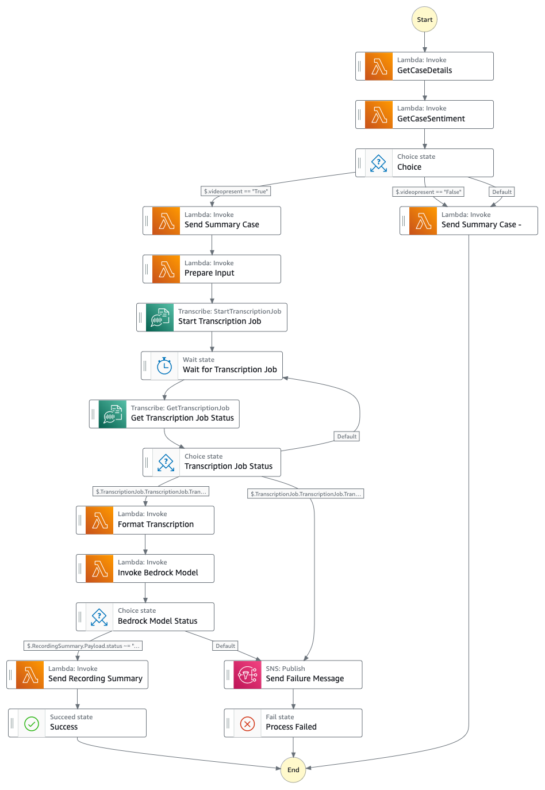

# Step Function to fetch an AWS Support case summary and sentiment

This sample project demonstrates how to use Step Functions to fetch the sentiment and summary of an AWS Support case alongside any meeting recordings pertaining to it.

Important: this application uses various AWS services and there are costs associated with these services after the Free Tier usage - please see the [AWS Pricing page](https://aws.amazon.com/pricing/) for details. You are responsible for any AWS costs incurred. No warranty is implied in this example.

## Requirements

* [Create an AWS account](https://portal.aws.amazon.com/gp/aws/developer/registration/index.html) if you do not already have one and log in. The IAM user that you use must have sufficient permissions to make necessary AWS service calls and manage AWS resources.
* [AWS CLI](https://docs.aws.amazon.com/cli/latest/userguide/install-cliv2.html) installed and configured
* [Git Installed](https://git-scm.com/book/en/v2/Getting-Started-Installing-Git)
* [AWS Serverless Application Model](https://docs.aws.amazon.com/serverless-application-model/latest/developerguide/serverless-sam-cli-install.html) (AWS SAM) installed

## Deployment Instructions

1. Create a new directory, navigate to that directory in a terminal and clone the GitHub repository:
    ```
    git clone https://github.com/aws-samples/serverless-patterns
    ```
1. Change directory to the pattern directory:
    ```
    cd sfn-supportcase-summary
    ```
1. From the command line, use AWS SAM to deploy the AWS resources for the workflow as specified in the template.yaml file:
    ```
    sam deploy --guided
    ```
1. During the prompts:
    * Enter a stack name
    * Enter the desired AWS Region
    * Allow SAM CLI to create IAM roles with the required permissions.
    * Accept all other defaults

    Once you have run `sam deploy --guided` mode once and saved arguments to a configuration file (samconfig.toml), you can use `sam deploy` in future to use these defaults.

1. Note the outputs from the SAM deployment process. These contain the resource names and/or ARNs which are used for testing.

1. Make sure to enter the required parameters like EmailAddressForSummary. You can leave the default parameter values for the parameter SummaryInstructions and parameter BedrockModelId.

## How it works

AWS Step Functions use a State machine, which you initially invoke with the attested payload. The statemachine invokes a AWS Lambda function which fetches the Support case details. Further, the next state makes use of Amazon Bedrock via a Lambda function to fetch the case summary and sentiment. Based on the input i.e., if there is no meeting recording, the summary and sentiment fetched will be sent to the user via SNS and also the S3 bucket is updated with the summary. 

However, if there is a meeting recording, the video is transcribed via AWS Transcribe and is then sent to Bedrock via Lambda function to fetch the summary and sentiment of it. Similar to the previous case summary, the video transcription, summary and sentiment fetched will be sent to the user via SNS and also the S3 bucket is updated with the summary.

## Pre-requisites

Important! In order to use Bedrock models, you must first enable model access as a one-time action. For this solution, you’ll need to enable access to the Anthropic Claude 3 Sonnet (not Claude Instant) model and Amazon Titan Text G1 - Express model. You can enable access following the guidance 

Accept the SNS subscription email received. 

You need to upload the sample-team-meeting-recording.mp4 or any recording of your choice in the S3 Bucket AssetBucketName under the /recordings folder.

## Image



## Testing

Manually trigger the workflow via the Console or the AWS CLI. The state machine ARN can be found as the ```Statemachine``` in output of ```sam deploy --guided```.

To trigger the workflow in the console, navigate to Step Functions and then click the step function name from the list of State Machines. In the Executions panel, click Start Execution. Click Start Execution again in the popup. Use the input format mentioned in input-sfn.json of this repository under Resources folder.

```
    {
  "caseid": "12345678910<support-case-id>",
  "casedetail": {
    "bucket": {
      "name": "<AssetBucketCaseName>"
    }
  },
  "detail": {
    "bucket": {
      "name": "<AssetBucketName>"
    },
    "object": {
      "key": "recordings/sample-team-meeting-recording.mp4"
    }
  },
  "videopresent":"True"
}
```

You can find a sample recording available under the Resources section titled as 'sample-team-meeting-recording.mp4'. Valid file formats are MP3, MP4, WAV, FLAC, AMR, OGG, and WebM. In the above invoke test event, replace AssetBucketCaseName with the output S3 bucket which signifies the location of storage for the case summary. Finally, replace AssetBucketName with the output S3 bucket pertaining to the recording.

Once the step function completes, check the data in the above S3 buckets. Additionally, you shall be receiving an SNS sent email as well.


## Cleanup

1. Delete the stack
    ```bash
    sam delete
    ```
1. During the prompts:
    ```bash
        Are you sure you want to delete the stack batch-sample in the region us-east-1 ? [y/N]: y
        Are you sure you want to delete the folder batch-sample in S3 which contains the artifacts? [y/N]: y
   ```
1. Delete the S3 buckets manually since they might have important data.
----
Copyright 2022 Amazon.com, Inc. or its affiliates. All Rights Reserved.

SPDX-License-Identifier: MIT-0