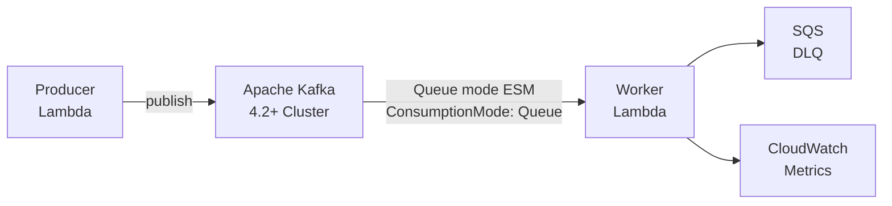

# Self-managed Apache Kafka Queue mode to AWS Lambda (KIP-932)

This pattern deploys an AWS Lambda function that consumes from a self-managed Apache Kafka 4.2+ cluster using **Queue consumption mode** (KIP-932 Share Groups). Queue mode allows multiple Lambda pollers to process records from the same partition concurrently — parallelism is decoupled from partition count.

Learn more about this pattern at Serverless Land: https://serverlessland.com/patterns/smk-lambda-queue-mode-python-sam

> **Important:** Queue consumption mode requires Apache Kafka 4.2 or later with share groups enabled. This is a preview feature — `ConsumptionMode: Queue` is not yet available in the AWS SAM or AWS CloudFormation schema. The ESM is created via a script that calls the Lambda API directly.

## Architecture



**Queue mode vs Stream mode:** In Stream mode each partition maps to exactly one consumer — a 3-partition topic supports at most 3 concurrent Lambda invocations. In Queue mode, multiple pollers share all partitions — 10 pollers can process a 3-partition topic concurrently, and a slow record in one poller does not block other pollers.

## Prerequisites

- [AWS CLI](https://docs.aws.amazon.com/cli/latest/userguide/install-cliv2.html) installed and configured
- [AWS SAM CLI](https://docs.aws.amazon.com/serverless-application-model/latest/developerguide/serverless-sam-cli-install.html) installed
- [Python 3.12](https://www.python.org/downloads/)
- curl >= 7.75 (for `--aws-sigv4` support)
- Apache Kafka 4.2+ cluster (see Deployment Path A to provision one automatically)

## Costs

This pattern uses Amazon EC2 (t3.medium), AWS Lambda, Amazon SQS, Amazon CloudWatch, and Amazon VPC resources. See [AWS Pricing](https://aws.amazon.com/pricing/) for details. There are costs associated with these services beyond the Free Tier.

---

## Deployment

Choose the path that matches your setup:

| Path | When to use |
|------|------------|
| **A — Full** | Starting from scratch — provisions VPC, Kafka EC2 broker, and Lambda app |
| **B — Bring your own Kafka** | You have an existing Kafka 4.2+ cluster; need VPC and Lambda app |
| **C — Bring your own Kafka + VPC** | You have an existing Kafka 4.2+ cluster and VPC |

### Clone the repository

```bash
git clone https://github.com/aws-samples/serverless-patterns
cd serverless-patterns/smk-lambda-queue-mode-python-sam
```

---

### Path A: Full deployment (VPC + Kafka broker + Lambda app)

**Step 1: Deploy the network stack**

```bash
aws cloudformation deploy \
  --stack-name kafka-queue-network \
  --template-file stacks/1-network.yaml \
  --region <region>
```

**Step 2: Deploy the Kafka broker**

```bash
aws cloudformation deploy \
  --stack-name kafka-queue-broker \
  --template-file stacks/2-broker.yaml \
  --capabilities CAPABILITY_IAM \
  --region <region>
```

This provisions a t3.medium Amazon EC2 instance. The instance is ready in ~2 minutes.

**Step 2b: Install Kafka on the broker**

```bash
chmod +x scripts/setup-broker.sh
./scripts/setup-broker.sh --region <region> --profile <profile>
```

This script connects to the broker via AWS Systems Manager (SSM) (no SSH required) and installs Apache Kafka 4.2.x, configures KRaft mode with share groups enabled, and starts the broker. It runs 6 steps sequentially and reports progress. The Kafka download (~130MB) takes about 15-20 minutes depending on network speed.

**Step 3: Build and deploy the application**

```bash
sam build --template stacks/3-app.yaml
sam deploy \
  --stack-name kafka-queue-app \
  --template-file .aws-sam/build/template.yaml \
  --capabilities CAPABILITY_IAM \
  --resolve-s3 \
  --region <region>
```

**Step 4: Create VPC endpoints**

ESM pollers run in private subnets and require three VPC interface endpoints: `lambda`, `sts`, and `sqs`. Missing any one of them — especially `sqs` — causes a silent failure where the ESM stays `Enabled/OK` but Lambda stops being invoked after the first batch.

```bash
chmod +x scripts/setup-vpc-endpoints.sh
./scripts/setup-vpc-endpoints.sh --region <region> --profile <profile>
```

This script is idempotent — it skips endpoints that already exist.

**Step 5: Create the Queue mode ESM**

```bash
chmod +x scripts/create-esm.sh
./scripts/create-esm.sh --region <region> --profile <profile>
```

Note the ESM UUID printed in the output — you need it for the observability step.

Wait ~60 seconds for the ESM to reach `State: Enabled`.

**Step 6: Deploy observability (optional)**

```bash
aws cloudformation deploy \
  --stack-name kafka-queue-observability \
  --template-file stacks/4-observability.yaml \
  --parameter-overrides ESMUuid=<esm-uuid-from-step-5> \
  --region <region>
```

This creates a CloudWatch dashboard (`kafka-queue-dashboard`) and alarms for share group lag, DLQ delivery, and poller errors.

---

### Path B: Bring your own Kafka cluster

Skip Steps 1, 2, and 2b. Provide your Kafka bootstrap servers, VPC subnet IDs, and security group at deploy time:

```bash
sam build --template stacks/3-app.yaml
sam deploy \
  --stack-name kafka-queue-app \
  --template-file .aws-sam/build/template.yaml \
  --capabilities CAPABILITY_IAM \
  --resolve-s3 \
  --parameter-overrides \
    UseExistingInfra=true \
    BootstrapServers="broker1.example.com:9092,broker2.example.com:9092" \
    VpcSubnetIds="subnet-aaa111,subnet-bbb222,subnet-ccc333" \
    VpcSecurityGroupId="sg-eee555" \
  --region <region>
```

Your Kafka cluster must:
- Run Apache Kafka 4.2 or later
- Have `group.coordinator.rebalance.protocols=classic,consumer,share` in `server.properties`
- Have `share.version` upgraded to 1 via `kafka-features.sh upgrade --feature share.version=1`
- Be reachable from the Lambda VPC subnets on the configured port

**Create VPC endpoints**

If your VPC does not already have `lambda`, `sts`, and `sqs` interface endpoints, create them:

```bash
./scripts/setup-vpc-endpoints.sh --region <region> --profile <profile> \
  --vpc-id <your-vpc-id> \
  --subnet-ids "subnet-aaa111,subnet-bbb222,subnet-ccc333" \
  --security-group-id <your-security-group-id>
```

If your VPC already has these endpoints, skip this step.

**Create the Queue mode ESM**

```bash
./scripts/create-esm.sh --region <region> --profile <profile>
```

---

### Path C: Bring your own Kafka cluster and VPC

Same as Path B — `UseExistingInfra=true` handles both cases. Provide your own `--vpc-id`, `--subnet-ids`, and `--security-group-id` to `setup-vpc-endpoints.sh` if your VPC doesn't already have the required endpoints.

---

---

## Testing

**Produce 20 records:**

```bash
aws lambda invoke \
  --function-name kafka-queue-app-producer \
  --region <region> \
  --cli-binary-format raw-in-base64-out \
  --payload '{"count": 20}' /dev/stdout
```

You can also override the topic at invocation time without redeploying:

```bash
aws lambda invoke \
  --function-name kafka-queue-app-producer \
  --region <region> \
  --cli-binary-format raw-in-base64-out \
  --payload '{"count": 20, "topic": "my-custom-topic"}' /dev/stdout
```

Every 7th record (`taskIndex % 7 == 0`) has `shouldFail: true` to demonstrate the RELEASE/retry/DLQ path.

**Watch the worker Lambda logs:**

```bash
aws logs tail /aws/lambda/kafka-queue-app-worker \
  --follow \
  --filter-pattern KAFKA_RECORD \
  --region <region>
```

You should see `KAFKA_RECORD` log entries with `topic`, `partition`, `offset`, and `payload`. Records with `shouldFail: true` log a warning and return in `batchItemFailures`, causing the broker to RELEASE them for retry.

**View the CloudWatch dashboard:**

Open the `kafka-queue-dashboard` dashboard in CloudWatch to see real-time metrics:
- **Share Group Lag** — records waiting to be processed (spikes on produce, drains to zero)
- **Provisioned Pollers** — number of active pollers (Queue mode only)
- **Event Counts** — PolledEventCount, InvokedEventCount, OnFailureDestinationDeliveredEventCount
- **Errors** — PollingErrorCount, FailedInvokeEventCount

All metrics are scoped to the ESM UUID, not the function name.

**Test locally:**

```bash
sam local invoke WorkerFunction \
  --template stacks/3-app.yaml \
  --event events/kafka-event.json
```

---

## Verifying Queue mode scaling

The key differentiator of Queue mode is that pollers exceed the partition count. Verify this directly on the broker after producing a large batch:

**Step 1: Produce a large batch**

```bash
aws lambda invoke \
  --function-name kafka-queue-app-producer \
  --region <region> \
  --cli-binary-format raw-in-base64-out \
  --payload '{"count": 200}' /dev/stdout
```

**Step 2: Check the broker coordinator log**

Connect to the broker via SSM Session Manager and run:

```bash
grep "new assignment state" /var/log/kafka.log | grep <your-consumer-group-id> | tail -20
```

You should see multiple members assigned to the same partition simultaneously. For example, with a 3-partition topic and `MaximumPollers: 10`, the output shows more than 3 members total — some partitions shared by 2 or more pollers:

```
[GroupId my-queue-group] Member AAA new assignment state: ... assignedPartitions=[topic-0]
[GroupId my-queue-group] Member BBB new assignment state: ... assignedPartitions=[topic-0]  <- same partition!
[GroupId my-queue-group] Member CCC new assignment state: ... assignedPartitions=[topic-1]
[GroupId my-queue-group] Member DDD new assignment state: ... assignedPartitions=[topic-1]  <- same partition!
[GroupId my-queue-group] Member EEE new assignment state: ... assignedPartitions=[topic-2]
```

In Stream mode, each partition can only appear once across all members. Multiple members sharing the same partition is only possible with share groups — this is the Queue mode scaling proof.

**Step 3: Confirm via kafka-share-groups.sh**

```bash
# On the broker
bin/kafka-share-groups.sh --bootstrap-server localhost:9092 --list
# Your consumer group ID should appear here (not in kafka-consumer-groups.sh)

bin/kafka-share-groups.sh --bootstrap-server localhost:9092 \
  --describe --group <your-consumer-group-id>
# Shows per-partition lag — confirms share group is consuming
```

If the group appears in `kafka-share-groups.sh` but NOT in `kafka-consumer-groups.sh`, it is a share group and Queue mode is active.

---

## Broker-side prerequisites

Before Queue mode can work, ensure your Kafka 4.2+ broker has:

```properties
# Required: enables the share rebalance protocol
group.coordinator.rebalance.protocols=classic,consumer,share

# Required for single-broker setups (default is 3)
share.coordinator.state.topic.replication.factor=1
share.coordinator.state.topic.min.isr=1

# Queue mode tuning parameters
group.share.partition.max.record.locks=100
group.share.record.lock.duration.ms=30000
group.share.delivery.count.limit=3
group.share.max.size=10
```

And run after broker start:

```bash
bin/kafka-features.sh --bootstrap-server localhost:9092 \
  upgrade --feature share.version=1
```

---

## Cleanup

Delete stacks in reverse order:

```bash
# 1. Delete the ESM first (get UUID from create-esm.sh output or console)
aws lambda delete-event-source-mapping --uuid <esm-uuid> --region <region>

# 2. Get your VPC ID
aws cloudformation describe-stacks \
  --stack-name kafka-queue-network \
  --query 'Stacks[0].Outputs[?OutputKey==`VpcId`].OutputValue' \
  --output text --region <region>

# 3. Find and delete the lambda VPC endpoint
aws ec2 describe-vpc-endpoints --filters "Name=vpc-id,Values=<vpc-id>" "Name=service-name,Values=com.amazonaws.<region>.lambda" --query 'VpcEndpoints[0].VpcEndpointId' --output text --region <region>

aws ec2 delete-vpc-endpoints --vpc-endpoint-ids <lambda-endpoint-id> --region <region>

# 4. Find and delete the sts VPC endpoint
aws ec2 describe-vpc-endpoints --filters "Name=vpc-id,Values=<vpc-id>" "Name=service-name,Values=com.amazonaws.<region>.sts" --query 'VpcEndpoints[0].VpcEndpointId' --output text --region <region>

aws ec2 delete-vpc-endpoints --vpc-endpoint-ids <sts-endpoint-id> --region <region>

# 5. Find and delete the sqs VPC endpoint
aws ec2 describe-vpc-endpoints --filters "Name=vpc-id,Values=<vpc-id>" "Name=service-name,Values=com.amazonaws.<region>.sqs" --query 'VpcEndpoints[0].VpcEndpointId' --output text --region <region>

aws ec2 delete-vpc-endpoints --vpc-endpoint-ids <sqs-endpoint-id> --region <region>

# 6. Delete application stacks
aws cloudformation delete-stack --stack-name kafka-queue-observability --region <region>

aws cloudformation delete-stack --stack-name kafka-queue-app --region <region>

# 7. Delete broker (if deployed)
aws cloudformation delete-stack --stack-name kafka-queue-broker --region <region>

# 8. Delete network (if deployed)
aws cloudformation delete-stack --stack-name kafka-queue-network --region <region>
```

---
Copyright 2024 Amazon.com, Inc. or its affiliates. All Rights Reserved.
SPDX-License-Identifier: MIT-0
