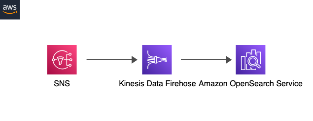

# AWS SNS to Kinesis Firehose to OpenSearch Dashboard

<p align="center">
  
</p>

This pattern deploys infrastructures that utilize Kinesis Firehose to deliver messages sent to an SNS topic to the Amazon OpenSearch serverless collection.

Learn more about this pattern at Serverless Land Patterns: [https://serverlessland.com/patterns/sns-firehose-opensearch-cdk-typescript](https://serverlessland.com/patterns/sns-firehose-opensearch-cdk-typescript)

Important: this application uses various AWS services and there are costs associated with these services after the Free Tier usage - please see the [AWS Pricing page](https://aws.amazon.com/pricing/) for details. You are responsible for any AWS costs incurred. No warranty is implied in this example.

## Requirements

* [Create an AWS account](https://portal.aws.amazon.com/gp/aws/developer/registration/index.html) if you do not already have one and log in. The IAM user that you use must have sufficient permissions to make necessary AWS service calls and manage AWS resources.
* [AWS CLI](https://docs.aws.amazon.com/cli/latest/userguide/install-cliv2.html) installed and configured
* [Git Installed](https://git-scm.com/book/en/v2/Getting-Started-Installing-Git)
* [AWS CDK Installed](https://docs.aws.amazon.com/cdk/latest/guide/getting_started.html#getting_started_install)

## Deployment Instructions

1. Create a new directory, navigate to that directory in a terminal and clone the GitHub repository:
    ``` bash
    git clone https://github.com/aws-samples/serverless-patterns
    ```
2. Change directory to the pattern directory:
    ```bash
    cd sns-firehose-opensearch-cdk-typescript
    ```
3. Install dependencies:
    ```bash
    npm install
    ```
4. Deploy the application. Before deployment, you can change the resource names in the file [sns-firehose-opensearch-cdk-typescript-stack.ts](https://github.com/aws-samples/serverless-patterns/blob/main/sns-firehose-opensearch-cdk-typescript/lib/sns-firehose-opensearch-cdk-typescript-stack.ts).
    ```bash
    cdk deploy
    ```

## How it works

Messages are sent to an SNS topic, and SNS fans out the messages to a Kinesis Data Firehose delivery stream. Firehose then streams and delivers the messages to OpenSearch, where the streaming data is loaded and indexed for analysis and searching. Additionally, failed data is backed up using an S3 bucket.

## Testing

1. Publish a message to the SNS topic either using the SNS console or by the following CLI command:
    ```bash
    aws sns publish --topic-arn <topicARN> --message "Hello world"
    ```

2. Open the OpenSearch Dashboard by logging in with the user configured in CDK. Dashboard url can be found from the CloudFormation stack outputs.

3. Click "Interact with the OpenSearch API".

4. Run the following query and verify that the messages appear in the query result. Please note that it may take a few minutes for the messages to be streamed and indexed.
    ```
    GET _search
    {
      "query": {
        "match_all": {}
      }
    }
    ```

## Cleanup
 
- Delete the stack
    ```bash
    cdk destroy
    ```
----
Copyright 2023 Amazon.com, Inc. or its affiliates. All Rights Reserved.

SPDX-License-Identifier: MIT-0
