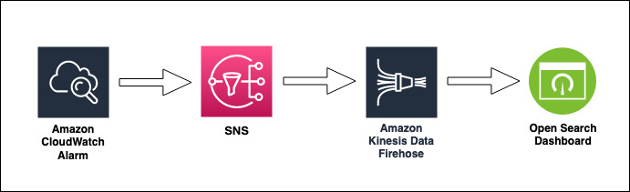

# AWS SNS to AWS Firehose to AWS Opensearch 



Cloudwatch Alarms triggers SNS notifications which are send to a Kinesis Firehose Delivery Stream subscription. The Firehose forwards the notification data to Opensearch collection for analysis using custom dashboards.

Learn more about this pattern at Serverless Land Patterns: https://serverlessland.com/patterns/sns-kinesis-data-firehose-opensearch-sam-python

Important: this application uses various AWS services and there are costs associated with these services after the Free Tier usage - please see the [AWS Pricing page](https://aws.amazon.com/pricing/) for details. You are responsible for any AWS costs incurred. No warranty is implied in this example.

## Requirements

* [Create an AWS account](https://portal.aws.amazon.com/gp/aws/developer/registration/index.html) if you do not already have one and log in. The IAM user that you use must have sufficient permissions to make necessary AWS service calls and manage AWS resources.
* [AWS CLI](https://docs.aws.amazon.com/cli/latest/userguide/install-cliv2.html) installed and configured
* [Git Installed](https://git-scm.com/book/en/v2/Getting-Started-Installing-Git)
* [AWS Serverless Application Model](https://docs.aws.amazon.com/serverless-application-model/latest/developerguide/serverless-sam-cli-install.html) (AWS SAM) installed
* Create an IAM user with Admin permissions

## Deployment Instructions

1. Create a new directory, navigate to that directory in a terminal and clone the GitHub repository:
    ``` 
    git clone https://github.com/aws-samples/serverless-patterns
    ```
1. Change directory to the pattern directory:
    ```
    cd sns-firehose-opensearch
    ```
1. From the command line, use AWS SAM to build and deploy the AWS resources for the pattern as specified in the template.yml file:
    ```
    sam build
    sam deploy --guided --capabilities CAPABILITY_NAMED_IAM
    ```
1. During the prompts:
    * Enter a stack name
    * Enter the desired AWS Region
    * Allow SAM CLI to create IAM roles with the required permissions.
    * Enter an Admin User Arn (only for this sample)

    Once you have run `sam deploy --guided --capabilities CAPABILITY_NAMED_IAM` mode once and saved arguments to a configuration file (samconfig.toml), you can use `sam deploy` in future to use these defaults.

1. Note the outputs from the SAM deployment process. These contain the resource names and/or ARNs which are used for testing.

## How it works

This SAM template creates an SNS Topic, Kinesis Firehose Delivery Stream, S3 bucket, and subscripted the Kinesis Firehose Delivery Stream to the SNS Topic. As messages are published to the topic, they are streamed to the Firehose Delivery Stream, and then delivered the the Firehose Delivery Stream's destinations, which in this case is an S3 bucket. 

==============================================

## Testing

1. Publish a message to the SNS topic by running the CLI command: 
```
aws sns publish --topic-arn arn:aws:sns:us-east-1:{AWS ACCOUNT NUMBER}:SourceSNSTopic --message "Hello world"
```

2. Check that test messages are being sent to the Opensearch (it will take a few minutes for events to begin streaming):

```
Open the Opensearch Dashboard by logging using the user credentials and check within the index
```


## Cleanup
 
1. Delete the stack
    ```bash
    aws cloudformation delete-stack --stack-name STACK_NAME
    ```
1. Confirm the stack has been deleted
    ```bash
    aws cloudformation list-stacks --query "StackSummaries[?contains(StackName,'STACK_NAME')].StackStatus"
    ```
----
Copyright 2021 Amazon.com, Inc. or its affiliates. All Rights Reserved.

SPDX-License-Identifier: MIT-0
