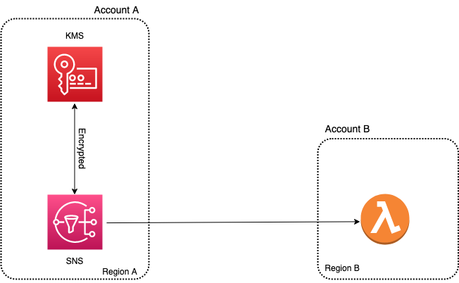

# Invoke cross account Step Function -> AWS Lambda Function
## Architecture
* Account Setup

    

This sample pattern allows users from one account to publish meesages to their Lambda function present in a different account via SNS. SNS can invoke and send encrypted messages to cross account cross region Lambda function, where the function can then decrpyt the message and further process it. 

Learn more about this pattern at Serverless Land Patterns: https://serverlessland.com/patterns/sns-lambda-crossregion-crossaccount-encrypted-terraform

Important: this application uses various AWS services and there are costs associated with these services after the Free Tier usage - please see the [AWS Pricing page](https://aws.amazon.com/pricing/) for details. You are responsible for any AWS costs incurred. No warranty is implied in this example.

## Requirements
* [Create two AWS accounts for cross account setup](https://portal.aws.amazon.com/gp/aws/developer/registration/index.html) if you do not already have, create them and log in. The IAM user that you use must have sufficient permissions to make necessary AWS service calls and manage AWS resources.

* [AWS CLI](https://docs.aws.amazon.com/cli/latest/userguide/install-cliv2.html) installed and configure two profiles with credentials for the individual accounts as below:
    ```
    [default]
    [crossaccount]
    ```
* [Git Installed](https://git-scm.com/book/en/v2/Getting-Started-Installing-Git)
* [Terraform](https://learn.hashicorp.cxom/tutorials/terraform/install-cli?in=terraform/aws-get-started) installed

## Deployment Instructions

1. Create a new directory, navigate to that directory in a terminal and clone the GitHub repository:
    ``` 
    git clone https://github.com/aws-samples/serverless-pattern
    ```
1. Change directory to the pattern directory:
    ```
    cd sns-lambda-crossregion-crossaccount-encrypted-terraform
    ```
1. From the command line, initialize terraform to to downloads and installs the providers defined in the configuration:
    ```
    terraform init
    ```
1. From the command line, apply the configuration in the main.tf file:
    ```
    terraform apply
    ```

1. During the prompts
    #var.kmsAlias
    - Enter a KMS key alias name that you want:

    #var.lambdaAccountId {enter the account ID where you want to create Lambda function}
    - Enter a account ID:

    #var.lambda_region {enter the region where you want to create your Lambda function}
    - Enter a region: (example: us-east-2)

    #var.snsAccountId {enter the account ID where you want to create SNS }
    - Enter a account ID:

    #var.sns_region {enter the region where you want to create your SNS}
    - Enter a region: (example: us-west-2)
## Testing

1. Login in to SNS account and publish a message.

1. Now login in to the account where Lambda function is deployed and check the CloudWatch logs of the function. 

## Cleanup
 de
1. Change directory to the pattern directory:
    ```
    cd serverless-patterns/step-function-lambda-function-crossaccount-terraform
    ```
1. Delete all created resources
    ```
    terraform destroy
    ```
    
1. During the prompts:
    ```
    Enter all details as entered during creation.
    ```
1. Confirm all created resources has been deleted
    ```
    terraform show
    ```
----
Copyright 2022 Amazon.com, Inc. or its affiliates. All Rights Reserved.

SPDX-License-Identifier: MIT-0
