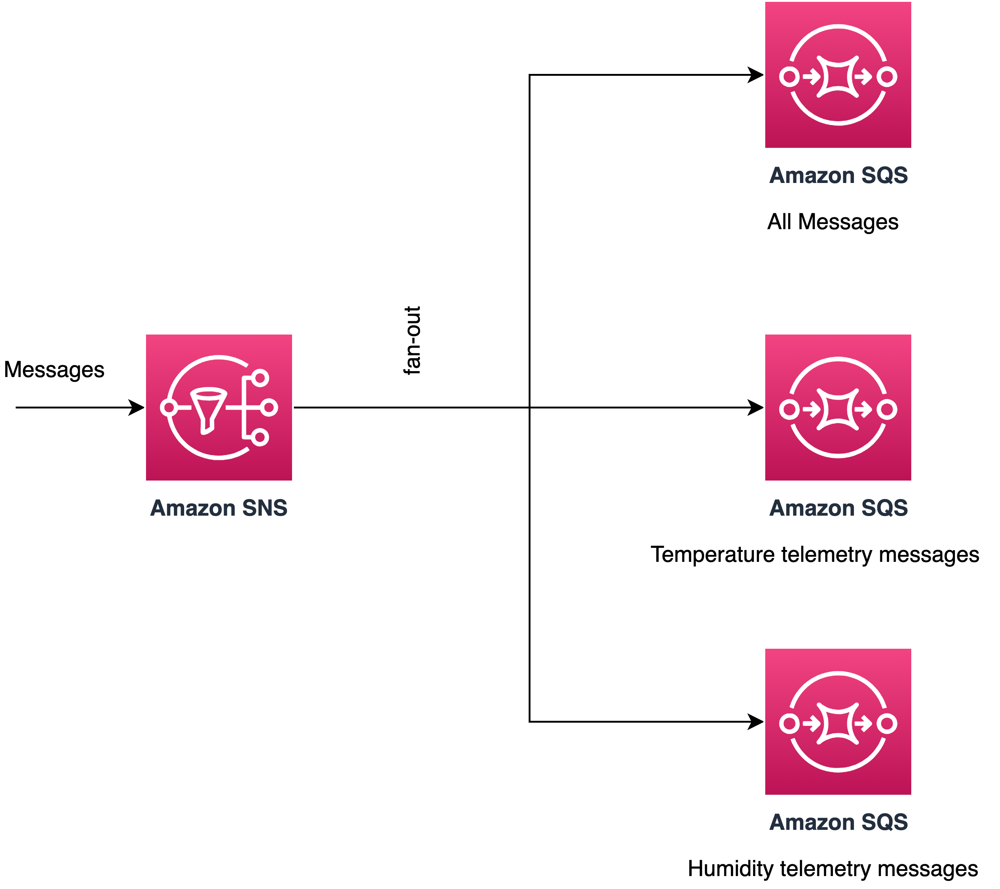
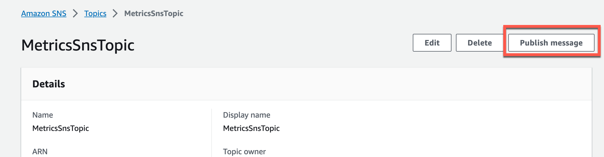
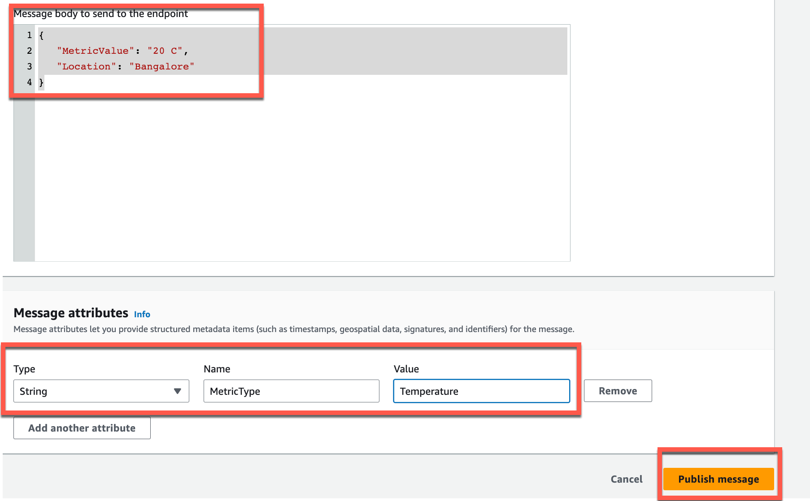
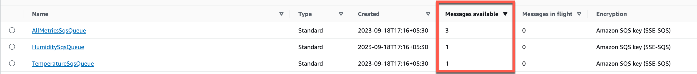

# SNS to SQS fanout pattern

This template demonstrates how to create fan-out pattern using SNS topic and sqs queues using subscription filters. The template uses one SNS topic and three SQS queues subscribed to the SNS topic. The messages from the SNS topic will move to different topic depending on the message attribute set in the SNS topic message.

Learn more about this pattern at Serverless Land Patterns: https://serverlessland.com/patterns/sns-sqs-fanout-tf

Important: this application uses various AWS services and there are costs associated with these services after the Free Tier usage - please see the [AWS Pricing page](https://aws.amazon.com/pricing/) for details. You are responsible for any AWS costs incurred. No warranty is implied in this example.

## Requirements

* [Create an AWS account](https://portal.aws.amazon.com/gp/aws/developer/registration/index.html) if you do not already have one and log in. The IAM user that you use must have sufficient permissions to make necessary AWS service calls and manage AWS resources.
* [AWS CLI](https://docs.aws.amazon.com/cli/latest/userguide/install-cliv2.html) installed and configured
* [Git Installed](https://git-scm.com/book/en/v2/Getting-Started-Installing-Git)
* [Terraform](https://learn.hashicorp.com/tutorials/terraform/install-cli?in=terraform/aws-get-started) installed


## Deployment Instructions

1. Create a new directory, navigate to that directory in a terminal and clone the GitHub repository:
    ``` 
    git clone https://github.com/aws-samples/serverless-patterns
    ```

1. Change the working directory to this pattern's directory

   ```sh
   cd serverless-patterns/sns-sqs-fanout-tf
   ```

1. From the command line, initialize terraform to  to downloads and installs the providers defined in the configuration:
    ```
    terraform init
    ```
1. From the command line, apply the configuration in the main.tf file:
    ```
    terraform apply
    ```
1. During the prompts:
   -   Enter yes
   
## How it works

The three SQS queues are subscribed to the SNS Topic. The message routing logic is defined through the subscription filter policy. The `AllMetricsSqsQueue` queue does not have any filter criteria and hence will receive all the messages, whereas, `TemperatureSqsQueue` and `HumiditySqsQueue` will receive messages having message attribute `MetricType` set to `Temperature` amd `Humidity` respectively. 

Please refer to the architecture diagram for the event flow.



## Testing

1. In the [AWS SNS console](https://us-east-1.console.aws.amazon.com/sns/v3/home), select `MetricsSnsTopic` topic and then click **Publish message** button.



2. Set the message payload and message attribute from the step 3 as per below image and click publish message button. 



3. Add one of the below message payloads: 
   
   Example payload 1:
   Message attribute: `MetricType=Temperature` 

    ```bash
    {
        "MetricValue": "20 C",
        "Location": "Bangalore"
    }
   ``` 

   Example payload 2: 
   Message attribute: `MetricType=Humidity` 

   ```bash
    {
        "MetricValue": "80%",
        "Location": "Bangalore"
    }
   ``` 

   Example payload 3: 
   Message attribute: `MetricType=WindSpeed` 

   ```bash
    {
        "MetricValue": "45 km/h",
        "Location": "Bangalore"
    }
   ``` 

4. Go to the [AWS SQS Console](https://us-east-1.console.aws.amazon.com/sqs/v2/home) page and search for the queue with name `AllMetricsSqsQueue`, `TemperatureSqsQueue` and `HumiditySqsQueue`. Validate the number of messages based on number of the times events were published on the `MetricsSnsTopic` topic. Please note `MetricType` message attribute in SNS Topic message determines the filter and routing logic.


## Cleanup

1. Change directory to the pattern directory:
    ```
    cd sns-sqs-fanout-tf
    ```
1. Delete all created resources by terraform
    ```bash
    terraform destroy
    ```
1. During the prompts:
    * Enter yes
1. Confirm all created resources has been deleted
    ```bash
    terraform show
    ```
----
Copyright 2021 Amazon.com, Inc. or its affiliates. All Rights Reserved.

SPDX-License-Identifier: MIT-0