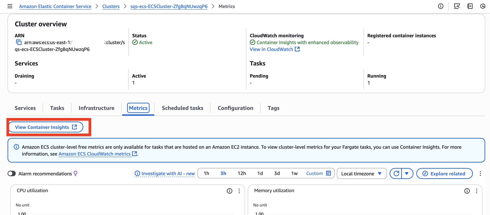

# Implementing Target tracking scaling policies for an Amazon ECS Fargate application

This pattern creates the following:

This pattern creates a serverless architecture with an SQS queue connected to an ECS Fargate service that automatically scales based on queue depth. It includes a VPC with private subnets, VPC endpoints for ECR, S3, CloudWatch Logs, and SQS, enabling the Fargate tasks to process messages without internet access. The target tracking scaling policy adjusts the number of tasks (1-10) based on the number of messages visible in the queue `ApproximateNumberOfMessagesVisible`, targeting 5 messages.

This pattern demonstrates how to effectively decouple your application components and tune your application scalability on the basis of incoming traffic flow.

Learn more about this pattern at Serverless Land Patterns: [https://serverlessland.com/patterns/sqs-ecs-autoscaling](https://serverlessland.com/patterns/sqs-ecs-autoscaling)

Important: this application uses various AWS services and there are costs associated with these services after the Free Tier usage - please see the [AWS Pricing page](https://aws.amazon.com/pricing/) for details. You are responsible for any AWS costs incurred. No warranty is implied in this example.

## Requirements

* [Create an AWS account](https://portal.aws.amazon.com/gp/aws/developer/registration/index.html) if you do not already have one and log in. The IAM user that you use must have sufficient permissions to make necessary AWS service calls and manage AWS resources.
* [AWS CLI](https://docs.aws.amazon.com/cli/latest/userguide/install-cliv2.html) installed and configured
* [Git Installed](https://git-scm.com/book/en/v2/Getting-Started-Installing-Git)
* [Docker](https://docs.docker.com/engine/install/)
* [AWS Serverless Application Model](https://docs.aws.amazon.com/serverless-application-model/latest/developerguide/serverless-sam-cli-install.html) (AWS SAM) installed


## Deployment Instructions

1. Create a new directory, navigate to that directory in a terminal and clone the GitHub repository:
    ``` 
    git clone https://github.com/aws-samples/serverless-patterns
    ```
1. Change directory to the pattern directory:
    ```
    cd sqs-ecs-autoscaling
    ```

1. First of all, execute the build-image.sh script, that will create an ECR repository (if not existing), a docker image of your application. It will also push the built image to the newly created registry:
    ```
    chmod +x build-image.sh
    sh build-image.sh
    ```

1. Once the above build is successful, from the command line, use AWS SAM to deploy the AWS resources for the pattern as specified in the template.yml file:
    ```
    sam deploy --guided
    ```

1. During the prompts:
    * Enter a stack name
    * Enter the desired AWS Region
    * Allow SAM CLI to create IAM roles with the required permissions.
    
    Once you have run `sam deploy -guided` mode once and saved arguments to a configuration file (samconfig.toml), you can use `sam deploy` in future to use these defaults.

1. Note the outputs from the SAM deployment process. These contain the resource names and/or ARNs which are used for testing.

## Testing

1. Once the deployment is completed successfully, you need to test out how your application scales on the basis of incoming traffic flow. There is a stress testing script `stress-test-app.sh` which upon execution pushes messages in parallel and in bulk to your SQS queue:
    ```
    chmod +x stress-test-app.sh
    STACK_NAME=${SAM_STACK_NAME} ./stress-test-app.sh
    ```
    Replace the `SAM_STACK_NAME` with the name of the stack you have used during sam deployment.
    While you perform the testing, observe the scaling activities in the ECS console.

    

2. Observe the CloudWatch logs of the application and the metrics of your cluster using CloudWatch Container Insights. Use the following command to turn on Container Insights with enhanced observability.

    Set the containerInsights account setting to enhanced
    ```
    aws ecs update-cluster-settings --cluster CLUSTER_NAME --settings name=containerInsights,value=enhanced
    ```

    By default, the put-account-setting applies only to the currently authenticated user. To enable the setting account-wide for all users and roles, use the root user as in the following example.
    ```
    aws ecs put-account-setting --name containerInsights --value enhanced --principal-arn arn:aws:iam::accountID:root
    ```
    After you set this account setting, all new clusters automatically use Container Insights with enhanced observability. Use the update-cluster-settings command to add Container Insights with enhanced observability to existing cluster, or to upgrade clusters that currently use Container Insights to Container Insights with enhanced observability.

    ```
    aws ecs update-cluster-settings --cluster CLUSTER_NAME --settings name=containerInsights,value=enhanced
    ```
    
    Replace CLUSTER_NAME with your ECS cluster name. Please refer to [this](https://docs.aws.amazon.com/AmazonCloudWatch/latest/monitoring/deploy-container-insights-ECS-cluster.html) document to know how to enable it from AWS Console.

3. Once you have enabled container insights, re-run the stress testing script. In order to view the Container Insights, click the link as shown your ECS Cluster console.

    

    Now, you can observe your Cluster summary and performance metrics at Cluster, Service, Task as well as at Container-level.

    

    Observe the container level metrics below:
    
    
    
    Once the testing is completing, observe how the task count varies with the `ApproximateNumberOfMessagesVisible` metric of your SQS queue:

    


## Cleanup

 1. For deleting the stack you can use sam delete from SAM CLI -
    ```
    sam delete
    ```

 2. The delete the repostory:
    ```
    aws ecr delete-repository --repository-name ${ECR_REPOSITORY_NAME} --force --region ${AWS_REGION}
    ```

    Replace `ECR_REPOSITORY_NAME` with the one that you have created. Also, use the correct value for `AWS_REGION`.


----
Copyright 2025 Amazon.com, Inc. or its affiliates. All Rights Reserved.

SPDX-License-Identifier: MIT-0