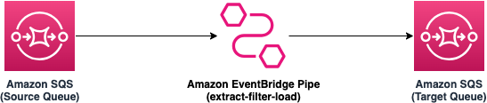

# Copying Amazon SQS messages between queues using an Amazon EventBridge Pipes filte

The pattern shows the filter capability of Amazon EventBridge Pipes while copying data from one Amazon SQS queue to another queue. The SAM template deploys two Amazon SQS queues, an Amazon EventBridge Pipe with filter having source as one of the SQS queues and target as another queue.

Learn more about this pattern at Serverless Land Patterns:https://serverlessland.com/patterns/eventbridge-pipes-sqs-to-sqs-with-data-filter

Important: this application uses various AWS services and there are costs associated with these services after the Free Tier usage - please see the [AWS Pricing page](https://aws.amazon.com/pricing/) for details. You are responsible for any AWS costs incurred. No warranty is implied in this example.

## Requirements

- [Create an AWS account](https://portal.aws.amazon.com/gp/aws/developer/registration/index.html) if you do not already have one and log in. The IAM user that you use must have sufficient permissions to make necessary AWS service calls and manage AWS resources.
- [AWS CLI](https://docs.aws.amazon.com/cli/latest/userguide/install-cliv2.html) installed and configured
- [Git Installed](https://git-scm.com/book/en/v2/Getting-Started-Installing-Git)
- [AWS Serverless Application Model](https://docs.aws.amazon.com/serverless-application-model/latest/developerguide/serverless-sam-cli-install.html) (AWS SAM) installed

## Deployment Instructions

1. Create a new directory, navigate to that directory in a terminal and clone the GitHub repository:
   ```
   git clone https://github.com/aws-samples/serverless-patterns
   ```
2. Change directory to the pattern directory:
   ```
   cd sqs-eventbridgepipes-sqs-msg-copy-data-filter-sam
   ```
3. From the command line, use AWS SAM to deploy the AWS resources for the pattern as specified in the template.yml file:
   ```
   sam deploy --guided
   ```
4. During the prompts:
    * Enter a stack name
    * Enter `us-east-1` or any other AWS Region. 
    * Allow SAM CLI to create IAM roles with the required permissions. Please keep all other options to default.
5. Make a note of the output, which will be used during testing.

## How it works

* This template creates two Amazon SQS queues - `source-queue` and `target-queue` along with an Amazon EventBridge Pipe. 
* The Amazon EventBridge pipe copies messages from `source-queue` to `target-queue` only if message payload (JSON) contains `color` attribute having values `red` or `blue`.
* Once the stack is deployed, we will use `send-messages-to-source-queue.sh` to send messages to the `source-queue`. This script sends four messages with different values for `color` attribute. 
* We will validate received messages on `target-queue` using `receive-messages-from-target-queue.sh`. Only the messages with `red` and `blue` values for `color` attribute will be available in `target-queue`.


Please refer to the architecture diagram below:



## Testing

1. Run the script `send-messages-to-source-queue.sh` to send four messages to the `source-queue` with a payload in `{"id":1, "color":"<value>"}` format having `red`, `blue`, `green` and `yellow` as color values. The script will ask for the queue URL and the region. Please provide the `SourceQueueURL` value received from the outout of the deployment step and your deployment region.
    ```bash
    bash send-messages-to-source-queue.sh
    ```

   Sample output:
   ```bash
      Enter the SQS source queue URL:
      {SourceQueueURL}
      Enter your AWS region:
      {your-region}
      {
         "MD5OfMessageBody": "266d1841ee6d382c85595fa0ca6e16b0",
         "MessageId": "b1d51544-e725-451a-ba2f-13ad5f2acd9d"
      }
      {
         "MD5OfMessageBody": "9cd1c133e3bc1406cf92d9ca0b39d7bc",
         "MessageId": "8c68b9a1-a09c-4c88-aa8f-60353a5701ee"
      }
      {
         "MD5OfMessageBody": "846a7a77cc95d371d002296f09dd6286",
         "MessageId": "c4d87ea3-732f-4ae9-b227-9df4c4c04051"
      }
      {
         "MD5OfMessageBody": "b77316a2ed44a33471ba262079fe8ce3",
         "MessageId": "794d654a-95a7-45ee-8cd5-eb197de084b1"
      }
   ```
2. Now, run the script `receive-messages-from-target-queue.sh` to receive messages from the `target-queue`. Please use the below aws cli command to read message from the SQS queue. Please replace the {SQSQueueURL} with the URL from the deployent output and also replace the {your-region} with the region that you selected during deployment:
    ```bash
    bash receive-messages-from-target-queue.sh
    ```
   
   Sample output:
    ```bash
      Enter SQS target queue URL:
      https://sqs.{your-region}.amazonaws.com/123456789012/target-queue
      Enter your AWS region:
      {your-region}
      {
         "Messages": [
            {
                  "MessageId": "82e7xxx-xx-xx-xx-xxxxxde",
                  "ReceiptHandle": "AQEBWmPxxxxxx2sMw==",
                  "MD5OfBody": "64bxxxxx232b",
                  "Body": "{\"messageId\":\"e517xxxxx513\",\"receiptHandle\":\"AQEBxxxxVusg==\",\"body\":\"{\\\"id\\\":1, \\\"color\\\":\\\"red\\\"}\",\"attributes\":{\"ApproximateReceiveCount\":\"1\",\"SentTimestamp\":\"1705663525194\",\"SenderId\":\"AIxxxxIFR\",\"ApproximateFirstReceiveTimestamp\":\"1705663525205\"},\"messageAttributes\":{},\"md5OfBody\":\"266xxxxx16b0\",\"eventSource\":\"aws:sqs\",\"eventSourceARN\":\"arn:aws:sqs:{your-region}:123456789012:source-queue\",\"awsRegion\":\"{your-region}\"}",
                  "Attributes": {
                     "SenderId": "ARxxxxZC:c11xxxx92f",
                     "ApproximateFirstReceiveTimestamp": "1705663569479",
                     "ApproximateReceiveCount": "6",
                     "SentTimestamp": "1705663525269"
                  }
            }
         ]
      }
      {
         "Messages": [
            {
                  "MessageId": "95f7xxx-xx-xx-xx-xxxxxde",
                  "ReceiptHandle": "AQEBWmPxxxxxx2sMw==",
                  "MD5OfBody": "64bxxxxx232b",
                  "Body": "{\"messageId\":\"e517xxxxx513\",\"receiptHandle\":\"AQEBxxxxVusg==\",\"body\":\"{\\\"id\\\":1, \\\"color\\\":\\\"blue\\\"}\",\"attributes\":{\"ApproximateReceiveCount\":\"1\",\"SentTimestamp\":\"1705663525194\",\"SenderId\":\"AIxxxxIFR\",\"ApproximateFirstReceiveTimestamp\":\"1705663525205\"},\"messageAttributes\":{},\"md5OfBody\":\"266xxxxx16b0\",\"eventSource\":\"aws:sqs\",\"eventSourceARN\":\"arn:aws:sqs:{your-region}:123456789012:source-queue\",\"awsRegion\":\"{your-region}\"}",
                  "Attributes": {
                     "SenderId": "ARxxxxZC:c11xxxx92f",
                     "ApproximateFirstReceiveTimestamp": "1705663566929",
                     "ApproximateReceiveCount": "6",
                     "SentTimestamp": "1705663525345"
                  }
            }
         ]
      }
    ```

   As you see from the message, even though we pushed four messages into the `source-queue`, only the two messages that matched the filter of EventBridge pipe was sent to the `target-queue`.

## Cleanup


1. Delete the stack
   ```bash
   sam delete
   ```

----
Copyright 2024 Amazon.com, Inc. or its affiliates. All Rights Reserved.

SPDX-License-Identifier: MIT-0
