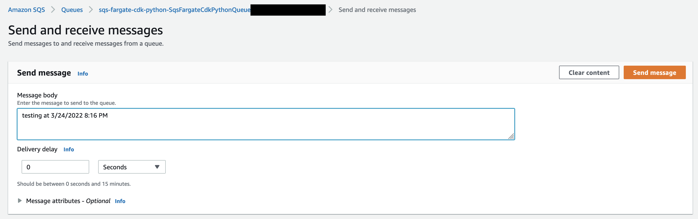
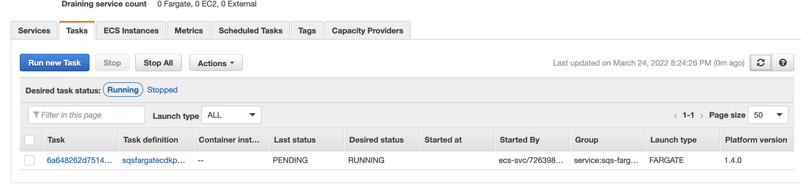
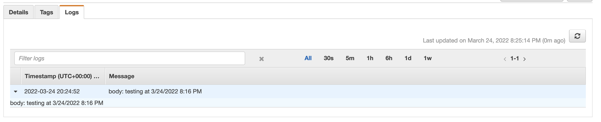

# Amazon SQS connected to an Amazon ECS

This pattern show how to scale an ECS cluster task that is connected to SQS queue.

Learn more about this pattern at Serverless Land
Patterns: https://github.com/aws-samples/serverless-patterns/tree/main/sqs-fargate-cdk-python

Important: this application uses various AWS services and there are costs associated with these services after the Free
Tier usage - please see the [AWS Pricing page](https://aws.amazon.com/pricing/) for details. You are responsible for any
AWS costs incurred. No warranty is implied in this example.

## Requirements

* [Create an AWS account](https://portal.aws.amazon.com/gp/aws/developer/registration/index.html) if you do not already
  have one and log in. The IAM user that you use must have sufficient permissions to make necessary AWS service calls
  and manage AWS resources.
* [AWS CLI](https://docs.aws.amazon.com/cli/latest/userguide/install-cliv2.html) installed and configured
* [Git Installed](https://git-scm.com/book/en/v2/Getting-Started-Installing-Git)
* [AWS Serverless Application Model](https://docs.aws.amazon.com/serverless-application-model/latest/developerguide/serverless-sam-cli-install.html) (
  AWS SAM) installed

## Deployment Instructions

1. Create a new directory, navigate to that directory in a terminal and clone the GitHub repository:
    ``` 
    git clone https://github.com/aws-samples/serverless-patterns
    ```
1. Change directory to the pattern directory:
    ```
    cd sqs-fargate-cdk-python
    ```
1. To manually create a virtualenv on MacOS and Linux:
    ```
    $ python3 -m venv .venv
    ```
1. After the init process completes and the virtualenv is created, you can use the following step to activate your
   virtualenv:
    ```
    $ source .venv/bin/activate
    ```

   Or if you are a Windows platform, you would activate the virtualenv like this:

    ```
    % .venv\Scripts\activate.bat
    ```
1. Once the virtualenv is activated, you can install the required dependencies:
    ```
    $ pip install -r requirements.txt
    ```
1. At this point you can now synthesize the CloudFormation template for this code:
    ```
    $ cdk synth
    ```

## Useful commands

* `cdk ls`          list all stacks in the app
* `cdk synth`       emits the synthesized CloudFormation template
* `cdk deploy`      deploy this stack to your default AWS account/region
* `cdk diff`        compare deployed stack with current state
* `cdk docs`        open CDK documentation

## How it works

It creates an SQS and an ECS cluster, for every message sent to queue a new task is created on the cluster and the
message is consumed by a Python application inside a Docker container.

## Testing

After run `cdk deploy` just place a message to the queue and watch the task's log.







## Cleanup

1. Delete the stack
    ```bash
    cdk destroy
    ```

----
Copyright 2021 Amazon.com, Inc. or its affiliates. All Rights Reserved.

SPDX-License-Identifier: MIT-0
