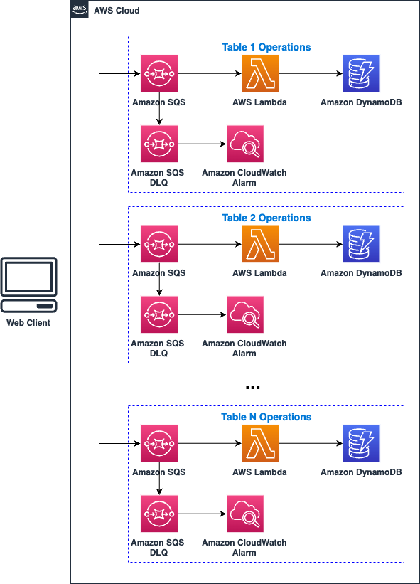
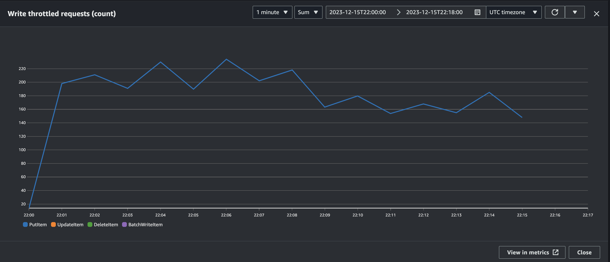

# Offloading DynamoDB Writes with SQS, Lambda, and CDK

The purpose of this pattern is to address write throttling issues of Provisioned Capacity DynamoDB Tables by offloading the requests to SQS to handle writes asynchronously. This pattern is deployed through an AWS Cloud Development Kit (CDK) app which provisions DynamoDB tables, SQS queues and DLQs, and Lambda functions. Test scripts have been provided for testing.

Learn more about this pattern at Serverless Land Patterns: [https://serverlessland.com/patterns/sqs-lambda-ddb-cdk-ts](https://serverlessland.com/patterns/sqs-lambda-ddb-cdk-ts)

## Architecture Diagram



## How it works

A new Amazon SQS queue will be created and configured to invoke an AWS Lambda function that will write the received messages into an Amazon DynamoDB table. The SQS queue redrive policy will be configured to send undeliverable messages to an Amazon SQS Dead-Letter Queue. Undeliverable messages are the ones that couldn't be written to the DynamoDB table with a maximum of `maxReceiveCount` number of attempts.

The Lambda function will stop writing messages into the DynamoDB table as soon as it catches an exception and will report the remaining messages to Amazon SQS service as failed.

The Amazon DynamoDB table will have a minimal `ProvisionedThroughput` configuration for demo purposes, so that the users can observe message retries on message writes when testing this stack. Real production throughput must be configured in accordance with the actual business requirements and message sizes.

## Considerations

* For simplicity and demo purposes, the DynamoDB Table deployed in this stack does not have Point-In-Time Recovery enabled. This pattern serves as a customizable template for a solution. It is recommended to enable this feature as in a production environment.
* For simplicity, this project uses a [config](./lib/config/tables.config.ts) file to configure the scaling limits of DynamoDB and Lambda. Customers may wish to automate this process to run in a closed loop based off desired Write Capacity Units (WCUs).
* This pattern doesn't guarantee message ordering when writing information to the DynamoDB table
* This application uses various AWS services and there are costs associated with these services after the Free Tier usage - please see the [AWS Pricing page](https://aws.amazon.com/pricing/) for details. You are responsible for any AWS costs incurred. No warranty is implied in this example.

## Prerequisites

* [Create an AWS account](https://portal.aws.amazon.com/gp/aws/developer/registration/index.html) if you do not already have one and log in. The IAM user that you use must have sufficient permissions to make necessary AWS service calls and manage AWS resources. This account needs to be bootstrapped to use AWS Cloud Development Kit.
* [AWS CLI](https://docs.aws.amazon.com/cli/latest/userguide/install-cliv2.html) installed and configured
* [Git Installed](https://git-scm.com/book/en/v2/Getting-Started-Installing-Git)
* [Node and NPM installed](https://docs.npmjs.com/downloading-and-installing-node-js-and-npm/)
* [AWS Cloud Development Kit](https://docs.aws.amazon.com/cdk/v2/guide/getting_started.html) (AWS CDK) installed and bootstrapped

## Deployment Instructions

1. Create a new directory on your machine, navigate to that directory and clone this repository.

```
git clone https://github.com/aws-samples/serverless-patterns
```

2. Navigate to the directory of this repository:

```
cd sqs-lambda-ddb-cdk-ts
```

3. Install Node Packages:

```
npm install
```

4. From the command line, use AWS CDK to synthesize an AWS CloudFormation Template:

```
cdk synth
```

5. From the command line, use AWS CDK to deploy the AWS resources:

```
cdk deploy
```

## Testing

Use the provided test script to send messages to the SQS queue. We will simulate a scenario where N messages are sent to the queue per second.

1. Navigate to the test-scripts directory and open up the file named push-sqs-messages.js

```
cd test-scripts
```

2. In the script, replace 'YOUR_REGION' and 'YOUR_SQS_QUEUE_URL' with your desired AWS Region and SQS Queue URL respectively

3. Using the command line, run the script and specify an integer for N (the number of requests per time interval - 5 is a sufficient number for this demo) and for T(the frequency in milliseconds with which to send the N events - 1000 is sufficient for this demo). Keep this script running in the background until later in step 10. You should begin to see continuous messages in your terminal saying "Batch of N items pushed to SQS at ...".

```
node push-sqs-messages.js N T
```

4. At this point, the Lambda function will start inserting items into the DynamoDB table. After a couple of minutes, you should notice the DLQ filling up with messages since DynamoDB will start throttling the requests.

5. Using Cloudwatch Log Insights, run a query on the Lambda function's Log Group to ensure that the requests are being throttled. Feel free to use the new Query Generator feature or simply run the following query:

```
filter @message like /ProvisionedThroughputExceededException/
```


6. Once you have confirmed that DynamoDB is throttling write requests, go back to the [config](./lib/config/tables.config.ts) file in repo and lower the `sqsMaxConcurrency` property to a value less than or equal to the current writeCapacity value of the table (2 is a sufficient value for this demo). If the writeCapacity of the table is already at 2, the lowest `sqsMaxConcurrency` value possible is 2. Increase the `retryAttempts` property value to a high value (20 should be sufficient for this demo) to give Lambda time to keep up with any subsequent throttling events.
\
\
**IMPORTANT:** Write down the approximate timestamp of when you make this change. It will come in handy when reading CloudWatch Logs.
\
\
**NOTE:** For this demo, it's more convenient to make this change through the Lambda Console as making changes to the config file requires you to run cdk deploy again. Do this by navigating to the function -> Configuration Tab -> Concurrency Tab. In a proper testing or production environment, it's recommended to leverage Infrastructure as Code rather than making changes via the AWS Console.

7. After some time, you should notice the rate at which messages come into the DLQ start to decrease. Navigate back to CloudWatch Log Insights and run the same query from step 5. You can adjust the time window as needed.
\
\
Look through the logs and you should notice that there are none or fewer ProvisionedThroughputExceededException errors after the timestamp you noted in the previous step.

8. For a visual representation, you can also look at CloudWatch metrics for **Write throttled requests(count)** in the monitoring tab of the DynamoDB Console. You should see a spike of write throttled requests and then it should decrease around the time you made the config change. It should look similar to the picture below.
\
\


\
\
**NOTE:** If there are no data points loading on the graph, wait a couple of minutes as CloudWatch takes some time to aggregate metrics.

9. <mark>Terminate the script! - It will otherwise continue to incur request cost until stopped.</mark> 

10. Congrats! You have successfully deployed and tested this serverless pattern. If you wish, feel free to play around with different configurations for the AWS services as well as the payload size of the messages. If not, move onto the Cleanup section to clear your resources and stop incurring costs.
## Cleanup

1. To delete the stack, run the following command:

```
cdk destroy
```


----
Copyright 2024 Amazon.com, Inc. or its affiliates. All Rights Reserved.

SPDX-License-Identifier: MIT-0