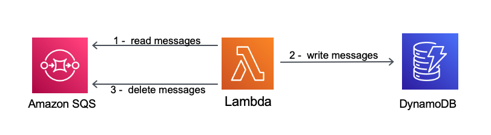

## Description
## A Lambda function read messages from a SQS queue, store them into a DynamoDB table, then removes them from the SQS queue

This pattern creates one SQS queue, a Lambda function and a DynamoDB table using SAM and Java 11.

Important: this application uses various AWS services and there are costs associated with these services after the Free Tier usage - please see the AWS Pricing page for details. You are responsible for any AWS costs incurred.

## Language:
####This is a Maven project which uses Java 11 and AWS SDK

## Framework

The framework used to deploy the infrastructure is SAM

## Services used

The AWS services used in this pattern are
#### AWS Lambda - Amazon SQS - DynamoDB

Topology




## Description
The SAM template contains all the information to deploy AWS resources(one Lambda function, one SQS queue and one DynamoDB table)
and also the permission required by these service to communicate.

You will be able to create and delete the CloudFormation stack using the CLI commands.

The lambda function will read messages in batch, will store them into the DynamoDB table, then will remove messages from the queue.

This is fully functional example developed in Java 11.

## Deployment commands

````
mvn clean package

# create an S3 bucket where the source code will be stored:
aws s3 mb s3://kndusin3i8920qindkasjdiq

# copy the source code located in the target folder:
aws s3 cp target/sourceCode.zip s3://kndusin3i8920qindkasjdiq

# SAM will deploy the CloudFormation stack described in the template.yml file:
sam deploy --s3-bucket kndusin3i8920qindkasjdiq --stack-name lambdaSQSDDB --capabilities CAPABILITY_IAM

````

## Testing

To test the endpoint first send data using the following command. Be sure to update the endpoint with endpoint of your stack.

```
# first send a few messages to the SQS queue
aws sqs send-message --queue-url https://sqs.YOUR_AWS_REGION.amazonaws.com/YOUR_AWS_ACCOUNT/OrdersQueue --message-body '{"orderId":"1111"}'
aws sqs send-message --queue-url https://sqs.YOUR_AWS_REGION.amazonaws.com/YOUR_AWS_ACCOUNT/OrdersQueue --message-body '{"orderId":"2222"}'
aws sqs send-message --queue-url https://sqs.YOUR_AWS_REGION.amazonaws.com/YOUR_AWS_ACCOUNT/OrdersQueue --message-body '{"orderId":"3333"}'
aws sqs send-message --queue-url https://sqs.YOUR_AWS_REGION.amazonaws.com/YOUR_AWS_ACCOUNT/OrdersQueue --message-body '{"orderId":"4444"}'

# invoke the lambda function
aws lambda invoke --function-name OrderConsumer response.json

# display the response
cat response.json

# scan the dynamodb table
aws dynamodb scan --table-name OrdersTable

```

## Cleanup

Run the given command to delete the resources that were created. It might take some time for the CloudFormation stack to get deleted.
```
aws cloudformation delete-stack --stack-name lambdaSQSDDB

aws s3 rm s3://kndusin3i8920qindkasjdiq --recursive

aws s3 rb s3://kndusin3i8920qindkasjdiq
```

## Requirements

* [Create an AWS account](https://portal.aws.amazon.com/gp/aws/developer/registration/index.html) if you do not already have one and log in. The IAM user that you use must have sufficient permissions to make necessary AWS service calls and manage AWS resources.
* [AWS CLI](https://docs.aws.amazon.com/cli/latest/userguide/install-cliv2.html) installed and configured
* [Git Installed](https://git-scm.com/book/en/v2/Getting-Started-Installing-Git)
* [AWS Serverless Application Model](https://docs.aws.amazon.com/serverless-application-model/latest/developerguide/serverless-sam-cli-install.html) (AWS SAM) installed


## Author bio
Name: Razvan Minciuna
Linkedin: https://www.linkedin.com/in/razvanminciuna/
Description: Software Architect
