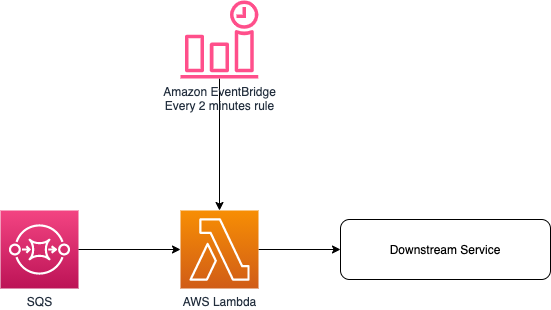

# Back pressure control pattern using Amazon SQS and AWS Lambda

This pattern deploys a Lambda function, an SQS queue and an EventBridge rule.

The Lambda function is used control how many jobs to submit to a downstream service for each incoming message in an Amazon SQS queue.
We may need to control the number of concurrent job executions due to a business requirement or due to scalability limitation of the downstream service. We are controlling the max number of concurrent executions by using a SQS queue. An Amazon EventBridge rule triggers an AWS Lambda function every 2 minutes to pick messages from SQS queue, one by one, until until we hit the max executions of our downstream service.

We’re not using the [SQS trigger for Lambda](https://aws.amazon.com/blogs/aws/aws-lambda-adds-amazon-simple-queue-service-to-supported-event-sources/) because the purpose is to slow down the creation of new executions. Whereas the Amazon SQS trigger would push messages to our AWS Lambda function eagerly.



An AWS Lambda function sample is provided with all the boiler plate. You just need to add the code to call your downstream service.

The CDK application contains the minimum IAM resources required to run the application.

Learn more about this pattern at: https://serverlessland.com/patterns/sqs-lambda-eventbridge

Important: this application uses various AWS services and there are costs associated with these services after the Free Tier usage - please see the AWS Pricing page for details. You are responsible for any AWS costs incurred. No warranty is implied in this example.

## Requirements

* [Create an AWS account](https://portal.aws.amazon.com/gp/aws/developer/registration/index.html) if you do not already have one and log in. The IAM user that you use must have sufficient permissions to make necessary AWS service calls and manage AWS resources.
* [AWS CLI](https://docs.aws.amazon.com/cli/latest/userguide/install-cliv2.html) installed and configured
* [Git Installed](https://git-scm.com/book/en/v2/Getting-Started-Installing-Git)
* [AWS Cloud Development Kit](https://docs.aws.amazon.com/cdk/v2/guide/getting_started.html) (AWS CDK >= 2.2.0) Installed

## Language

Python

## Framework

CDK

## Services From/To

Amazon SQS to AWS Lambda

## Deployment Instructions

1. Create a new directory, navigate to that directory in a terminal and clone the GitHub repository:
    ```bash
    git clone https://github.com/aws-samples/serverless-patterns
    ```
1. Change directory to the pattern directory:
    ```bash
    cd sqs-lambda-cdk
    ```
1. Create a virtual environment for python:
    ```bash
    python3 -m venv .venv
    ```
1. Activate the virtual environment:
    ```bash
    source .venv/bin/activate
    ```

    If you are in Windows platform, you would activate the virtualenv like this:

    ```
    % .venv\Scripts\activate.bat
    ```

1. Install python modules:
    ```bash
    python3 -m pip install -r requirements.txt
    ```
1. From the command line, use CDK to synthesize the CloudFormation template and check for errors:

    ```bash
    cdk synth
    ```
1. From the command line, use CDK to deploy the stack:

    ```bash
    cdk deploy
    ```

    Expected result:

    ```bash
    SqsLambdaCdkStack

    Outputs:
    SqsLambdaCdkStack.FunctionName = SqsLambdaCdkStack-MyLambdaFunction67CCA873-OsINMhWgMsXV
    SqsLambdaCdkStack.QueueArn = arn:aws:sqs:us-east-1:xxxxxxxxxxxxx:SqsLambdaCdkStack-MyQueueE6CA6235-1F31KU17V75YB
    SqsLambdaCdkStack.QueueName = SqsLambdaCdkStack-MyQueueE6CA6235-1F31KU17V75YB
    SqsLambdaCdkStack.QueueUrl = https://sqs.us-east-1.amazonaws.com/xxxxxxxxxxxxx/SqsLambdaCdkStack-MyQueueE6CA6235-1F31KU17V75YB
    SqsLambdaEbCdkStack.RuleName = SqsLambdaEbCdkStack-Rule4C995B7F-1F0HUZBIE414V
    ```

1. Note the outputs from the CDK deployment process. These contain the resource names and/or ARNs which are used for testing.

### Testing

Use the [AWS CLI](https://aws.amazon.com/cli/) to send a message to the SQS queue and observe the event delivered to the Lambda function:

1. Send several SQS messages by executing the following command several times:

```bash
aws sqs send-message --queue-url ENTER_YOUR_SQS_QUEUE_URL --message-body "Test message"
```

2. Retrieve the logs from the Lambda function:

List the log streams for that log group:

```bash
aws logs describe-log-streams --log-group-name '/aws/lambda/ENTER_YOUR_FUNCTION_NAME' --query logStreams[*].logStreamName
```

Expected result:

```bash
[
    "2021/12/17/[$LATEST]6922e90439514d8195e455360917eaa9"
]

```

Get the log events for that stream:

```bash
aws logs get-log-events --log-group-name '/aws/lambda/ENTER_YOUR_FUNCTION_NAME' --log-stream-name '2021/12/17/[$LATEST]6922e90439514d8195e455360917eaa9'
```

Expected result:

```json
{
    "events": [
        {
            "timestamp": 1639924111885,
            "message": "START RequestId: 3fd21ffd-4a8b-4d08-9435-89717282b90a Version: $LATEST\n",
            "ingestionTime": 1639924120949
        },
        {
            "timestamp": 1639924111888,
            "message": "Lambda function invoked\n",
            "ingestionTime": 1639924120949
        },
        {
            "timestamp": 1639924111888,
            "message": "{\"version\": \"0\", \"id\": \"dc17d87c-1f64-f72e-44df-20a7fe0dbe1e\", \"detail-type\": \"Scheduled Event\", \"source\": \"aws.events\", \"account\": \"xxxxxxxxxxx\", \"time\": \"2021-12-19T14:28:21Z\", \"region\": \"us-east-1\", \"resources\": [\"arn:aws:events:us-east-1:xxxxxxxxxxx:rule/SqsLambdaEbCdkStack-Rule4C995B7F-1F0HUZBIE414V\"], \"detail\": {}}\n",
            "ingestionTime": 1639924120949
        },
        {
            "timestamp": 1639924112038,
            "message": "Total messages: 1\n",
            "ingestionTime": 1639924120949
        },
        {
            "timestamp": 1639924112038,
            "message": "Submitting job to downstream service...\n",
            "ingestionTime": 1639924120949
        },
        {
            "timestamp": 1639924112050,
            "message": "Deleted item from queue...\n",
            "ingestionTime": 1639924120949
        },
        {
            "timestamp": 1639924112070,
            "message": "Total messages: 1\n",
            "ingestionTime": 1639924120949
        },
        {
            "timestamp": 1639924112070,
            "message": "Submitting job to downstream service...\n",
            "ingestionTime": 1639924120949
        },
        {
            "timestamp": 1639924112110,
            "message": "Deleted item from queue...\n",
            "ingestionTime": 1639924120949
        },
        {
            "timestamp": 1639924112130,
            "message": "Total messages: 1\n",
            "ingestionTime": 1639924120949
        },
        {
            "timestamp": 1639924112130,
            "message": "Submitting job to downstream service...\n",
            "ingestionTime": 1639924120949
        },
        {
            "timestamp": 1639924112170,
            "message": "Deleted item from queue...\n",
            "ingestionTime": 1639924120949
        },
        {
            "timestamp": 1639924112190,
            "message": "Total messages: 1\n",
            "ingestionTime": 1639924120949
        },
        {
            "timestamp": 1639924112190,
            "message": "Submitting job to downstream service...\n",
            "ingestionTime": 1639924120949
        },
        {
            "timestamp": 1639924112230,
            "message": "Deleted item from queue...\n",
            "ingestionTime": 1639924120949
        },
        {
            "timestamp": 1639924112284,
            "message": "No messages in queue.\n",
            "ingestionTime": 1639924120949
        },
        {
            "timestamp": 1639924112284,
            "message": "Started 4 jobs.\n",
            "ingestionTime": 1639924120949
        },
        {
            "timestamp": 1639924112285,
            "message": "END RequestId: 3fd21ffd-4a8b-4d08-9435-89717282b90a\n",
            "ingestionTime": 1639924120949
        },
        {
            "timestamp": 1639924112285,
            "message": "REPORT RequestId: 3fd21ffd-4a8b-4d08-9435-89717282b90a\tDuration: 397.75 ms\tBilled Duration: 398 ms\tMemory Size: 128 MB\tMax Memory Used: 65 MB\t\n",
            "ingestionTime": 1639924120949
        }
    ],
    "nextForwardToken": "f/36571529772994308243753387311916838477425035126096068626/s",
    "nextBackwardToken": "b/36571529764074010164341138055302551168365690523703902208/s"
}
```

## Cleanup

1. Delete the stack
    ```bash
    cdk destroy
    ```

## Tutorial

See [this useful workshop](https://cdkworkshop.com/30-python.html) on working with the AWS CDK for Python projects.

## Useful commands

 * `cdk ls`          list all stacks in the app
 * `cdk synth`       emits the synthesized CloudFormation template
 * `cdk deploy`      deploy this stack to your default AWS account/region
 * `cdk diff`        compare deployed stack with current state
 * `cdk docs`        open CDK documentation


Enjoy!
