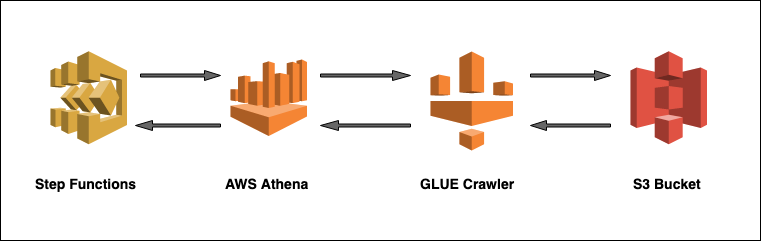

# Serverless example to process all results from S3 data fetched in Athena Query using Step Functions. 



This serverless pattern uses AWS Athena allows to analyze data in Amazon S3 using standard SQL. A Glue crawler creates a database table from the S3 data which is queried by Athena. Step Function can be leveraged to query as well as process each result in this data received from Athena with the help of **NextToken**.

Athena is out-of-the-box integrated with AWS Glue Data Catalog, allowing you to create a unified metadata repository across various services, crawl data sources to discover schemas and populate your Catalog with new and modified table and partition definitions, and maintain schema versioning. It is easy to use. Simply point to your data in Amazon S3, define the schema, and start querying using standard SQL. Most results are delivered within seconds.

This application pattern can be used to query, analyze and procees any type of data stored in S3. For example, the data can be a list of movie results, cloudtrail logs, vpc logs, inventory list etc.

Learn more about this pattern at Serverless Land Patterns: https://serverlessland.com/patterns/sfn-athena-glue-sam

Important: this application uses various AWS services and there are costs associated with these services after the Free Tier usage - please see the [AWS Pricing page](https://aws.amazon.com/pricing/) for details. You are responsible for any AWS costs incurred. No warranty is implied in this example.

## Requirements

* [Create an AWS account](https://portal.aws.amazon.com/gp/aws/developer/registration/index.html) if you do not already have, create them and log in. The IAM user that you use must have sufficient permissions to make necessary AWS service calls and manage AWS resources.
* [AWS CLI](https://docs.aws.amazon.com/cli/latest/userguide/install-cliv2.html) installed and configured
* [Git Installed](https://git-scm.com/book/en/v2/Getting-Started-Installing-Git)
* [AWS Serverless Application Model](https://docs.aws.amazon.com/serverless-application-model/latest/developerguide/serverless-sam-cli-install.html) (AWS SAM) installed

## Deployment Instructions

1. Create a new directory, navigate to that directory in a terminal and clone the GitHub repository:
    ``` 
    git clone https://github.com/aws-samples/serverless-pattern
    ```
1. Change directory to the pattern directory:
    ```
    cd serverless-patterns/step-functions-athena-glue-sam
    ```
1. From the command line, use AWS SAM to deploy the AWS resources for the pattern as specified in the template.yml file:
    ```
    sam deploy --guided
    ```
1. During the prompts:
    * Enter a stack name
    * Enter the desired AWS Region
    * Allow SAM CLI to create IAM roles with the required permissions.

Once you have run sam deploy -guided mode once and saved arguments to a configuration file (samconfig.toml), you can use sam deploy in future to use these defaults.


## Testing

1. Go to the *agawcrawler* names S3Bucket and upload the sample data csv file

1. Go to the Glue Crawler page and run the newly created Crawler *testcrawler*. This will scan the S3 bucket data and automatically create tables out it.

1. Use the following dummy JSON payload to run your Step function execution:
    ```JSON
    {
        "key1": "value1",
        "key2": "value2",
        "key3": "value3"
    }
    ```
2. Observe the logs of the step function execution to verify if all the results fetched by the Athena query is processed or not.

## Cleanup

 1. For deleting the stack you can use sam delete from SAM CLI -
    ```
    sam delete
    ```

----
Copyright 2021 Amazon.com, Inc. or its affiliates. All Rights Reserved.

SPDX-License-Identifier: MIT-0
