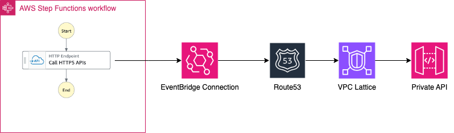

# AWS Step Function workflow to demonstrate direct integration with Private REST API gateway custom domain

The SAM template deploys a AWS Step Function standard workflow that invokes a Private REST API gateway custom domain using Eventbridge Connection, Amazon VPC Lattice and AWS PrivateLink. The SAM template contains the required resouces with IAM permission to run the application with logging enabled.

Important: this application uses various AWS services and there are costs associated with these services after the Free Tier usage - please see the [AWS Pricing page](https://aws.amazon.com/pricing/) for details. You are responsible for any AWS costs incurred. No warranty is implied in this example.

## Requirements

* [Create an AWS account](https://portal.aws.amazon.com/gp/aws/developer/registration/index.html) if you do not already have one and log in. The IAM user that you use must have sufficient permissions to make necessary AWS service calls and manage AWS resources.
* [AWS CLI](https://docs.aws.amazon.com/cli/latest/userguide/install-cliv2.html) installed and configured
* [Git Installed](https://git-scm.com/book/en/v2/Getting-Started-Installing-Git)
* [AWS Serverless Application Model](https://docs.aws.amazon.com/serverless-application-model/latest/developerguide/serverless-sam-cli-install.html) (AWS SAM) installed
* [Private REST API gateway custom domain](https://docs.aws.amazon.com/apigateway/latest/developerguide/apigateway-private-custom-domains-tutorial.html)
* [Public Route 53 Hosted zone for your domain](https://docs.aws.amazon.com/Route53/latest/DeveloperGuide/AboutHZWorkingWith.html)


## Deployment Instructions

1. Create a new directory, navigate to that directory in a terminal and clone the GitHub repository:
    ``` 
    git clone https://github.com/aws-samples/serverless-patterns
    ```
2. Change directory to the pattern directory:
    ```
    cd stepfunction-invoke-private-apigateway-customdomain
    ```

3. From the command line, use AWS SAM to deploy the AWS resources for the pattern as specified in the template.yml file:
    ```
    sam deploy --guided
    ```
5. During the prompts:

    * Enter **stack name**.
    * Enter desired **AWS Region**.
    * Enter **Private Custom Domain Name** (e.g. private.mydomain.com) for the Domainname parameter.
    * Enter **PrivateAPIInvokeURL**  (e.g. https://private.mydomain.com/<apigw-resource-path>) which is complete API invocation url.
    * Enter **VPC Id** for the VPCId parameter to create VPC lattice resource gateway in VPC. Recommendation: use same VPC as of API Gateway VPC endpoint attached to private api gateway. 
    * Enter **Subnet Id's** for the SubnetIds parameter (comma seperated e.g. subnet1,subnet2) to create resource gateway. Recommendation: use same subnets as of API gateway VPC endpoint. 
    * Enter **SecurityGroup Id's** for the SecurityGroup parameter which allows inbound access on port 443 from your VPC's CIDR range.
    * Allow SAM CLI to create IAM roles with the required permissions.


    Once you have run `sam deploy --guided` mode once and saved arguments to a configuration file (samconfig.toml), you can use `sam deploy` in future to use these defaults.

6. Note the outputs from the SAM deployment process. These contain the resource names and/or ARNs which are used for testing.

7. **Important Note** : Once the stack is deployed, Create a 'A' record in your Public Route53 hosted zone for the 'Custom Domain Name' with below target:
        
        a) Target type - alias
        b) Choose endpoint - Alias to VPC Endpoint
        c) Choose region - select your AWS region
        d) Choose Endpoint - select the VPC Endpoint which is attached to your Private REST API. Eg: vpce-1123444556666-avx567.execute-api.<AWS-region>.vpce.amazonaws.com

## How it works

* Start the AWS Step Function workflow using the `start-execution` api command or from AWS Step Function console.
* The state machine will invoke the Private REST API gateway custom domain from the State - "Call HTTPS APIs" using Amazon EventBridge connection.

Please refer to the architecture diagram below:




## Testing

1. Run the following AWS CLI command to start the Step Function workflow. Note, you must edit the {StateMachineHTTPEndpointArn} placeholder with the ARN of the deployed Step Function workflow. This is provided in the stack outputs. Please replace {your-region} with the region selected at the time of deployment.

```bash
aws stepfunctions start-execution --state-machine-arn "{StateMachineHTTPEndpointArn}" --region {your-region}
```

This Step Function does not require any input. 

### Example output:

```bash
{
    "executionArn": "arn:aws:states:{your-region}:123456789012:execution:StateMachineHTTPEndpoint-mnZFTe6jJSDu:40e520d2-4d3e-42ce-a8e3-b33bfed22fc1",
    "startDate": "2024-01-10T20:06:47.616000+05:30"
}
```

3. Run the following AWS CLI command to get the output of the Private REST API gateway. Note, you must edit the {executionArn} placeholder with the `executionArn` from the above step. Please replace {your-region} with the region selected at the time of deployment.

```bash
aws stepfunctions describe-execution --execution-arn {executionArn} --query 'output' --region {your-region}
```

This will output the response of the Private REST API integration which you have configured in the resource of the api gateway. The same can also be validated from the AWS Step Function console.


## Cleanup
 
Delete the stack
```bash
    sam delete
```

----
Copyright 2024 Amazon.com, Inc. or its affiliates. All Rights Reserved.

SPDX-License-Identifier: MIT-0
