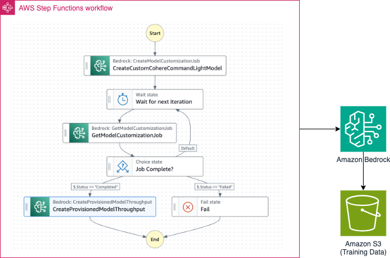

# AWS Step Functions to customise Amazon Bedrock Cohere Command Light model

The Step Functions Workflow can be started using the AWS CLI or from another service (e.g. API Gateway).

The SAM template deploys a Step Functions workflow that creates custom model by fine tuning Amazon Bedrock Cohere Command Light model and then creates a provisioned throughput with that custom model. The SAM template contains the required resources with IAM permission to run the application.

Learn more about this pattern at Serverless Land Patterns: https://serverlessland.com/patterns/stepfunctions-bedrock-model-customisation-sam

Important: this application uses various AWS services and there are costs associated with these services after the Free Tier usage - please see the [AWS Pricing page](https://aws.amazon.com/pricing/) for details. You are responsible for any AWS costs incurred. No warranty is implied in this example.

## Requirements

* [Create an AWS account](https://portal.aws.amazon.com/gp/aws/developer/registration/index.html) if you do not already have one and log in. The IAM user that you use must have sufficient permissions to make necessary AWS service calls and manage AWS resources.
* [AWS CLI](https://docs.aws.amazon.com/cli/latest/userguide/install-cliv2.html) installed and configured
* [Git Installed](https://git-scm.com/book/en/v2/Getting-Started-Installing-Git)
* [AWS Serverless Application Model](https://docs.aws.amazon.com/serverless-application-model/latest/developerguide/serverless-sam-cli-install.html) (AWS SAM) installed
* You must enable the Amazon Bedrock Cohere Command Light Model access in the Amazon Bedrock console in the region where you are going to run the SAM template.

## Deployment Instructions

1. Create a new directory, navigate to that directory in a terminal and clone the GitHub repository:
    ``` 
    git clone https://github.com/aws-samples/serverless-patterns
    ```
2. Change directory to the pattern directory:
    ```
    cd stepfunctions-bedrock-model-customisation-sam
    ```
3. From the command line, use AWS SAM to deploy the AWS resources for the pattern as specified in the template.yml file:
    ```
    sam deploy --guided
    ```
4. During the prompts:
    * Enter a stack name
    * Enter `us-east-1` AWS Region. 
    * Allow SAM CLI to create IAM roles with the required permissions.

    Once you have run `sam deploy --guided` mode once and saved arguments to a configuration file (samconfig.toml), you can use `sam deploy` in future to use these defaults.

5. Note the outputs from the SAM deployment process. These contain the resource names and/or ARNs which are used for testing.

## How it works

* Upload the training data in JSON Line format into the Amazon S3 bucket.
* Start the AWS Step Functions Workflow using the `start-execution` api command with the input payload in JSON format. 
* The workflow invokes Amazon Bedrock's `CreateModelCustomizationJob` API to fine tune `Cohere Command Light` model with the traing data from the Amazon S3 bucket.
* The workflow periodically checks for the status of the `CreateModelCustomizationJob`.
* Once the custom fine tuned `Cohere Command Light` is created, the workflow invokes Amazon Bedrock's `CreateProvisionedModelThroughput` API to create a Provisioned Throughput with no commitment. 

Please refer to the architecture diagram below:




## Testing

1. Upload one of the three provided training data files to the Amazon S3 bucket using the following command. Please replace `BedrockModelCustomisationS3Bucket` with the value from the `sam deploy --guided` output. Also please replace `train-data-xxxx.jsonl` with the desired file name:

   ```bash
   aws s3 cp {train-data-xxxx.jsonl} s3://{BedrockModelCustomisationS3Bucket}/{train-data-xxxx.jsonl}
   ```

2. Run the following AWS CLI command to start the Step Functions workflow. Please replace `StateMachineCustomiseBedrockModelArn`, `BedrockModelCustomisationServiceRoleArn` and `BedrockModelCustomisationS3Bucket` with the values from the `sam deploy --guided` output. Please replace `UniqueModelName`, `UniqueJobName` with unique values and `train-data-xxxx.jsonl` with the selected file name in the previous step. Also, please update `your-region` with the region that you provided while running the SAM template.

    ```bash
    aws stepfunctions start-execution --state-machine-arn "{StateMachineCustomiseBedrockModelArn}" --input "{\"BaseModelIdentifier\": \"cohere.command-light-text-v14:7:4k\",\"CustomModelName\": \"{UniqueModelName}\",\"JobName\": \"{UniqueJobName}\",\"OutputDataConfigS3Uri\": \"s3://{BedrockModelCustomisationS3Bucket}\",\"RoleArn\": \"{BedrockModelCustomisationServiceRoleArn}\",\"TrainingDataConfigS3Uri\": \"s3://{BedrockModelCustomisationS3Bucket}/{train-data-xxxx.jsonl}\"}" --region {your-region}
    ```

    #### Example output:

    ```bash
    {
        "executionArn": "arn:aws:states:{your-region}:123456789012:execution:{stack-name}-wcq9oavUCuDH:2827xxxx-xxxx-xxxx-xxxx-xxxx6e369948",
        "startDate": "2024-01-28T08:00:26.030000+05:30"
    }
    ```
    
    Please note the customisation may take 45 minutes to 1 hour to complete!

3. Run the following AWS CLI command to check the Step Functions workflow status or Log into AWS Step Functions Cosole to check the execution status. Wait until the workflow completes successfully. Please replace the `executionArn` from previous step output and also `your-region`.
    ```bash
    aws stepfunctions describe-execution --execution-arn {executionArn} --query status --region {your-region}
    ```

4. Once the AWS Step Functions workflow completes successfully, run the following AWS CLI command to get the Step Functions workflow execution output. Please replace the `executionArn` and also `your-region`.
    ```bash
    aws stepfunctions get-execution-history --execution-arn {executionArn} --query events[].executionSucceededEventDetails.output --region {your-region}
    ```
    #### Example output:

    ```bash
    [
        "{\"ProvisionedModelArn\":\"arn:aws:bedrock:{your-region}:123456789012:provisioned-model/abcd1234xxxx\"}"
    ]
    ```
    Now we will ask the base model before fine-tuning, as well as the custom model after fine-tuning, to summarise a dialog similar to training data set.

5.  Run the following command to ask the base model before fine-tuning to summarise. Please replace `your-region`:
    ```bash
    bash invoke-base-model.sh  
    ```
    #### Example output:

    ```bash
    Enter the deployment region: {your-region}
    {
        "contentType": "application/json"
    }
    ```
    The output will be saved in `base-model-output.txt` file.  The summarised output will be under `text` attribute.

    #### Example summarisation by base model before tuning:

    ```bash
    #Person2# helps John Sandals with his reservation and explains they only accept MasterCard or VISA, not American Express. John gives #Person2# his VISA card and then #Person2# tells him he'll be in room 507.
    ```

5. Now, run the following to command to ask the fine tuned custom model to summarise. Please replace `{ProvisionedModelArn}` from the previous step and also `your-region`:
    ```bash
    bash invoke-customised-model.sh  
    ```
    #### Example output:

    ```bash
    Enter the provisioned model ARN (output of the Step Function): {ProvisionedModelArn}
    Enter the deployment region: {your-region}
    {
        "contentType": "application/json"
    }
    ```
    The output will be saved in `custom-model-output.txt` file. The summarised output will be under `text` attribute.
    #### Example summarisation by fine-tuned custom model:

    ```bash
    John Sandals got a reservation. #Person2# takes MasterCard and VISA. #Person2# helps John Sandals check in and gives him the key.
    ```

    As you see, the summarisation after fine-tuning is much consize and to the point.


## Cleanup
 
1. Delete the Amazon Bedrock provisioned throughput of the custom mode. Please *ensure* that the correct `ProvisionedModelArn` is provided to avoid accidental unwanted delete:
   ```bash
   aws bedrock delete-provisioned-model-throughput --provisioned-model-id {ProvisionedModelArn} --region {your-region}
   ``` 

2. Delete the Amazon Bedrock custom model. Please *ensure* that the correct `CustomModelName` is provided to avoid accidental unwanted delete:
   ```bash
   aws bedrock delete-custom-model --model-identifier {CustomModelName} --region {your-region}
   ``` 

3. Delete the content in the Amazon S3 bucket using the following command. Please *ensure* that the correct bucket name is provided to avoid accidental data loss:
   ```bash
   aws s3 rm s3://{BedrockModelCustomisationS3Bucket} --recursive
   ```

4. To delete the resources deployed to your AWS account via AWS SAM, run the following command:
   ```bash
   sam delete
   ```

----
Copyright 2024 Amazon.com, Inc. or its affiliates. All Rights Reserved.

SPDX-License-Identifier: MIT-0
