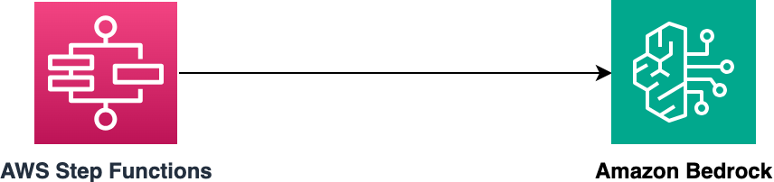

# AWS Step Functions Express Workflow to Amazon Bedrock Anthropic Claude Model v2.1 for Content Generation  

The Step Functions Express Workflow can be started using the AWS CLI or from another service (e.g. API Gateway).

The SAM template deploys a Step Functions Express workflow that invokes Amazon Bedrock Anthropic Claude Model v2.1 and returns the generated content based on the provided prompts. The SAM template contains the required resources with IAM permission to run the application with logging enabled.

Learn more about this pattern at Serverless Land Patterns: https://serverlessland.com/patterns/stepfunctions-bedrock-sam

Important: this application uses various AWS services and there are costs associated with these services after the Free Tier usage - please see the [AWS Pricing page](https://aws.amazon.com/pricing/) for details. You are responsible for any AWS costs incurred. No warranty is implied in this example.

## Requirements

* [Create an AWS account](https://portal.aws.amazon.com/gp/aws/developer/registration/index.html) if you do not already have one and log in. The IAM user that you use must have sufficient permissions to make necessary AWS service calls and manage AWS resources.
* [AWS CLI](https://docs.aws.amazon.com/cli/latest/userguide/install-cliv2.html) installed and configured
* [Git Installed](https://git-scm.com/book/en/v2/Getting-Started-Installing-Git)
* [AWS Serverless Application Model](https://docs.aws.amazon.com/serverless-application-model/latest/developerguide/serverless-sam-cli-install.html) (AWS SAM) installed
* You must enable the Anthropic Claude Model access in the Amazon Bedrock console in the region where you are going to run the SAM template.

## Deployment Instructions

1. Create a new directory, navigate to that directory in a terminal and clone the GitHub repository:
    ``` 
    git clone https://github.com/aws-samples/serverless-patterns
    ```
2. Change directory to the pattern directory:
    ```
    cd stepfunctions-bedrock-sam
    ```
3. From the command line, use AWS SAM to deploy the AWS resources for the pattern as specified in the template.yml file:
    ```
    sam deploy --guided
    ```
4. During the prompts:
    * Enter a stack name
    * Enter `us-east-1` AWS Region. 
    * Allow SAM CLI to create IAM roles with the required permissions.

    Once you have run `sam deploy --guided` mode once and saved arguments to a configuration file (samconfig.toml), you can use `sam deploy` in future to use these defaults.

5. Note the outputs from the SAM deployment process. These contain the resource names and/or ARNs which are used for testing.

## How it works

* Start the Express Workflow using the `start-sync-execution` api command with a "prompt" string in English for generating content as per the input payload.
* The Express Workflow invokes Amazon Bedrock Anthropic Claude v2.1 Model with the prompt.
* Amazon Bedrock returns the generated content as the given promptsentiment of the input text. 
* If the integration succeeds, the generated content is returned in the Step Function execution results within an `output` object.
* If the integration fails, the Step Functions workflow will retry up to 5 times before exiting with a `status:FAILED` response.

Please refer to the architecture diagram below:




## Testing

Run the following AWS CLI command to send a 'start-sync-execution` command to start the Step Functions workflow. Note, you must edit the {StateMachineExpressSyncToBedrockArn} placeholder with the ARN of the deployed Step Functions workflow. This is provided in the stack outputs. Also, please update {your-region} with the region that you provided while running the SAM template.

```bash
aws stepfunctions start-sync-execution  --name "test" --state-machine-arn "{StateMachineExpressSyncToBedrockArn}" --input "{\"prompt\": \"\n\nHuman:Write 5 lines about how Moon was formed.\n\nAssistant:\"}" --region {your-region}
```

### Example output:

```bash
{
    "executionArn": "arn:aws:states:us-east-1:123456789012:express:StateMachineExpressSyncToBedrock-MXFRi47uY7pX:test:4f3726da-74e1-4762-bd43-babeb2a291be",
    "stateMachineArn": "arn:aws:states:us-east-1:123456789012:stateMachine:StateMachineExpressSyncToBedrock-MXFRi47uY7pX",
    "name": "test",
    "startDate": "2024-01-08T11:49:18.981000+05:30",
    "stopDate": "2024-01-08T11:49:28.758000+05:30",
    "status": "SUCCEEDED",
    "input": "{\"prompt\": \"\\n\\nHuman:Write 5 lines about how Moon was formed.\\n\\nAssistant:\"}",
    "inputDetails": {
        "included": true
    },
    "output": "{\"Body\":{\"completion\":\" Here is a 5 line summary of how the Moon was formed:\\n\\n1. The leading theory is that the Moon formed from debris left over after a massive collision between the young Earth and a Mars-sized body about 4.5 billion years ago.\\n\\n2. This collision threw molten rock and debris into Earth's orbit that eventually cooled and coalesced into the Moon we see today. \\n\\n3. Over billions of years, the Moon's gravity caused Earth's rotation to slow down and its orbit to expand outward. \\n\\n4. The Moon likely had an intense period of volcanism in its early history, but volcanism ended around 3 billion years ago as the Moon's interior cooled.\\n\\n5. Without the stabilizing effect of the Moon, Earth would wobble more on its axis, causing more radical climate swings over long time periods.\",\"stop_reason\":\"stop_sequence\",\"stop\":\"\\n\\nHuman:\"},\"ContentType\":\"application/json\"}",
    "outputDetails": {
        "included": true
    },
    "billingDetails": {
        "billedMemoryUsedInMB": 64,
        "billedDurationInMilliseconds": 9800
    }
}
```
## Cleanup
 
Delete the stack
```bash
    sam delete
```

----
Copyright 2024 Amazon.com, Inc. or its affiliates. All Rights Reserved.

SPDX-License-Identifier: MIT-0
