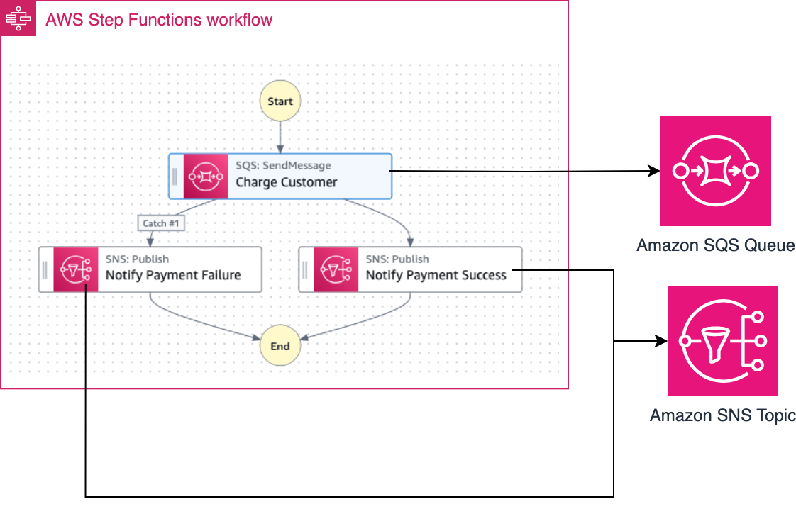

# AWS Step Functions Workflow to demonstrate wait for callback functionality

The Step Functions Workflow can be started using the AWS CLI or from another service (e.g. API Gateway).

The SAM template deploys a Step Functions Standard workflow that takes a JSON input (for example, payload to charge customer). The state machine sends the message to Amazon SQS Queue and waits for the callback. An AWS Lambda function is deployed to process the message from the SQS Queue and calls the state machine with either task success or failure. Depending on the callback type (success or failure) the state machine publishes messages to Amazon SNS Topic for notification. The SAM template contains the required resouces with IAM permission to run the application with logging enabled.

Learn more about this pattern at Serverless Land Patterns: https://serverlessland.com/patterns/stepfunctions-callback-sam

Important: this application uses various AWS services and there are costs associated with these services after the Free Tier usage - please see the [AWS Pricing page](https://aws.amazon.com/pricing/) for details. You are responsible for any AWS costs incurred. No warranty is implied in this example.

## Requirements

* [Create an AWS account](https://portal.aws.amazon.com/gp/aws/developer/registration/index.html) if you do not already have one and log in. The IAM user that you use must have sufficient permissions to make necessary AWS service calls and manage AWS resources.
* [AWS CLI](https://docs.aws.amazon.com/cli/latest/userguide/install-cliv2.html) installed and configured
* [Git Installed](https://git-scm.com/book/en/v2/Getting-Started-Installing-Git)
* [AWS Serverless Application Model](https://docs.aws.amazon.com/serverless-application-model/latest/developerguide/serverless-sam-cli-install.html) (AWS SAM) installed

## Deployment Instructions

1. Create a new directory, navigate to that directory in a terminal and clone the GitHub repository:
    ``` 
    git clone https://github.com/aws-samples/serverless-patterns
    ```
2. Change directory to the pattern directory:
    ```
    cd stepfunctions-callback-sam
    ```
3. From the command line, use AWS SAM to deploy the AWS resources for the pattern as specified in the template.yml file:
    ```
    sam deploy --guided
    ```
4. During the prompts:
    * Enter a stack name
    * Enter `us-east-1` or any AWS Region where you have access. 
    * Allow SAM CLI to create IAM roles with the required permissions.

    Once you have run `sam deploy --guided` mode once and saved arguments to a configuration file (samconfig.toml), you can use `sam deploy` in future to use these defaults.

5. Note the outputs from the SAM deployment process. These contain the resource names and/or ARNs which are used for testing.

## How it works

* Start the Standard Workflow using the `start-execution` api command with a JSON input payload.
* The Workflow sends the payload along with a task token into an Amazon SQS Queue and waits for a callback.
* An AWS Lambda Function processes the message from the SQS queue and calls back the Step Functions workflow with the task token. The Lambda Function either calls with the `send_task_success` or `send_task_failure` API at random.
* If the Step Functions workflow publishes a notification message to Amazon SNS topic either through usual next step or through error handling depending the callback API used by the Lambda Function.
* For vlidation purpose, an Amazon SQS queue is subscribed to the SNS topic to check the notification messages. 

Please refer to the architecture diagram below:




## Testing

1. Run the following AWS CLI command to start the Step Functions workflow. Note, you must edit the {StateMachineWaitForCallbackArn} placeholder with the ARN of the deployed Step Functions workflow. This is provided in the stack outputs. Please replace {your-region} with the region selected at the time of deployment.

```bash
aws stepfunctions start-execution  --name "test" --state-machine-arn "{StateMachineWaitForCallbackArn}" --input "{\"orderId\": \"1234567\",\"customerId\": \"98766\",\"orderDate\": \"2024-01-14\",\"amount\": 100,\"nameOnCard\": \"FIRSTNAME LASTNAME\",\"creditCardNumber\": \"1234 1234 1234 1234\",\"expiry\": \"XX/YY\",\"cvv\": \"123\"}" --region {your-region}
```

### Example output:

```bash
{
    "executionArn": "arn:aws:states:{your-region}:123456789012:execution:StateMachineWaitForCallback-mnZFTe6jJSDu:40e520d2-4d3e-42ce-a8e3-b33bfed22fc1",
    "startDate": "2024-01-10T20:06:47.616000+05:30"
}
```

2. Run the above commands a few more times. As we can test both the success and failure task callbacks.

3. Run the following AWS CLI command to receive messages from the test SQS queue. Note, you must edit the {WaitForCallbackDemoNotificationTestQueueUrl} placeholder with the deployed Amazon SQS Test Queue URL. This is provided in the stack outputs. Please replace {your-region} with the region selected at the time of deployment.

```bash
aws sqs receive-message --queue-url {WaitForCallbackDemoNotificationTestQueueUrl} --max-number-of-messages 10 --wait-time-seconds 20 --region {your-region}
```

### Example output:

```bash
{
    "Messages": [
        {
            "MessageId": "40fc7cbd-2dd5-440c-9092-0da1ef992a99",
            "ReceiptHandle": "AQEB+xxxxxxxxxxxxxxxxxxxxxxxxxxxxxx/V6VkU8lWzDreKWDc9JJzDBx9oqnE3nY/TQBqr4hxX26D76KN5PZ+3fXatZ7RRoA9QSx71rpTzoX/e5AvHOqCuJyKKmQ408LUoEcvInnbl/ANYT+qTKEqGusGmITEObBeGrc/H0JVobIkMt7U/fPwDAsSuM+iPEh27y6sPvdt82UVZCjckckjwmSH7yTG+snp8HJBgCw9LEwS54dMcIfp59mCjde50XWEN4B0rKgRIOgouCMA/V1jb0tyNQ/VHCtMGmZn51NmS6N1g6hCVrSJ8j00nq0/1sSxfkgrL+CV3ACDO7F17QwjKK7aGjcku1qKDzvy884OAY+F/ulneGfSSXJA8bepMs3wjtS5pCF+xnw2t0eKwxB37t1b2FVtEsQutiqhmel9ZH++0bWfTNtRrn",
            "MD5OfBody": "e1xxxxxxxxxxxxxxd0df952be3c2b2",
            "Body": "{\n  \"Type\" : \"Notification\",\n  \"MessageId\" : \"f5fe5954-183e-5a42-bfc5-074cb45d6aab\",\n  \"TopicArn\" : \"arn:aws:sns:REGION:123456789012:WaitForCallbackTopic\",\n  \"Message\" : \"{\\\"Error\\\":\\\"Failed to process payment\\\",\\\"Cause\\\":\\\"Invalid Credit Card\\\"}\",\n  \"Timestamp\" : \"2024-01-10T14:30:59.435Z\",\n  \"SignatureVersion\" : \"1\",\n  \"Signature\" : \"E8Zxxxxxxxxxxxxxxxxxxxxxxxxx0k1XoAWKo5wm3S01xur2Kr2OYkBn1f19TTWDp6hA6n90yIgei6iMrhxDalGrMY3f5iVtbgayvfsH5jzxdY3AS8uKSGt54fQ0pRpzt/y81itrNFnOW/e8He0l3vGTTYAliGHY4PrUtHEoQxvAv79RST7mnt9bCDKHqAQEfbC84YGjJcDBR3Dm3IAF4FxW5lhGSQ9PNvkWYYUeUgdS2jSNq6yNsLQXVBKSfkKCCzT6O7U8GYJY897VPQfAgo6gI5qQHx8yjU6r9YdKJp8Zni4uWXN6DN6+WsD5DJoh9N86I0dXhzA==\",\n  \"SigningCertURL\" : \"https://sns.REGION.amazonaws.com/SimpleNotificationService-60eadc530605d63b8e62a523676ef735.pem\",\n  \"UnsubscribeURL\" : \"https://sns.REGION.amazonaws.com/?Action=Unsubscribe&SubscriptionArn=arn:aws:sns:REGION:123456789012:WaitForCallbackTopic:406e2ec2-9d6d-41dc-8ec5-6691c25eca1c\"\n}"
        },
        {
            "MessageId": "0fb65f5c-2bac-4c99-be10-49eb02adfad4",
            "ReceiptHandle": "AQEB6HZh3uKmx/GYbxxxxxxxxxxxxxxxxxxxu7a6tt0eVz9TJ4tF541PC7krkbMzno1sf1GMRouZDaua63S5GfpQDlpiMtDk9c6dx61YVlW621hLFGFCH+UB0LrDgUkvqQspjGpSd5K4HOsn341Y0BwiGsEsUMVkkZ7xkc8vK6fdFuqKKASJwWXdgWl1xyp2zp6HeSvyrriErac2gfzwde0cW1zabA/RPzkfd1qsMaqmKy/fh7wyYSQHvii9vIYPksSEf0LdyHb11SJPu0hKEdNKyULVzlYCDj2QoBnM+yJOrzEGhE9lxH/idwc1+8ALVoD4dlnbtqbx7ZH7seqoU1qvpAfWKxV8bMwwjBiUsbVBJD9SxBFjmffnyQ5IS/GRDiSYGIaZdWFj79i/SZBvR67gdIG5Z17FKClQb8ufMSmHLkb8mmQXc1xT/4RM5z",
            "MD5OfBody": "09a8xxxxxxxxxxxxxxxxxxac",
            "Body": "{\n  \"Type\" : \"Notification\",\n  \"MessageId\" : \"8e486acc-919d-52b4-8d70-34d429c0e6ca\",\n  \"TopicArn\" : \"arn:aws:sns:REGION:123456789012:WaitForCallbackTopic\",\n  \"Message\" : \"Payment processed successfully.\",\n  \"Timestamp\" : \"2024-01-10T15:22:05.949Z\",\n  \"SignatureVersion\" : \"1\",\n  \"Signature\" : \"X/xxxxxxxxxxxxxxxxxxxx/l1uVaUQsqk2rEvdKOsgpt5BFYAVa5SB1tPfPrFYa3y32bDdZdKdthZH6+ShIE/oS9qJ0UtRgHc7UTkmZOs5AsjPOOL/TDF/dzutZC6E4BL/pU5ED3QKaV262rhs7xgD1FtRcO7PgrdWWAPg3UAuNIhs3VlvmjCVJRu6agt2liME2uPCN9FYElxUIG3UEJSI08/4j354k7mSXZcfzIVU4ghTL0bQxxxxxxxxxxxxxxxxxxxxxxxxFRUhl1tlQudL3E+AY5ILTwfdNTk1nTaKkrDrdt6M4oqg==\",\n  \"SigningCertURL\" : \"https://sns.REGION.amazonaws.com/SimpleNotificationService-60eadc530605d63b8e62a523676ef735.pem\",\n  \"UnsubscribeURL\" : \"https://sns.REGION.amazonaws.com/?Action=Unsubscribe&SubscriptionArn=arn:aws:sns:REGION:123456789012:WaitForCallbackTopic:406e2ec2-9d6d-41dc-8ec5-6691c25eca1c\"\n}"
        }
    ]
}
```


## Cleanup
 
Delete the stack
```bash
    sam delete
```

----
Copyright 2024 Amazon.com, Inc. or its affiliates. All Rights Reserved.

SPDX-License-Identifier: MIT-0
