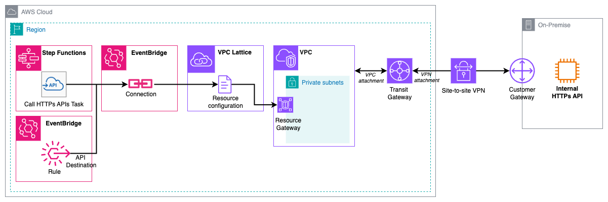

# AWS Step Functions to on-premises API

This pattern demonstrate how to call an on-premises API from a Step Functions state machine, leveraging Amazon EventBridge connection and VPC Lattice resource
gateway and resource configuration.

Important: this application uses various AWS services and there are costs associated with these services after the Free Tier usage - please see the [AWS Pricing page](https://aws.amazon.com/pricing/) for details. You are responsible for any AWS costs incurred. No warranty is implied in this example.

## Requirements

* [Create an AWS account](https://portal.aws.amazon.com/gp/aws/developer/registration/index.html) if you do not already have one and log in. The IAM user that you use must have sufficient permissions to make necessary AWS service calls and manage AWS resources.
* [AWS CLI](https://docs.aws.amazon.com/cli/latest/userguide/install-cliv2.html) installed and configured
* [Git Installed](https://git-scm.com/book/en/v2/Getting-Started-Installing-Git)
* [AWS Cloud Development Kit](https://docs.aws.amazon.com/cdk/latest/guide/cli.html) (AWS CDK) installed

## Deployment Instructions

### Pre-requisites

This example assumes you already have a VPC with a connection to your datacenter (through VPN or Direct Connect) and an API is exposed on-premises and accessible from this VPC.
The VPC and connection to your datacenter are not provided by this example. Refer to this [documentation](https://docs.aws.amazon.com/whitepapers/latest/aws-vpc-connectivity-options/network-to-amazon-vpc-connectivity-options.html) to set up such connectivity.

### Deployment

1. Create a new directory, navigate to that directory in a terminal and clone the GitHub repository:
    ``` 
    git clone https://github.com/aws-samples/serverless-patterns
    ```
2. Change directory to the pattern directory:
    ```
    cd stepfunctions-eventbridge-onpremise-cdk
    ```
3. Edit cdk.json to update the configuration to your setup.
4. From the command line, use CDK to deploy the AWS resources:
    ```
    npm install
    cdk deploy
    ```

   When prompted do you want to deploy the infrastructure, type ```y``` and press enter.

5. Note the outputs from the CDK deployment process. These contain the resource ARNs which are used for testing.

## How it works



1. The HTTP task in Step Functions is leveraging an EventBridge Connection. It defines the target endpoint (e.g. https://my-internal-api.company.com/customer) and HTTP method (e.g. GET) as well as eventual HTTP headers.
2. The EventBridge Connection defines the authentication mechanism (OAuth, Basic or API Key in this case) for the target endpoint as well as the resource configuration to use for a private/internal endpoint.
3. The resource configuration defines the target endpoint itself, generally an on-premise IP address or DNS name (e.g. my-internal-api.company.com). Resource configuration is associated to a resource gateway.
4. The resource gateway "opens a door" to the VPC and allow ingress. It is linked to the chosen subnets (generally private) and is also protected by a security group to further protect your backend API. Note: You could stop here at the VPC level, with a private API deployed in a private subnet.
5. The site-to-site VPN or Direct Connect connection establishes the connection between the AWS cloud (generally with a VPN Gateway or a Transit Gateway) and your datacenter (through a Customer Gateway).
6. Finally, the internal API that resides in your datacenter can be accessed via this "route".

You can get more details in this [blog post](https://community.aws/content/2oExiwtkpK7go3wzAVzzF05ysqu).

## Testing

1. First make sure the EventBridge connection is active. Use the command `aws events describe-connection --name on-premise-connection --query ConnectionState` and verify it is `ACTIVE`. Otherwise, wait for an additional minute and verify again.
2. Go to the AWS Step Functions console and open the state machine deployed by the example (`state-machine-call-onprem`).
3. Click on `Start Execution` on the top right and again in the popup (no input is required for this example).
4. Observe the result. Your on-premise API should be called by the state machine and an eventual result returned to the task.

You can also use the AWS CLI with the following command (make sure to use the output of the cdk command):

```shell
 aws stepfunctions start-execution --state-machine-arn arn:aws:states:us-east-1:123456789012:stateMachine:StateMachine1234-WXYZ
```

## Cleanup
**To avoid incurring future charges, delete the resources created by the CDK code.**
1.	Return to the directory where you deployed your CDK code.
2.	To destroy the infrastructure in AWS, run the command

```bash
    cdk destroy
```
When prompted do you want to destroy the infrastructure, type ```y``` and press enter.

----
Copyright 2025 Amazon.com, Inc. or its affiliates. All Rights Reserved.

SPDX-License-Identifier: MIT-0