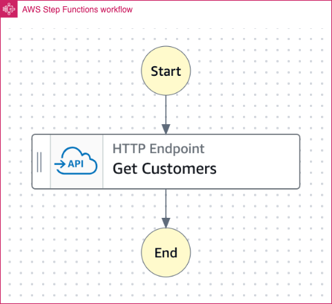

# AWS Step Functions Workflow to demonstrate direct integration with third-party HTTP API

The Step Functions Workflow can be started using the AWS CLI or from another service (e.g. API Gateway).

The SAM template deploys a Step Functions Standard workflow that invokes a third-party API directly. The SAM template contains the required resouces with IAM permission to run the application with logging enabled.

Learn more about this pattern at Serverless Land Patterns: https://serverlessland.com/patterns/stepfunctions-httpendpoint-sam

Important: this application uses various AWS services and there are costs associated with these services after the Free Tier usage - please see the [AWS Pricing page](https://aws.amazon.com/pricing/) for details. You are responsible for any AWS costs incurred. No warranty is implied in this example.

## Requirements

* [Create an AWS account](https://portal.aws.amazon.com/gp/aws/developer/registration/index.html) if you do not already have one and log in. The IAM user that you use must have sufficient permissions to make necessary AWS service calls and manage AWS resources.
* [AWS CLI](https://docs.aws.amazon.com/cli/latest/userguide/install-cliv2.html) installed and configured
* [Git Installed](https://git-scm.com/book/en/v2/Getting-Started-Installing-Git)
* [AWS Serverless Application Model](https://docs.aws.amazon.com/serverless-application-model/latest/developerguide/serverless-sam-cli-install.html) (AWS SAM) installed
* [Stripe Test User](https://stripe.com/docs/connect/express-accounts)

## Deployment Instructions

1. Create a new directory, navigate to that directory in a terminal and clone the GitHub repository:
    ``` 
    git clone https://github.com/aws-samples/serverless-patterns
    ```
2. Change directory to the pattern directory:
    ```
    cd stepfunctions-httpendpoint-sam
    ```
3. Please update the `<USER_UPDATE_ME>` and `<PASSWORD_UPDATE_ME>` in `template.yaml` file with the Strip test user based on [Stripe Documentation](https://stripe.com/docs/connect/express-accounts). `USER_UPDATE_ME` is in format `sk_test_*`. `PASSWORD_UPDATE_ME` can be a random string, it is not validated from Stripe but it can not be set to empty as Amazon EventBridge API Connection with empty password. Please refer to the Stripe documentation for latest user details.

4. From the command line, use AWS SAM to deploy the AWS resources for the pattern as specified in the template.yml file:
    ```
    sam deploy --guided
    ```
5. During the prompts:
    * Enter a stack name
    * Enter `us-east-1` or any AWS Region where you have access. Please refer to the list of supported regions for `Invoke public HTTPS endpoints and test individual states` feature in [recent feature launches](https://docs.aws.amazon.com/step-functions/latest/dg/recent-launches.html) 
    * Allow SAM CLI to create IAM roles with the required permissions.

    Once you have run `sam deploy --guided` mode once and saved arguments to a configuration file (samconfig.toml), you can use `sam deploy` in future to use these defaults.

6. Note the outputs from the SAM deployment process. These contain the resource names and/or ARNs which are used for testing.

## How it works

* Start the Standard Workflow using the `start-execution` api command with a JSON input payload.
* The Workflow directly invokes the third-party API.
* EventBridge API Connection is used for the authentication of the third-party API. 

Please refer to the architecture diagram below:




## Testing

1. Run the following AWS CLI command to start the Step Functions workflow. Note, you must edit the {StateMachineHTTPEndpointArn} placeholder with the ARN of the deployed Step Functions workflow. This is provided in the stack outputs. Please replace {your-region} with the region selected at the time of deployment.

```bash
aws stepfunctions start-execution --state-machine-arn "{StateMachineHTTPEndpointArn}" --region {your-region}
```

This Step Function does not require any input. However, If you need to pass any input to your own AWS Step Function, then you can pass the same using `--input {stringifiedJson}` format. For example:  `--input "{\"orderId\": \"1234567\",\"customerId\": \"98766\",\"orderDate\": \"2024-01-14\",\"amount\": 100,\"nameOnCard\": \"FIRSTNAME LASTNAME\",\"creditCardNumber\": \"1234 1234 1234 1234\",\"expiry\": \"XX/YY\",\"cvv\": \"123\"}"`


### Example output:

```bash
{
    "executionArn": "arn:aws:states:{your-region}:123456789012:execution:StateMachineHTTPEndpoint-mnZFTe6jJSDu:40e520d2-4d3e-42ce-a8e3-b33bfed22fc1",
    "startDate": "2024-01-10T20:06:47.616000+05:30"
}
```

3. Run the following AWS CLI command to get the output of the third-party API call. Note, you must edit the {executionArn} placeholder with the `executionArn` from the above step. Please replace {your-region} with the region selected at the time of deployment.

```bash
aws stepfunctions describe-execution --execution-arn {executionArn} --query 'output' --region {your-region}
```

This will output the response of the third-party API. The same can also be validated from the AWS Step Functions console.


## Cleanup
 
Delete the stack
```bash
    sam delete
```

----
Copyright 2024 Amazon.com, Inc. or its affiliates. All Rights Reserved.

SPDX-License-Identifier: MIT-0
