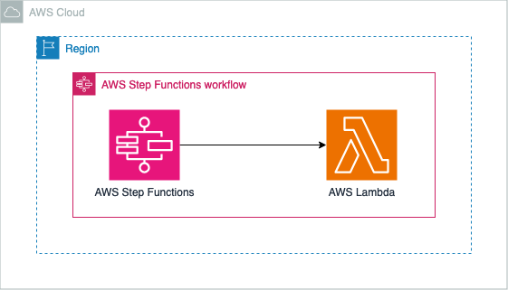

# Serverless Microservices Orchestration with AWS Step Functions and .NET Lambda

This pattern demonstrates how to create a serverless blog processing system using AWS Step Functions to orchestrate multiple AWS Lambda functions. The pattern includes content creation, validation, image processing, and publishing steps, implemented using AWS CDK with .NET.

Learn more about this pattern at Serverless Land Patterns: [Add your pattern link here]

Important: this application uses various AWS services and there are costs associated with these services after the Free Tier usage - please see the [AWS Pricing page](https://aws.amazon.com/pricing/) for details. You are responsible for any AWS costs incurred. No warranty is implied in this example.

## Architecture


## Requirements

* [Create an AWS account](https://portal.aws.amazon.com/gp/aws/developer/registration/index.html) if you do not already have one and log in. The IAM user that you use must have sufficient permissions to make necessary AWS service calls and manage AWS resources.
* [AWS CLI](https://docs.aws.amazon.com/cli/latest/userguide/install-cliv2.html) installed and configured
* [Git Installed](https://git-scm.com/book/en/v2/Getting-Started-Installing-Git)
* [Node and NPM](https://nodejs.org/en/download/) installed
* [AWS Cloud Development Kit](https://docs.aws.amazon.com/cdk/latest/guide/cli.html) (AWS CDK) installed
* [.NET 8](https://dotnet.microsoft.com/download/dotnet/8.0) installed

## Deployment Instructions

1. Create a new directory, navigate to that directory in a terminal and clone the GitHub repository:
    ``` 
    git clone https://github.com/aws-samples/serverless-patterns
    ```
2. Change directory to the pattern directory:
    ```
    cd serverless-patterns/stepfunctions-lambda-dotnet-cdk
    ```
3. Build the .NET Lambda functions:
    ```
    dotnet build src
    ```
4. From the command line, use AWS CDK to deploy the AWS resources for the pattern:
    ```
    cdk deploy
    ```
5. Note the outputs from the CDK deployment process. These contain the resource names and/or ARNs which are used for testing.

## How it works

This pattern deploys a Step Functions state machine that orchestrates a serverless blog processing workflow:

1. Content Creation: A Lambda function creates blog post content.
2. Content Validation: Another Lambda function validates the content.
3. Image Processing: If content is valid, a Lambda function processes associated images.
4. Publishing: A final Lambda function publishes the validated and processed blog post.

The workflow also includes error handling and a mechanism to extract and report the IDs of successfully published blog posts.

## Testing

You can test the deployed Step Functions state machine by starting an execution with a sample input. Here's how you can do it using the AWS CLI:

1. Start an execution of the state machine. Replace `<StateMachineArn>` with the ARN of the deployed state machine, which you can find in the CDK deployment outputs:

```bash
aws stepfunctions start-execution \
--state-machine-arn <StateMachineArn> \
--input '{ 
  "title": "My First Blog Post", 
  "content": "This is the content of my first blog post. It is going to be amazing!", 
  "authorName": "John Doe" 
}'

aws stepfunctions start-execution \
--state-machine-arn <StateMachineArn> \
--input '{ 
  "title": "My First Blog Post", 
  "content": "This is the content of my first blog post. It is going to be amazing! This blog post is about creating AWS StepFunction with Lambda handler using .NET CDK", 
  "authorName": "John Doe" 
}'
```

2. The command will return an execution ARN. You can use this to check the status of the execution:

```bash
aws stepfunctions describe-execution --execution-arn <ExecutionArn>
```

3. Once the execution is complete, you can see the output, which should include the IDs of the published blog posts.

## Cleanup
 
1. Delete the stack
    ```bash
    cdk destroy
    ```
----
Copyright 2023 Amazon.com, Inc. or its affiliates. All Rights Reserved.

SPDX-License-Identifier: MIT-0