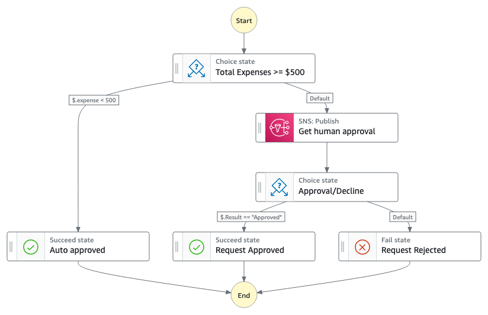

# Filter and Transform Amazon SQS messages with Amazon EventBridge Pipes 

The application will create a Amazon Step Functions State Machine, an Amazon SNS topic, and an Amazon API Gateway REST API. This pattern allows you to integrate a human review or approval process into your workflows. The State Machine task sends a message to an SNS topic which sends a notification to a human reviewer by email. The workflow then waits until the approver completes their review. When the reviewer makes a selection, it will trigger an API that sends the `SendTaskSuccess` [API](https://docs.aws.amazon.com/step-functions/latest/apireference/API_SendTaskSuccess.html) or or `SendTaskFailure` [API](https://docs.aws.amazon.com/step-functions/latest/apireference/API_SendTaskFailure.html) call with the chosen result.
This pattern is implemented with AWS Serverless Application Model (AWS SAM).

Learn more about this pattern at Serverless Land Patterns: https://serverlessland.com/patterns/stepfunctions-sns-apigw-human-review

Important: this application uses various AWS services and there are costs associated with these services after the Free Tier usage - please see the [AWS Pricing page](https://aws.amazon.com/pricing/) for details. You are responsible for any AWS costs incurred. No warranty is implied in this example.

## Requirements

- [Create an AWS account](https://portal.aws.amazon.com/gp/aws/developer/registration/index.html) if you do not already have one and log in. The IAM user that you use must have sufficient permissions to make necessary AWS service calls and manage AWS resources.
- [AWS CLI](https://docs.aws.amazon.com/cli/latest/userguide/install-cliv2.html) installed and configured
- [Git Installed](https://git-scm.com/book/en/v2/Getting-Started-Installing-Git)
- [AWS SAM](https://docs.aws.amazon.com/cdk/latest/guide/cli.html) installed and configured

## Deployment Instructions

1. Create a new directory, navigate to that directory in a terminal and clone the GitHub repository:
   ```
   git clone https://github.com/aws-samples/serverless-patterns
   ```
2. Change directory to the pattern directory:
   ```
   cd serverless-patterns/stepfunctions-sns-apigw-human-review/
   ```
3. From the command line, use AWS SAM to deploy the AWS resources for the pattern as specified in the template.yaml file:
    ```
    sam deploy --guided --capabilities CAPABILITY_IAM CAPABILITY_NAMED_IAM
    ```
4. During the prompts:
    * Enter a stack name
    * Enter `us-east-1` or any other AWS Region. 
    * Enter an email address that should receive the notifications from the workflow.
    * Allow SAM CLI to create IAM roles with the required permissions. Please keep all other options to default.

Once you have run `sam deploy --guided` mode once and saved arguments to a configuration file (samconfig.toml), you can use `sam deploy` in future to use these defaults.

## How it works



1. During the workflow execution, a message is sent to an [Amazon Simple Notification Service (SNS)](https://aws.amazon.com/sns/) topic which sends out a notification via Email. The notification contains links to `Approve` or `Reject` the request. The link contains an API Gateway endpoint with [task token](https://docs.aws.amazon.com/step-functions/latest/dg/connect-to-resource.html#connect-wait-token), which is automatically generated by AWS Step Functions.
2. After approving or denying, the reviewer calls the `SendTaskSuccess` API and passes the task token as well as the review result.
3. The Step Function assesses the outcome and moves the workflow to the next task.

## Testing

1. After deployment you receive an email titled `AWS Notification - Subscription Confirmation`. To confirm your subscription, click on the link provided in the email. This will allow SNS to send you emails.
2. Navigate to the AWS Step Functions console and select the step function workflow.
3. Select `Start Execution` and use the JSON payload listed below as input.
   ```
   {
      "expense": 900
   }
   ```
4. Select `Start Execution` and wait until you receive the email from SNS.
5. Select the review response as `Approve`.
6. Observe the task in the Step Functions console. Since the response confirms the approval, the task moved to the `Request Approved` step.
7. If you trigger a new execution and select the review response as `Decline` in step 6, the workflow transitions to `Request Rejected` step. 

## Delete stack

```
sam delete
```

---

Copyright 2023 Amazon.com, Inc. or its affiliates. All Rights Reserved.

SPDX-License-Identifier: MIT-0
