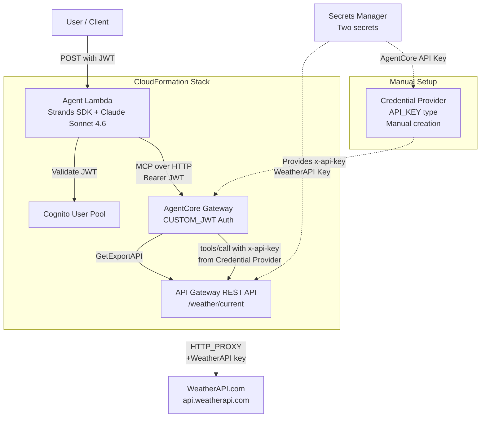
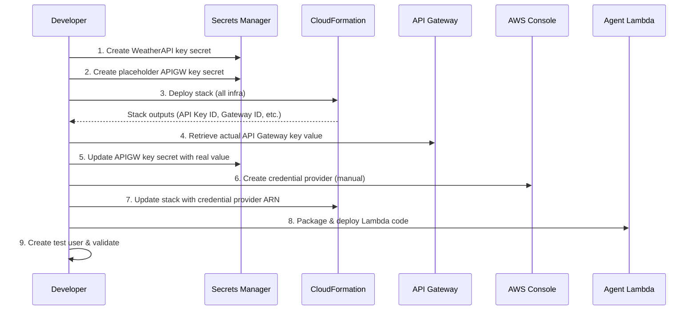

# Design Document: AgentCore API Gateway Weather Agent

## Overview

This design describes a serverless AI weather agent built on AWS Bedrock AgentCore Gateway using the API Gateway target type. The system enables users to ask natural language weather questions, which are processed by a Strands SDK agent (Claude Sonnet 4.6) that invokes weather tools discovered automatically from an API Gateway REST API via AgentCore's `GetExportAPI` mechanism.

The architecture has five layers:

1. **Agent Lambda** — Strands SDK agent handling natural language → tool invocation → response
2. **Cognito** — JWT-based user authentication for the AgentCore Gateway
3. **AgentCore Gateway** — MCP-based gateway with API Gateway target, auto-discovering weather operations
4. **API Gateway REST API** — Exposes `/weather/current` endpoint, validates API keys via usage plan
5. **WeatherAPI.com** — External weather data provider, accessed via HTTP_PROXY integration

Two independent API keys are in play:
- **AgentCore → API Gateway**: Managed by the AgentCore Identity credential provider, injected as `x-api-key` header
- **API Gateway → WeatherAPI.com**: Stored separately, injected by the API Gateway integration into downstream requests

The credential provider cannot be created via CloudFormation and requires a multi-step deployment process.

### Key Design Decisions

1. **API Gateway target (not OpenAPI target)**: AgentCore auto-discovers the API spec via `GetExportAPI`, eliminating manual OpenAPI spec management. This is simpler but means the spec is derived from API Gateway's export, not a hand-crafted document.

2. **HTTP_PROXY integration**: API Gateway proxies directly to WeatherAPI.com without Lambda intermediaries, keeping latency low and cost minimal.

3. **WeatherAPI key via stage variable**: The WeatherAPI.com key is injected into the integration request via a stage variable referenced in a query string mapping. This avoids a Lambda authorizer or VTL complexity while keeping the key out of the template.

4. **Reuse existing agent code**: The handler, agent_processor, and strands_client modules from `handoff/src/agent/` are used as-is. The shared utilities (models, JWT, logging, errors) from `handoff/src/shared/` are also reused unchanged.

5. **us-east-1 deployment**: All resources deploy to us-east-1 due to BedrockAgentCore service availability constraints.

## Architecture



### Deployment Sequence



## Components and Interfaces

### 1. CloudFormation Template (`infrastructure/cloudformation-template.yaml`)

The single CloudFormation template defines all provisionable resources. Key resource groups:

#### API Gateway Resources
| Resource | Type | Purpose |
|----------|------|---------|
| `RestApi` | `AWS::ApiGateway::RestApi` | REST API with `ApiKeySourceType: HEADER` |
| `WeatherResource` | `AWS::ApiGateway::Resource` | `/weather` path segment |
| `WeatherCurrentResource` | `AWS::ApiGateway::Resource` | `/weather/current` path segment |
| `GetCurrentWeatherMethod` | `AWS::ApiGateway::Method` | GET method, `ApiKeyRequired: true`, HTTP_PROXY integration |
| `ApiDeployment` | `AWS::ApiGateway::Deployment` | Deployment (DependsOn all methods) |
| `ApiStage` | `AWS::ApiGateway::Stage` | Stage with WeatherAPI key stage variable |
| `ApiKey` | `AWS::ApiGateway::ApiKey` | API key for AgentCore access (DependsOn stage) |
| `UsagePlan` | `AWS::ApiGateway::UsagePlan` | Usage plan referencing stage |
| `UsagePlanKey` | `AWS::ApiGateway::UsagePlanKey` | Links ApiKey to UsagePlan |

#### AgentCore Resources
| Resource | Type | Purpose |
|----------|------|---------|
| `AgentCoreGateway` | `AWS::BedrockAgentCore::Gateway` | Gateway with CUSTOM_JWT auth |
| `WeatherAPITarget` | `AWS::BedrockAgentCore::GatewayTarget` | API Gateway target with credential provider config |

#### Auth Resources
| Resource | Type | Purpose |
|----------|------|---------|
| `CognitoUserPool` | `AWS::Cognito::UserPool` | User pool for JWT auth |
| `CognitoUserPoolClient` | `AWS::Cognito::UserPoolClient` | Client with USER_PASSWORD_AUTH + REFRESH_TOKEN_AUTH |

#### Compute Resources
| Resource | Type | Purpose |
|----------|------|---------|
| `AgentLambdaFunction` | `AWS::Lambda::Function` | Python 3.12, x86_64, 120s timeout, 1024MB memory |
| `AgentLambdaRole` | `AWS::IAM::Role` | Lambda execution role |
| `GatewayExecutionRole` | `AWS::IAM::Role` | Gateway execution role |

### 2. Agent Lambda (Existing Code — Reused)

The Lambda code is reused from `handoff/src/`:

```
src/
├── agent/
│   ├── handler.py             # Lambda entry point — JWT validation, request/response
│   ├── agent_processor.py     # Creates MCPClient + Strands Agent, runs agentic loop
│   └── strands_client.py      # Factory: create_mcp_client(), create_agent()
└── shared/
    ├── models.py              # UserContext, AgentRequest, AgentResponse
    ├── logging_utils.py       # StructuredLogger with request ID correlation
    ├── error_utils.py         # ErrorHandler with HTTP status codes
    └── jwt_utils.py           # JWT validation via Cognito JWKS
```

**Interface**: Lambda receives events with `Authorization` header (Bearer JWT) and JSON body `{"prompt": "...", "session_id": "..."}`. Returns `{"response": "...", "session_id": "...", "user_context": {...}}`.

### 3. Deployment Script (`scripts/deploy.sh`)

Shell script automating the multi-step deployment:

```
Input Parameters:
  --environment-name    Environment name (e.g., dev, staging, prod)
  --weather-api-key     WeatherAPI.com API key
  --region              AWS region (default: us-east-1)
  --s3-bucket           S3 bucket for Lambda code (if >50MB)

Steps:
  1. Validate CloudFormation template
  2. Create/update Secrets Manager secrets
  3. Deploy CloudFormation stack
  4. Retrieve API Gateway key value
  5. Update Secrets Manager with real key
  6. Print credential provider setup instructions
  7. Package Lambda (pip install --platform manylinux2014_x86_64 --python-version 3.12, preserve .dist-info)
  8. Deploy Lambda code (S3 if >50MB, direct otherwise)
```

### 4. Credential Provider (Manual — Not in CloudFormation)

Created manually via AWS Console after initial stack deployment:
- Type: API Key
- Secret ARN: Points to the Secrets Manager secret holding the API Gateway API key
- Credential Location: HEADER
- Parameter Name: `x-api-key`

The ARN is then passed back into the CloudFormation template as the `CredentialProviderArn` parameter for the GatewayTarget.

## Data Models

### CloudFormation Parameters

```yaml
Parameters:
  EnvironmentName:
    Type: String
    Description: Environment name for resource namespacing
    Default: dev
  WeatherApiKeySecretArn:
    Type: String
    Description: ARN of Secrets Manager secret containing WeatherAPI.com key
  CredentialProviderArn:
    Type: String
    Description: ARN of the manually-created AgentCore credential provider
    Default: ''  # Empty on first deploy, populated after manual creation
```

### CloudFormation Outputs

```yaml
Outputs:
  GatewayId:
    Value: !Ref AgentCoreGateway
  RestApiId:
    Value: !Ref RestApi
  ApiKeyId:
    Value: !Ref ApiKey
  UserPoolId:
    Value: !Ref CognitoUserPool
  UserPoolClientId:
    Value: !Ref CognitoUserPoolClient
  CognitoJwksUrl:
    Value: !Sub 'https://cognito-idp.${AWS::Region}.amazonaws.com/${CognitoUserPool}/.well-known/jwks.json'
  AgentLambdaArn:
    Value: !GetAtt AgentLambdaFunction.Arn
  ApiEndpointUrl:
    Value: !Sub 'https://${RestApi}.execute-api.${AWS::Region}.amazonaws.com/${EnvironmentName}'
```

### API Gateway Integration Request Mapping

The GET method on `/weather/current` maps query parameters and injects the WeatherAPI key:

```yaml
Integration:
  Type: HTTP_PROXY
  IntegrationHttpMethod: GET
  Uri: 'https://api.weatherapi.com/v1/current.json'
  RequestParameters:
    integration.request.querystring.q: method.request.querystring.q
    integration.request.querystring.key: stageVariables.weatherApiKey
```

The stage variable `weatherApiKey` is set during deployment from the Secrets Manager secret value.

### Existing Data Models (Reused)

From `handoff/src/shared/models.py`:

- **UserContext**: `user_id`, `username`, `client_id` — extracted from JWT claims
- **AgentRequest**: `prompt`, `jwt_token`, `session_id` — parsed from Lambda event
- **AgentResponse**: `response`, `session_id`, `user_context` — returned as Lambda response with 200 status

### IAM Permission Model

**Agent Lambda Role** permissions:
- `bedrock:InvokeModel`, `bedrock:InvokeModelWithResponseStream`, `bedrock:Converse`, `bedrock:ConverseStream` on `*`
- `bedrock-agentcore:GetGateway` on the Gateway resource
- `logs:CreateLogGroup`, `logs:CreateLogStream`, `logs:PutLogEvents` on CloudWatch Logs

**Gateway Execution Role** permissions:
- `bedrock-agentcore:GetWorkloadAccessToken` on workload-identity-directory resources (2 ARN patterns)
- `bedrock-agentcore:GetResourceApiKey` on 4 ARN patterns (token-vault/default, token-vault/default/apikeycredentialprovider/*, workload-identity-directory/default, workload-identity-directory/default/workload-identity/{GatewayName}-*)
- `secretsmanager:GetSecretValue` on `bedrock-agentcore-identity!default/apikey/*`
- `apigateway:GET` on REST API exports resource (for GetExportAPI)


## Correctness Properties

*A property is a characteristic or behavior that should hold true across all valid executions of a system — essentially, a formal statement about what the system should do. Properties serve as the bridge between human-readable specifications and machine-verifiable correctness guarantees.*

### Property 1: Deployment depends on all methods

*For any* API Gateway Method resource defined in the CloudFormation template, the Deployment resource's `DependsOn` list must include that method's logical ID. This ensures no deployment occurs before all routes are configured — a missing dependency causes an empty API.

**Validates: Requirements 1.7**

### Property 2: Agent Lambda role includes all required Bedrock actions

*For any* action in the set {`bedrock:InvokeModel`, `bedrock:InvokeModelWithResponseStream`, `bedrock:Converse`, `bedrock:ConverseStream`}, the Agent Lambda execution role's policy must include that action. Missing `ConverseStream` specifically causes `AccessDeniedException` at runtime because the Strands SDK uses the ConverseStream API internally.

**Validates: Requirements 6.1**

### Property 3: Gateway role includes all four GetResourceApiKey ARN patterns

*For any* ARN pattern in the set {`token-vault/default`, `token-vault/default/apikeycredentialprovider/*`, `workload-identity-directory/default`, `workload-identity-directory/default/workload-identity/{GatewayName}-*`}, the Gateway execution role's `GetResourceApiKey` statement must include a resource matching that pattern. Missing any single pattern causes "Internal Error" on `tools/call` while `tools/list` works fine — a notoriously hard-to-debug failure.

**Validates: Requirements 6.4**

### Property 4: All named resources use EnvironmentName for namespacing

*For any* resource in the CloudFormation template that has a `Name` property (or equivalent naming field), the name value must reference the `EnvironmentName` parameter (via `!Sub` or `!Ref`). This ensures multiple environments can be deployed without naming collisions.

**Validates: Requirements 8.2**

### Property 5: All required outputs are defined

*For any* output name in the set {`GatewayId`, `RestApiId`, `ApiKeyId`, `UserPoolId`, `UserPoolClientId`, `CognitoJwksUrl`, `AgentLambdaArn`, `ApiEndpointUrl`}, the CloudFormation template's Outputs section must define that output. Missing outputs break the deployment script and downstream consumers.

**Validates: Requirements 8.4**

## Error Handling

### Agent Lambda Errors

The existing `ErrorHandler` class (from `handoff/src/shared/error_utils.py`) handles all Lambda error scenarios:

| Scenario | HTTP Status | Error Code | Handler Method |
|----------|-------------|------------|----------------|
| Missing/invalid Authorization header | 401 | AuthenticationError | `handle_authentication_error` |
| JWT validation failure | 401 | AuthenticationError | `handle_authentication_error` |
| Missing `prompt` in body | 400 | MissingParameterError | `handle_missing_parameter_error` |
| Invalid JSON body | 400 | ValidationError | `handle_validation_error` |
| Agent processing failure | 500 | InternalError | `handle_generic_error` |
| AWS service error | Varies (400-500) | AWS error code | `handle_aws_error` |

### API Gateway Errors

| Scenario | HTTP Status | Response |
|----------|-------------|----------|
| Missing x-api-key header | 403 | `{"message": "Forbidden"}` |
| Invalid API key | 403 | `{"message": "Forbidden"}` |
| WeatherAPI.com unreachable | 502 | Bad Gateway (HTTP_PROXY passthrough) |
| WeatherAPI.com returns error | Passthrough | HTTP_PROXY forwards upstream status |

### AgentCore Gateway Errors

| Scenario | Root Cause | Symptom |
|----------|-----------|---------|
| Missing GetResourceApiKey ARN pattern | IAM policy incomplete | "Internal Error" on `tools/call`, `tools/list` works |
| Credential provider not created | Manual step skipped | Target cannot authenticate to API Gateway |
| API Gateway stage not deployed | Deployment ordering | GetExportAPI returns empty spec |
| Invalid JWT | Token expired or wrong issuer | 401 from Gateway |

### Deployment Script Error Handling

The deployment script should:
- Exit on any `aws cloudformation` failure (set -e)
- Validate template before deploy to catch syntax errors early
- Check stack status after create/update and report failures
- Verify the API Gateway key was retrieved successfully before updating Secrets Manager

## Testing Strategy

### Unit Tests (pytest)

Unit tests validate the CloudFormation template structure by parsing the YAML and checking resource configurations. These are specific example-based checks:

1. **Template structure tests** (`tests/unit/test_cloudformation_template.py`):
   - RestApi has `ApiKeySourceType: HEADER`
   - Resource path hierarchy: `/weather` → `/weather/current`
   - GET method has `ApiKeyRequired: true` and `AuthorizationType: NONE`
   - Integration type is `HTTP_PROXY` with correct URI
   - Query parameter `q` is mapped through
   - WeatherAPI key injection via stage variable
   - Stage references Deployment
   - ApiKey depends on Stage
   - UsagePlan references Stage
   - UsagePlanKey links ApiKey to UsagePlan
   - Gateway has `AuthorizerType: CUSTOM_JWT` with correct JWT config
   - GatewayTarget uses `ApiGateway` block (not `OpenApiSchema`)
   - GatewayTarget references RestApi and Stage
   - Credential provider config has `API_KEY` type
   - Cognito UserPool and UserPoolClient exist with correct auth flows
   - Lambda has `python3.12`, `x86_64`, timeout >= 120, memory >= 1024
   - Lambda environment variables include GATEWAY_ID, COGNITO_JWKS_URL, BEDROCK_MODEL_ID
   - Template parameters include EnvironmentName, WeatherApiKeySecretArn, CredentialProviderArn
   - Agent Lambda role includes `bedrock-agentcore:GetGateway`
   - Gateway role includes `GetWorkloadAccessToken`, `secretsmanager:GetSecretValue`, `apigateway:GET`
   - Agent Lambda role includes CloudWatch Logs permissions

2. **Deployment script tests** (`tests/unit/test_deploy_script.py`):
   - Script accepts `--environment-name` parameter
   - Script contains credential provider setup instructions output

### Property-Based Tests (pytest + hypothesis)

Property-based tests use the `hypothesis` library to verify universal properties across generated inputs. Each test runs a minimum of 100 iterations.

Each property test must be tagged with a comment in the format:
**Feature: agentcore-apigw-weather-agent, Property {number}: {property_text}**

1. **Property 1 test**: Generate random sets of API Gateway Method logical IDs. For each set, verify that a compliant template's Deployment `DependsOn` includes all of them.

2. **Property 2 test**: Generate random subsets of the four required Bedrock actions. Verify that the Lambda role policy always contains the full required set (not just the generated subset).

3. **Property 3 test**: Generate random subsets of the four required ARN patterns. Verify that the Gateway role's `GetResourceApiKey` statement always contains all four patterns (not just the generated subset).

4. **Property 4 test**: Generate random resource names and verify that a compliant naming function always incorporates the EnvironmentName parameter.

5. **Property 5 test**: Generate random subsets of the eight required output names. Verify that the template's Outputs section always contains the full required set.

### Integration Tests (`tests/integration/test_e2e.py`)

Integration tests run against a deployed stack:

1. **API Gateway 403 test**: Call the API Gateway endpoint without an API key, verify 403 response.
2. **End-to-end agent test**: Authenticate via Cognito, obtain JWT, send weather query to Agent Lambda, verify response contains weather data.

### Test Configuration

- **Property-based testing library**: `hypothesis` (Python)
- **Minimum iterations**: 100 per property test (`@settings(max_examples=100)`)
- **Unit test framework**: `pytest`
- **Each property test references its design property via comment tag**
- **Each correctness property is implemented by a single property-based test**
