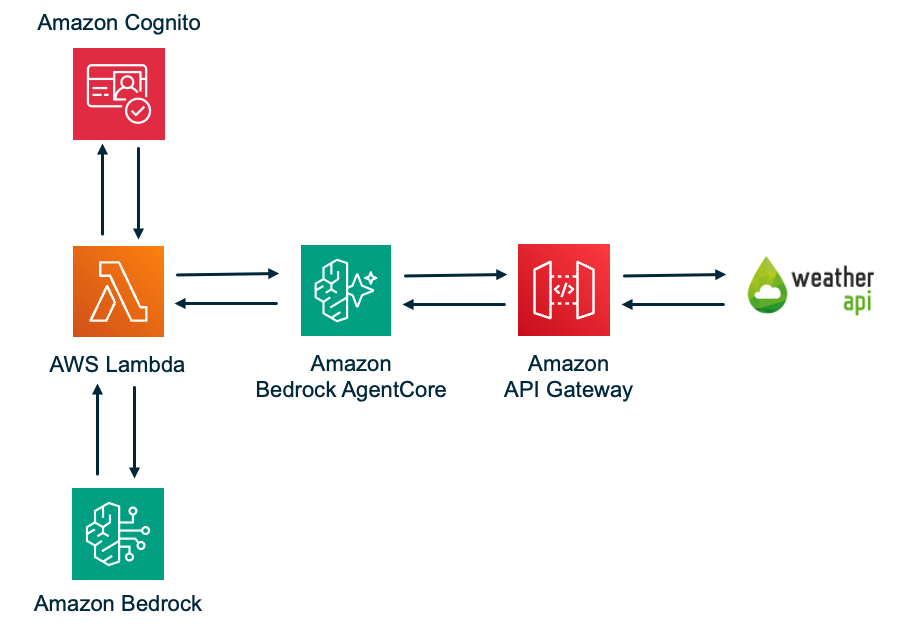

# AgentCore API Gateway Weather Agent

A serverless AI weather agent built on AWS Bedrock AgentCore. Uses the Strands SDK to orchestrate an LLM (Claude Sonnet 4.6) that calls weather tools exposed through an AgentCore Gateway backed by API Gateway and WeatherAPI.com.

## Architecture



```
User → Agent Lambda → AgentCore Gateway (MCP) → API Gateway → WeatherAPI.com
         │                    │                      │
    Strands Agent        CUSTOM_JWT Auth         API Key Auth
    + BedrockModel       + MCP Routing           (credential
    + MCPClient          + Tool Discovery         provider)
         │
    Cognito JWT
    Validated
```

The LLM decides which tool to call. AgentCore auto-discovers available tools from the API Gateway's OpenAPI export and presents them to the agent via MCP `tools/list`. When the agent calls a tool, AgentCore routes the request to API Gateway, authenticating with an API key managed by a credential provider.

## Prerequisites

- AWS SAM CLI ([install guide](https://docs.aws.amazon.com/serverless-application-model/latest/developerguide/install-sam-cli.html))
- AWS CLI 2.28+ (required for `bedrock-agentcore-control` commands)
- Python 3 with `pip` (any recent 3.x — used only to drive the build; the Lambda's Linux dependencies are downloaded as prebuilt wheels, so a local `python3.12` is not required)
- GNU Make (preinstalled on macOS and most Linux distros)
- A [WeatherAPI.com](https://www.weatherapi.com/) API key (free tier works)
- AWS account with Bedrock and AgentCore enabled in `us-east-1`

> **No Docker required.** `sam build` uses a Makefile custom build (`src/Makefile`) that downloads `manylinux` wheels for the Lambda runtime, so the build works on any host OS without Docker or a matching local Python version.

## Quick Start

### Step 1: Open a Terminal

Open a terminal on your machine and navigate to where you want to clone the project.

### Step 2: Clone the Repository

```bash
git clone https://github.com/aws-samples/serverless-patterns
cd serverless-patterns/strands-agentcore-apigw
```

### Step 3: Deploy

```bash
./scripts/deploy.sh \
  --environment-name dev \
  --weather-api-key YOUR_WEATHERAPI_KEY \
  --region us-east-1
```

The default LLM is `us.anthropic.claude-sonnet-4-6`. To use a different model, add `--bedrock-model-id`:

```bash
./scripts/deploy.sh \
  --environment-name dev \
  --weather-api-key YOUR_WEATHERAPI_KEY \
  --bedrock-model-id us.anthropic.claude-haiku-4-5-20251001-v1:0
```

See [Changing the Model](#changing-the-model) for available model IDs.

The script handles everything in order:
1. Validates the SAM template (`sam validate`)
2. Creates Secrets Manager secrets (WeatherAPI key + API Gateway key)
3. Builds the application with `sam build` (a Makefile custom build downloads `manylinux` wheels matching the Lambda runtime — no Docker needed)
4. Deploys the stack with `sam deploy` (API Gateway, AgentCore Gateway, Cognito, Lambda, IAM)
5. Retrieves the API Gateway key and updates Secrets Manager
6. Creates/updates the AgentCore credential provider via CLI
7. Re-deploys with the credential provider ARN
8. Creates a test user in Cognito
9. Generates `scripts/test.sh` with baked-in values

### Step 4: Test

```bash
./scripts/test.sh
./scripts/test.sh 'What is the weather in Liverpool, England?'
```

The test script authenticates via Cognito, gets an ID token, and invokes the Lambda with your prompt.

## Parameters

| Parameter | Required | Description |
|-----------|----------|-------------|
| `--environment-name` | Yes | Environment name (e.g. `dev`, `staging`, `prod`). Used for resource namespacing. |
| `--weather-api-key` | Yes | Your WeatherAPI.com API key |
| `--region` | No | AWS region (default: `us-east-1`) |
| `--s3-bucket` | No | S3 bucket for SAM deployment artifacts. If omitted, SAM uses its own managed bucket (`--resolve-s3`). |
| `--bedrock-model-id` | No | Bedrock model ID (default: `us.anthropic.claude-sonnet-4-6`) |


## Project Structure

```
├── infrastructure/
│   └── template.yaml                  # SAM template: API GW, AgentCore, Cognito, Lambda, IAM
├── scripts/
│   ├── deploy.sh                      # One-command SAM deployment script
│   └── test.sh                        # Generated after deploy — end-to-end test
├── src/
│   ├── requirements.txt               # Lambda dependencies (used by the build)
│   ├── Makefile                       # SAM custom build — downloads manylinux wheels (no Docker)
│   ├── agent/
│   │   ├── handler.py                 # Lambda entry point
│   │   ├── agent_processor.py         # MCP client + Strands Agent lifecycle
│   │   └── strands_client.py          # Factory functions
│   └── shared/
│       ├── models.py                  # UserContext, AgentRequest, AgentResponse
│       ├── jwt_utils.py               # JWT validation (Cognito ID tokens)
│       ├── error_utils.py             # Error handling
│       └── logging_utils.py           # Structured logging
├── tests/
│   ├── unit/
│   │   ├── test_cloudformation_template.py
│   │   ├── test_properties.py         # Property-based tests
│   │   └── conftest.py
│   └── integration/
│       └── test_e2e.py
├── handoff/                           # Reference patterns (do not modify)
├── requirements.txt                   # Dev/test dependencies
└── README.md
```

## Changing the Model

The model is controlled by the `--bedrock-model-id` parameter. Claude Sonnet 4.6 and newer models on Bedrock **require a cross-region inference profile ID** — using the bare `anthropic.*` model ID will result in a `ValidationException`.

Profile IDs follow the pattern `<routing>.<model-id>`:
- `us.*` — routes within the US (lower latency for US-based workloads)
- `global.*` — routes globally (higher availability)

### Available Claude 4.x inference profiles

| Profile ID | Model |
|------------|-------|
| `us.anthropic.claude-sonnet-4-6` | Claude Sonnet 4.6 (US) — **default** |
| `global.anthropic.claude-sonnet-4-6` | Claude Sonnet 4.6 (Global) |
| `us.anthropic.claude-sonnet-4-5-20250929-v1:0` | Claude Sonnet 4.5 (US) |
| `us.anthropic.claude-sonnet-4-20250514-v1:0` | Claude Sonnet 4 (US) |
| `us.anthropic.claude-opus-4-7` | Claude Opus 4.7 (US) |
| `us.anthropic.claude-haiku-4-5-20251001-v1:0` | Claude Haiku 4.5 (US) — fastest/cheapest |

### Example

```bash
./scripts/deploy.sh \
  --environment-name dev \
  --weather-api-key YOUR_WEATHERAPI_KEY \
  --bedrock-model-id us.anthropic.claude-haiku-4-5-20251001-v1:0
```

### Changing the model on an existing deployment

Re-run `deploy.sh` with the new model ID — no teardown needed. SAM rebuilds and redeploys the stack:

```bash
./scripts/deploy.sh \
  --environment-name dev \
  --weather-api-key YOUR_WEATHERAPI_KEY \
  --bedrock-model-id us.anthropic.claude-opus-4-7
```

Alternatively, update just the Lambda environment variable directly (faster, skips infrastructure steps):

```bash
# 1. Get current environment variables
CURRENT_ENV=$(aws lambda get-function-configuration \
  --function-name dev-weather-agent \
  --region us-east-1 \
  --query 'Environment.Variables' --output json)

# 2. Update BEDROCK_MODEL_ID in place
NEW_ENV=$(echo $CURRENT_ENV | python3 -c "
import json, sys
env = json.load(sys.stdin)
env['BEDROCK_MODEL_ID'] = 'us.anthropic.claude-opus-4-7'
print(json.dumps({'Variables': env}))
")

# 3. Apply
aws lambda update-function-configuration \
  --function-name dev-weather-agent \
  --environment "$NEW_ENV" \
  --region us-east-1
```

To list all available inference profiles in your account:

```bash
aws bedrock list-inference-profiles --region us-east-1 \
  --query "inferenceProfileSummaries[].{id:inferenceProfileId,name:inferenceProfileName}" \
  --output table
```

## Teardown

```bash
# Delete credential provider (managed via CLI, not the stack)
aws bedrock-agentcore-control delete-api-key-credential-provider \
  --name dev-weather-apigw-key --region us-east-1

# Delete the stack
sam delete --stack-name dev-weather-agent --region us-east-1 --no-prompts

# Delete secrets
aws secretsmanager delete-secret --secret-id "dev/weather-api-key" \
  --force-delete-without-recovery --region us-east-1
aws secretsmanager delete-secret --secret-id "dev/apigw-api-key" \
  --force-delete-without-recovery --region us-east-1
```

Replace `dev` with your environment name if different.

## Running Tests

```bash
# Unit tests
python3 -m pytest tests/unit/ -v

# Property-based tests
python3 -m pytest tests/unit/test_properties.py -v
```

## Key Implementation Notes

- **Two separate API keys**: One for AgentCore → API Gateway (managed by credential provider), another for API Gateway → WeatherAPI.com (injected via stage variable from Secrets Manager)
- **SAM build without Docker (Makefile custom build)**: The Agent Lambda uses `BuildMethod: makefile` (see `src/Makefile`). Instead of Docker or a host pip install, the Makefile runs a two-step `pip install --platform manylinux2014_x86_64 --python-version 3.12 --only-binary=:all:` that downloads prebuilt Linux wheels for binary dependencies (`cryptography`, `cffi`). This makes `sam build` work on any host OS with no Docker and no local `python3.12`. (The two-step install is needed because `--only-binary=:all:` with `--platform` silently skips pure-Python packages, so a second `--no-deps` pass installs those explicitly.)
- **JWT validation**: Accepts both access and ID tokens. Audience verification is disabled (AgentCore Gateway handles it via `AllowedAudience`)
- **Credential provider**: Provisioned via CLI (`bedrock-agentcore-control`), not the SAM stack. The deploy script auto-detects CLI support and creates/updates it between deploys, with a fallback to manual instructions. AgentCore reached GA with CloudFormation support in September 2025 and `AWS::BedrockAgentCore::ApiKeyCredentialProvider` is now an available resource type, so folding it into the template is a possible future simplification.
- **Region**: Must be `us-east-1` (AgentCore availability)
- **Bedrock model ID — inference profile required**: Claude Sonnet 4.6 does not support direct on-demand invocation on Bedrock. You must use a cross-region inference profile ID. The default is `us.anthropic.claude-sonnet-4-6` (US profile). Using the bare `anthropic.claude-sonnet-4-6` ID will result in a `ValidationException`. If you need global routing, use `global.anthropic.claude-sonnet-4-6` instead.
- **SAM template**: The Lambda is an `AWS::Serverless::Function` — SAM generates its execution role (from the inline `Policies`) and log group, and `sam build`/`sam deploy` handle packaging and upload. The remaining resources (AgentCore Gateway and target, API Gateway, Cognito, the Gateway execution role) are plain CloudFormation resources included in the SAM template unchanged, since SAM offers no shorthand for them.

---

Copyright 2026 Amazon.com, Inc. or its affiliates. All Rights Reserved.

SPDX-License-Identifier: MIT-0
