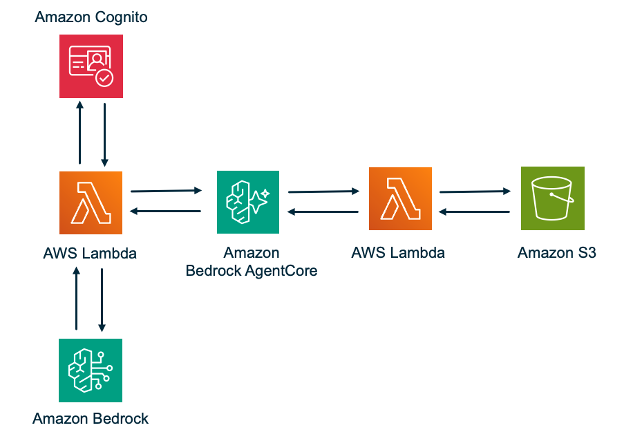

# Serverless AI Agent Gateway

A serverless AI agent system that enables natural language AWS resource management using the Strands Agents SDK, AWS Bedrock, and AgentCore Gateway with MCP protocol. Features JWT-based authentication via Cognito and end-to-end user context propagation.

## Architecture




```
User → Cognito (JWT) → Agent Lambda → AgentCore Gateway (MCP) → Interceptor Lambda → Tool Lambda → AWS Services
                          │                    │                        │                    │
                    Strands Agent         JWT Validated           JWT Claims            User Context
                    + BedrockModel        + MCP Routing           Extracted &            Received &
                    + MCPClient                                   Injected               Logged
```

### Components

| Component | Description | Runtime |
|-----------|-------------|---------|
| Cognito User Pool | JWT access token authentication | Managed |
| Agent Lambda | Strands Agent with `us.anthropic.claude-sonnet-4-6` via BedrockModel, MCPClient for tool discovery/execution | Python 3.12, 1024MB, 120s |
| AgentCore Gateway | MCP protocol gateway with CUSTOM_JWT authorizer and REQUEST interceptor | Managed |
| Interceptor Lambda | Extracts JWT claims (`sub`, `username`, `client_id`) and injects `user_context` into tool arguments | Python 3.12, 128MB, 5s |
| Tool Lambda | Executes AWS operations (S3 ListBuckets) with user attribution | Python 3.12, 256MB, 10s |

### Strands SDK Integration

The Agent Lambda uses the [Strands Agents SDK](https://github.com/strands-agents/sdk-python) for AI orchestration:

```python
# strands_client.py — Factory functions
from strands import Agent
from strands.models.bedrock import BedrockModel
from strands.tools.mcp import MCPClient
from mcp.client.streamable_http import streamablehttp_client

# MCPClient connects to AgentCore Gateway MCP endpoint with JWT auth
mcp_client = MCPClient(
    lambda: streamablehttp_client(
        url=gateway_url,
        headers={"Authorization": f"Bearer {jwt_token}"},
    )
)

# Agent wires together model + tools
agent = Agent(
    model=BedrockModel(model_id="us.anthropic.claude-sonnet-4-6", region_name="us-east-1"),
    tools=[mcp_client],
    system_prompt="You are a helpful AI assistant with access to tools...",
)

# Single call drives the full agentic loop (tool discovery, selection, execution)
result = agent("List my S3 buckets")
```

Key design decisions:
- MCPClient is created per-request (carries the user's JWT token)
- Gateway URL is cached at the Lambda container level via `get_gateway` API
- The Strands SDK handles the full agentic loop: tool discovery via MCP `tools/list`, Claude tool selection, MCP `tools/call` execution, and response formatting
- No hardcoded tool definitions — tools are discovered dynamically from the Gateway

### Why the Interceptor Lambda

AgentCore Gateway validates JWT tokens but does not extract claims or pass user identity to tool targets. The Interceptor Lambda bridges this gap:

1. Gateway invokes Interceptor with the original request including JWT in headers
2. Interceptor decodes JWT and extracts `sub`, `username`, `client_id`
3. Interceptor injects `user_context` into the MCP tool arguments
4. Gateway forwards the transformed request to the Tool Lambda
5. Tool Lambda receives complete user context for attribution and logging

Without the Interceptor, Tool Lambda would have no knowledge of which user initiated the request.

## Project Structure

```
├── src/
│   ├── agent/                    # Agent Lambda
│   │   ├── handler.py            # Lambda entry point — JWT validation, request parsing
│   │   ├── agent_processor.py    # Orchestrates Strands Agent per invocation
│   │   └── strands_client.py     # Factory: MCPClient, BedrockModel, Agent
│   ├── interceptor/
│   │   └── handler.py            # REQUEST interceptor — JWT claim extraction
│   ├── tool/
│   │   └── handler.py            # MCP tool execution with user attribution
│   └── shared/
│       ├── models.py             # Dataclasses: UserContext, AgentRequest, ToolRequest, etc.
│       ├── jwt_utils.py          # JWT validation and claim extraction
│       ├── logging_utils.py      # Structured logging with user context
│       └── error_utils.py        # Error handling, retry with backoff
├── tests/
│   ├── test_strands_client.py    # Property tests for Strands SDK factories
│   ├── test_agent_processor.py   # Property tests for AgentProcessor
│   ├── test_migration_checks.py  # Property tests for migration correctness
│   ├── test_shared_models.py     # Unit tests for data models
│   ├── test_tool_handler.py      # Unit tests for tool execution
│   └── test_integration.py       # Integration tests
├── infrastructure/
│   ├── cloudformation-template.yaml  # All AWS resources
│   ├── deploy_stack.py               # CloudFormation deployment
│   ├── validate_template.py          # Template validation
│   └── validate_deployment.py        # Post-deploy resource checks
├── agent-lambda-deps/            # Pre-built Linux wheels for Agent Lambda
├── agent-requirements.txt        # Agent Lambda pip dependencies
├── requirements.txt              # Dev/test dependencies
├── deploy_all.py                 # Package + upload all 3 Lambdas
├── package_agent_lambda.py       # Package Agent Lambda zip
├── package_interceptor_lambda.py # Package Interceptor Lambda zip
├── package_tool_lambda.py        # Package Tool Lambda zip
├── upload_agent_lambda.py        # Upload Agent Lambda to AWS
├── upload_interceptor_lambda.py  # Upload Interceptor Lambda to AWS
├── upload_tool_lambda.py         # Upload Tool Lambda to AWS
├── create_cognito_user.py        # Create test user in Cognito
├── test_e2e_flow.py              # End-to-end validation script
├── setup.py                      # Package setup (editable install)
└── setup.sh                      # Dev environment setup
```

## AWS Services Used

| Service | Purpose |
|---------|---------|
| Cognito | User pool + app client for JWT access tokens |
| Lambda (×3) | Agent, Interceptor, Tool functions |
| Bedrock | `us.anthropic.claude-sonnet-4-6` model invocation via cross-region inference profile |
| BedrockAgentCore Gateway | MCP protocol gateway with JWT auth + interceptor |
| BedrockAgentCore GatewayTarget | Lambda-backed MCP tool with inline schema |
| IAM | Least-privilege roles per component |
| CloudWatch Logs | Structured logging with 30-day retention |
| CloudWatch Alarms | Error rate, duration, throttle monitoring |


## Deployment

### Step 1: Open a Terminal

Open a terminal on your machine and navigate to where you want to clone the project.

### Step 2: Prerequisites

Ensure the following are in place before running any commands:

- Python 3.12+ — verify with `python3 --version`
- AWS CLI installed and configured with credentials — verify with `aws sts get-caller-identity`
- AWS account with Bedrock model access enabled in `us-east-1`
- `boto3` installed — `pip3 install boto3`

### Step 3: Clone the Repository

```bash
git clone https://github.com/aws-samples/serverless-patterns
cd serverless-patterns/strands-agentcore-lambda
```

### Step 4: Deploy CloudFormation Stack

```bash
python3 infrastructure/deploy_stack.py
```

Creates all AWS resources (Cognito, Gateway, 3 Lambdas, IAM roles, CloudWatch). Takes ~5-10 minutes. Stack outputs saved to `infrastructure/stack_outputs.json`.

To deploy with a different Bedrock model:

```bash
python3 infrastructure/deploy_stack.py --bedrock-model-id us.anthropic.claude-opus-4 --bedrock-base-model-id anthropic.claude-opus-4
```

Available options:

| Option | Default | Description |
|--------|---------|-------------|
| `--stack-name` | `serverless-ai-agent-gateway-test` | CloudFormation stack name |
| `--environment` | `test` | Environment prefix (`dev`, `test`, `prod`) |
| `--region` | `us-east-1` | AWS region |
| `--bedrock-model-id` | `us.anthropic.claude-sonnet-4-6` | Cross-region inference profile ID |
| `--bedrock-base-model-id` | `anthropic.claude-sonnet-4-6` | Base foundation model ID |

The `--bedrock-model-id` and `--bedrock-base-model-id` parameters control the `BEDROCK_MODEL_ID` Lambda env var and the IAM resource ARNs granting Bedrock invoke permissions.

> **Note:** Lambda function names are prefixed with the `--environment` value (default `test`). If you deploy with `--environment dev`, your functions will be named `dev-agent-lambda`, `dev-interceptor-lambda`, `dev-tool-lambda`.

#### Validate Template First (Optional)

```bash
python3 infrastructure/validate_template.py
```

### Step 5: Package and Upload Lambda Code

```bash
python3 deploy_all.py
```

This runs 6 scripts in sequence:
1. `package_agent_lambda.py` — bundles `src/agent/`, `src/shared/`, and `agent-lambda-deps/` into a zip
2. `package_interceptor_lambda.py` — bundles `src/interceptor/` and `src/shared/`
3. `package_tool_lambda.py` — bundles `src/tool/` and `src/shared/`
4. `upload_agent_lambda.py` — updates Agent Lambda function code
5. `upload_interceptor_lambda.py` — updates Interceptor Lambda function code
6. `upload_tool_lambda.py` — updates Tool Lambda function code

Lambda packaging uses `pip install --platform manylinux2014_x86_64 --python-version 3.12 --only-binary=:all:` to download pre-built Linux wheels from PyPI. No Docker required.

> **Note:** Do not remove `.dist-info` directories from `agent-lambda-deps/` — opentelemetry needs them for `importlib.metadata.entry_points()` discovery.

### Step 6: Create Test User

```bash
python3 create_cognito_user.py
```

Creates a confirmed user in the Cognito User Pool.

### Step 7: Run End-to-End Test

```bash
python3 test_e2e_flow.py
```

Validates the complete flow: Cognito auth → Agent Lambda → Strands Agent → Gateway MCP → Interceptor → Tool Lambda → S3 → response with user context.

### Step 8: Validate Deployment (Optional)

```bash
python3 infrastructure/validate_deployment.py
```

Checks Gateway configuration, Lambda env vars, IAM permissions, CloudWatch logging, and that no Lambdas are attached to a VPC.

### Teardown

```bash
aws cloudformation delete-stack --stack-name serverless-ai-agent-gateway-test --region us-east-1
aws cloudformation wait stack-delete-complete --stack-name serverless-ai-agent-gateway-test --region us-east-1
```

## Stack Outputs

After deployment, review outputs:

```bash
cat infrastructure/stack_outputs.json
```

Key outputs: `GatewayId`, `CognitoUserPoolId`, `AgentLambdaArn`, `InterceptorLambdaArn`, `ToolLambdaArn`.

## Redeployment

After modifying source code only:
```bash
python3 deploy_all.py
```

After modifying `cloudformation-template.yaml`:
```bash
python3 infrastructure/deploy_stack.py
python3 deploy_all.py
```

## Required AWS Permissions

- CloudFormation: create/update/delete stacks
- Lambda: create/update functions, update function code
- IAM: create roles and policies
- CloudWatch Logs: create log groups
- BedrockAgentCore: create Gateway, GatewayTarget
- Cognito: create user pools, manage users
- Bedrock: invoke models

## Testing

```bash
# Install dev dependencies
pip install -r requirements.txt
pip install -e .

# Run all tests
pytest tests/

# Property-based tests only (Hypothesis)
pytest tests/ -k property -v

# With coverage
pytest tests/ --cov=src --cov-report=html
```

### Test Coverage

- `test_strands_client.py` — Property tests: MCPClient creation, Agent creation, system prompt invariants
- `test_agent_processor.py` — Property tests: AgentProcessor initialization, gateway URL caching, session management
- `test_migration_checks.py` — Property tests: no legacy imports, Strands SDK usage, per-request MCPClient lifecycle
- `test_shared_models.py` — Unit tests: UserContext, AgentRequest, ToolRequest serialization
- `test_tool_handler.py` — Unit tests: S3 tool execution, error handling
- `test_integration.py` — Integration tests: cross-component flows

## Usage

```python
import boto3, json

# Authenticate with Cognito to get access token
cognito = boto3.client('cognito-idp', region_name='us-east-1')
auth = cognito.initiate_auth(
    ClientId='<your-client-id>',
    AuthFlow='USER_PASSWORD_AUTH',
    AuthParameters={'USERNAME': '<email>', 'PASSWORD': '<password>'}
)
jwt_token = auth['AuthenticationResult']['AccessToken']

# Invoke Agent Lambda
lambda_client = boto3.client('lambda', region_name='us-east-1')
response = lambda_client.invoke(
    FunctionName='test-agent-lambda',  # Replace 'test' with your --environment value
    Payload=json.dumps({
        'headers': {'Authorization': f'Bearer {jwt_token}'},
        'body': json.dumps({'prompt': 'List my S3 buckets'})
    })
)

result = json.loads(response['Payload'].read())
body = json.loads(result['body'])
print(body['response'])
# → "You have 31 S3 buckets: ..."
print(body['user_context'])
# → {"user_id": "c4a87458-...", "username": "testuser@example.com", "client_id": "7g533v..."}
```

## Viewing Logs

Replace `test` with your environment name if you deployed with a different `--environment` value:

```bash
aws logs tail /aws/lambda/test-agent-lambda --follow
aws logs tail /aws/lambda/test-interceptor-lambda --follow
aws logs tail /aws/lambda/test-tool-lambda --follow
```

CloudWatch Logs Insights query for user-attributed requests:
```
fields @timestamp, user_id, username, @message
| filter user_id != "unknown"
| sort @timestamp desc
| limit 50
```

## Troubleshooting

| Issue | Cause | Fix |
|-------|-------|-----|
| "Invalid authentication token" | Using ID token instead of access token, or token expired | Verify `token_use` claim is `access`; re-authenticate |
| "No module named 'agent'" | Lambda code not uploaded | Run `python3 deploy_all.py` |
| `AccessDeniedException` on ConverseStream | IAM policy ARN mismatch | Cross-region profiles route to multiple regions — ensure `bedrock:*::foundation-model/*` wildcard is in IAM policy |
| Tool Lambda shows `user_id: unknown` | Interceptor not attached or failing | Check Interceptor CloudWatch logs |
| Gateway not found | Stack not deployed or wrong GATEWAY_ID | Check `stack_outputs.json` |
| Agent Lambda timeout | Gateway or Bedrock latency | Increase timeout in CloudFormation (currently 120s) |

## Current Status

✅ Fully operational — E2E test passing with real AWS resources, 31 S3 buckets listed, user context propagated end-to-end.

### Implemented Tools

- `list-s3-buckets` — Lists all S3 buckets with creation dates and user attribution

### Adding New Tools

1. Create a new Tool Lambda (or add a route to the existing one)
2. Add a `GatewayTarget` resource in `cloudformation-template.yaml` with inline MCP schema
3. Redeploy the stack — the Strands Agent discovers new tools automatically via MCP `tools/list`

## Cost

Estimated ~$10-50/month for light testing. Delete the stack when not in use.

## Documentation

- [Strands Agents SDK](https://github.com/strands-agents/sdk-python)
- [AgentCore Gateway Guide](https://docs.aws.amazon.com/bedrock/latest/userguide/agentcore-gateway.html)
- [Model Context Protocol](https://modelcontextprotocol.io/)
