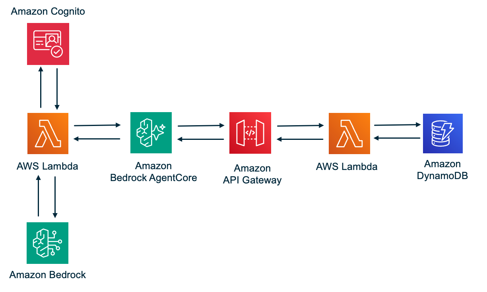

# strands-agentcore-mcp

A serverless AI agent that answers natural-language prompts about products by invoking tools through AWS Bedrock AgentCore Gateway using the Model Context Protocol (MCP).

## Architecture



```
User → Agent Lambda → AgentCore Gateway (MCP) → API Gateway → MCP Server Lambda → DynamoDB
            │                   │                                      │
       Strands Agent       CUSTOM_JWT Auth                       JSON-RPC 2.0
       + BedrockModel      + MCP Routing                         Tool Execution
       + MCPClient         + Tool Discovery                      (list/get/put)
            │
       Cognito JWT
       Validated
```

The agent is model-driven: Claude decides which tool to call based on the user's prompt and the tool schemas discovered at runtime via `tools/list`.

> **Why API Gateway?** AgentCore Gateway's MCP target type requires an HTTPS endpoint to forward MCP requests to. Lambda functions don't have a public HTTPS URL on their own, so API Gateway sits in front of the MCP Server Lambda to provide one. This is different from Smithy or OpenAPI targets where the Gateway handles protocol translation — with an MCP target, the Lambda itself speaks MCP (JSON-RPC 2.0 over HTTP) directly.

## Prerequisites

- [AWS SAM CLI](https://docs.aws.amazon.com/serverless-application-model/latest/developerguide/install-sam-cli.html) installed
- AWS CLI v2 configured with credentials for `us-east-1`
- Python 3.12 and `pip3`
- **No Docker required.** The build is Docker-free: `sam build` runs the root `Makefile`'s `BuildMethod: makefile` targets, which perform the two-step `pip3` manylinux install directly on your machine. There is no `--use-container` step and no Docker daemon to run.
- Bedrock model access enabled in your account:
  - Open the [Bedrock console](https://console.aws.amazon.com/bedrock) → Model Access
  - Enable **Claude Sonnet 4.5** (cross-region inference profile)

## Deploy

### Step 1: Open a Terminal

Open a terminal on your machine and navigate to where you want to clone the project.

### Step 2: Clone the Repository

```bash
git clone https://github.com/aws-samples/serverless-patterns
cd serverless-patterns/strands-agentcore-mcp
```

### Step 3: Deploy

```bash
./scripts/deploy.sh
```

To use a different model, edit the `BedrockModelId` value in the `parameter_overrides` line of `samconfig.toml` before running (or pass `sam deploy --parameter-overrides 'BedrockModelId="<model-id>"'`).

The deploy script is a thin wrapper around AWS SAM. It runs `sam build` (Docker-free — no `--use-container`) followed by `sam deploy` (which reads `samconfig.toml`), then performs the post-deploy steps. In order it will:

1. Build the SAM application with `sam build` — the native `BuildMethod: makefile` build (driven by the root `Makefile`) installs Lambda dependencies via the two-step `pip3` manylinux install and packages the real `src/` tree, no Docker needed
2. Deploy the stack with `sam deploy` — Cognito, DynamoDB, API Gateway, Lambda x2, AgentCore Gateway, and IAM roles are created (or updated) in one shot with the real Lambda code, no inline placeholders
3. Read the stack outputs
4. Create and synchronize the MCP Gateway Target
5. Seed DynamoDB with 3 sample products
6. Create a Cognito test user (`testuser` / `TestPass123!`)
7. Generate `scripts/test.sh` with deployment values baked in

Deploy takes approximately 5–10 minutes on first run.

> **Packaging convention.** The native SAM `BuildMethod: makefile` build replaces the old in-script two-step `pip3` packaging and the separate `aws lambda update-function-code` flow. The proven two-step `pip3 --platform manylinux2014_x86_64 --only-binary=:all:` install (binary packages, then pure-Python packages `--no-deps`) now lives in the root `Makefile`'s `build-AgentLambdaFunction` / `build-McpServerLambda` targets and runs during `sam build`. `sam deploy` ships the real code directly, so there is no manual zip-and-update step.

## Test

Run the default prompt (lists all products):

```bash
./scripts/test.sh
```

Or pass a custom prompt:

```bash
./scripts/test.sh 'List all products in Electronics'
./scripts/test.sh 'Get product ELEC-001 details'
./scripts/test.sh 'Add a new product called Widget Pro in Electronics for $49.99'
./scripts/test.sh 'Update the price of ELEC-001 to $149.99'
```

## Terminate

Removes all AWS resources created by the deploy:

```bash
./scripts/terminate.sh
```

This deletes:
- AgentCore Gateway Target (created outside CloudFormation)
- CloudFormation stack (Lambda x2, API Gateway, DynamoDB, Cognito User Pool, IAM roles, AgentCore Gateway)
- CloudWatch Log Groups
- Legacy S3 deploy bucket, if one is still present from an older deploy (SAM now uses its own managed artifact bucket via `resolve_s3`, which is not removed here)
- Generated `scripts/test.sh`

## MCP Tools

The agent has access to three product management tools:

| Tool | Description |
|------|-------------|
| `list_products` | List all products, optionally filtered by category |
| `get_product` | Get a specific product by `category` and `productId` |
| `put_product` | Create or update a product |

## Project Structure

```
├── infrastructure/
│   └── template.yaml                   # SAM template — all AWS resources
├── Makefile                            # Docker-free SAM build targets (BuildMethod: makefile)
├── samconfig.toml                      # sam deploy parameters (stack, region, capabilities)
├── scripts/
│   ├── deploy.sh                       # One-command deploy (wraps sam build + sam deploy)
│   ├── terminate.sh                    # One-command teardown
│   └── test.sh                         # Generated by deploy.sh
├── src/
│   ├── agent/                          # Agent Lambda (Strands SDK)
│   │   ├── handler.py
│   │   ├── agent_processor.py
│   │   └── strands_client.py
│   ├── mcp_server/                     # MCP Server Lambda
│   │   ├── handler.py                  # JSON-RPC 2.0 handler
│   │   ├── tools.py                    # Tool registry
│   │   └── dynamodb_client.py          # DynamoDB operations
│   └── shared/                         # Shared utilities
│       ├── jwt_utils.py
│       ├── models.py
│       ├── error_utils.py
│       └── logging_utils.py
├── tests/
│   ├── unit/                           # Template and deploy script assertions
│   └── property/                       # Hypothesis property-based tests
├── requirements.txt                    # Lambda runtime dependencies
└── requirements-dev.txt                # Local dev/test dependencies
```

## Running Tests

```bash
pip3 install -r requirements-dev.txt
python3 -m pytest tests/unit/ tests/property/ -v
```

## Notes

- Region: `us-east-1`
- Build: Docker-free. `sam build` uses each function's `Metadata.BuildMethod: makefile` to run the root `Makefile`'s two-step `pip3` manylinux install, producing Linux-correct wheels on macOS without a Docker daemon.
- Model: Claude Sonnet 4.5 (cross-region inference profile `us.anthropic.claude-sonnet-4-5-20250929-v1:0`)
- To swap models without code changes, edit the `BedrockModelId` value in the `parameter_overrides` line of `samconfig.toml` and re-run `./scripts/deploy.sh`.
- The MCP Gateway Target is created via boto3 in `deploy.sh` (not the SAM template) because AgentCore probes `tools/list` during target creation — keeping it as an ordered post-deploy step preserves the proven create-vs-update behavior even though `sam deploy` ships the real Lambda code.

---

Copyright 2026 Amazon.com, Inc. or its affiliates. All Rights Reserved.  
SPDX-License-Identifier: MIT-0
