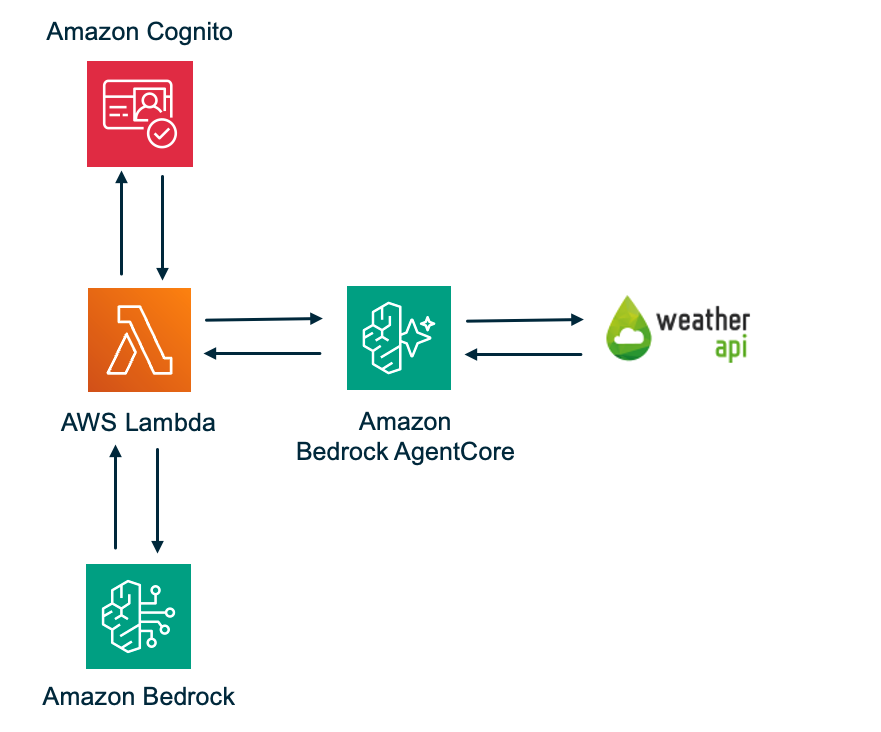

# Serverless AI Agent with AgentCore MCP Gateway and OpenAPI Target

A serverless AI agent system that enables natural language interaction with OpenAPI-compliant REST APIs using AWS Bedrock AgentCore Gateway and Claude Sonnet 4.5.

## Overview

The OpenAPI Agent Gateway dynamically discovers and invokes REST API operations from OpenAPI 3.x specifications. Users authenticate via Cognito JWT, submit natural language prompts to an Agent Lambda powered by Claude/Bedrock, which discovers and invokes tools dynamically generated from OpenAPI specifications through the AgentCore Gateway.

## Architecture



```
User → Agent Lambda → AgentCore Gateway (MCP) → WeatherAPI.com
            │                   │                       │
     ───────────────    ─────────────────────    ─────────────────────
     Strands Agent       CUSTOM_JWT Auth           API Key Auth
     + BedrockModel      + MCP Tool Routing        (Credential Provider
     + MCPClient         + Tool Discovery           → Secrets Manager)
            │                   │
     Cognito JWT          OpenAPI Target
     Validated            (auto-discovered)
```

- **Agent Lambda** (512MB, 120s timeout): Processes natural language prompts using Claude Sonnet 4.5, discovers tools from OpenAPI specifications via the Gateway, and orchestrates tool execution
- **AgentCore Gateway**: Handles CUSTOM_JWT auth via Cognito, exposes tools via MCP, and calls WeatherAPI.com directly using API key credential injection

> **Why WeatherAPI.com (and not a key-less API like Open-Meteo)?**
> AgentCore Gateway **OpenAPI targets only support `API_KEY` or `OAuth` outbound authorization** — IAM is not supported, and the service rejects a target created without a credential provider (`"CredentialProviderConfigurations is required for OpenAPI targets"`). That rules out genuinely key-less public APIs for this pattern. WeatherAPI.com fits naturally because it authenticates with an API key, which the Gateway injects from an API Key Credential Provider backed by Secrets Manager.
>
> If you need to call a key-less or IAM-authenticated backend, front it with **Amazon API Gateway** and use an API Gateway target instead (API Gateway targets support IAM / `GATEWAY_IAM_ROLE`).

## Project Structure

```
.
├── src/
│   ├── agent/              # Agent Lambda implementation
│   ├── shared/             # Shared utilities and data models
│   ├── openapi_parser/     # OpenAPI specification parser
│   └── requirements.txt    # Runtime dependencies (used by `sam build`)
├── template.yaml           # AWS SAM template
├── tests/                  # Unit, property, and integration tests
├── deployment/             # Test-user setup and generated outputs
├── scripts/                # deploy.sh and generated test.sh
└── README.md
```

## Prerequisites

- Python 3.12+ — [python.org/downloads](https://www.python.org/downloads/)
- AWS CLI v2 (2.28+ recommended) — [docs.aws.amazon.com/cli/latest/userguide/install-cliv2.html](https://docs.aws.amazon.com/cli/latest/userguide/install-cliv2.html)
- AWS SAM CLI — [docs.aws.amazon.com/serverless-application-model/latest/developerguide/install-sam-cli.html](https://docs.aws.amazon.com/serverless-application-model/latest/developerguide/install-sam-cli.html)
- `make` (used by the SAM Makefile build; preinstalled on macOS via Xcode CLT and most Linux distros). No Docker required.
- AWS account with access to: Bedrock, Lambda, AgentCore Gateway, Cognito, Secrets Manager, S3, CloudWatch
- Bedrock model access enabled for Claude Sonnet 4.5 (or your chosen model) in `us-east-1`
- A free WeatherAPI.com API key — [weatherapi.com/signup.aspx](https://www.weatherapi.com/signup.aspx)

## Deployment

### Step 1: Clone the repository

Open a terminal and run:

```bash
git clone https://github.com/aws-samples/serverless-patterns
cd serverless-patterns/strands-agentcore-openapi
```

### Step 2: Set up your Python environment

```bash
python3 -m venv venv
source venv/bin/activate    # On Windows: venv\Scripts\activate
pip install -r requirements.txt
```

### Step 3: Configure AWS credentials

If you haven't already configured the AWS CLI:

```bash
aws configure
# AWS Access Key ID: <your-access-key>
# AWS Secret Access Key: <your-secret-key>
# Default region name: us-east-1
# Default output format: json
```

Verify it's working:

```bash
aws sts get-caller-identity
```

### Step 4: Get your own WeatherAPI.com API key

Each person deploying this project uses **their own** WeatherAPI.com key — no key is bundled in the repo, and the deploy script requires one.

1. Sign up at [weatherapi.com/signup.aspx](https://www.weatherapi.com/signup.aspx) (free, no credit card)
2. Verify your email and log in to [weatherapi.com/my](https://www.weatherapi.com/my/)
3. Copy your API key from the dashboard

> Your key is passed only via the `--weather-api-key` flag and stored in your own AWS account (Secrets Manager + the credential provider). Never commit it to the repo.

### Step 5: Deploy

```bash
./scripts/deploy.sh \
  --environment-name dev \
  --weather-api-key YOUR_WEATHERAPI_KEY
```

The script creates the WeatherAPI secret and API Key credential provider, then runs `sam build` and `sam deploy`, and finally creates a Cognito test user. When it finishes, run a quick test:

```bash
./scripts/test.sh 'What is the weather in Liverpool, United Kingdom?'
```

#### Deploy script options

| Flag | Default | Description |
|------|---------|-------------|
| `--environment-name` | required | Prefix for all resources (e.g. dev, prod) |
| `--weather-api-key` | required | Your WeatherAPI.com API key |
| `--model-id` | `us.anthropic.claude-sonnet-4-5-20250929-v1:0` | Bedrock model ID to use |
| `--region` | `us-east-1` | AWS region |

SAM manages the deployment artifact bucket automatically (`--resolve-s3`), so there's no bucket to configure.

### Step 6: Changing the model (optional)

The agent defaults to Claude Sonnet 4.5. Pass `--model-id` to use a different Bedrock model:

```bash
./scripts/deploy.sh \
  --environment-name dev \
  --weather-api-key YOUR_WEATHERAPI_KEY \
  --model-id anthropic.claude-3-5-sonnet-20241022-v2:0
```

To update a live deployment without redeploying the full stack:

```bash
aws lambda update-function-configuration \
  --function-name <agent-lambda-name> \
  --environment "Variables={BEDROCK_MODEL_ID=anthropic.claude-3-5-sonnet-20241022-v2:0,GATEWAY_ID=<gateway-id>,COGNITO_JWKS_URL=<jwks-url>}" \
  --region us-east-1
```

> When updating via CLI, the entire `Variables` map is replaced — include all existing variables.

**Available Bedrock model IDs:**

| Model | ID |
|---|---|
| Claude Sonnet 4.5 (default) | `us.anthropic.claude-sonnet-4-5-20250929-v1:0` |
| Claude 3 Sonnet | `anthropic.claude-3-sonnet-20240229-v1:0` |
| Claude 3.5 Sonnet v2 | `anthropic.claude-3-5-sonnet-20241022-v2:0` |
| Claude 3.5 Haiku | `anthropic.claude-3-5-haiku-20241022-v1:0` |
| Claude 3 Opus | `anthropic.claude-3-opus-20240229-v1:0` |
| Amazon Nova Pro | `amazon.nova-pro-v1:0` |
| Amazon Nova Lite | `amazon.nova-lite-v1:0` |

Make sure the model has access enabled in your account under **Bedrock → Model access**.

## Teardown

```bash
sam delete --stack-name dev-openapi-agent-gateway --region us-east-1
```

To fully clean up the resources created outside the stack:

1. Delete the credential provider:
   ```bash
   aws bedrock-agentcore-control delete-api-key-credential-provider --name dev-weatherapi-key --region us-east-1
   ```
2. Delete the secret:
   ```bash
   aws secretsmanager delete-secret --secret-id dev/weatherapi-key --force-delete-without-recovery --region us-east-1
   ```
   > `--force-delete-without-recovery` purges the secret immediately. Without it, Secrets Manager keeps the secret in a 30-day recovery window, and a redeploy within that window fails with `"You can't perform this operation on the secret because it was marked for deletion."` (recover with `aws secretsmanager restore-secret --secret-id dev/weatherapi-key`).

## Troubleshooting

**`sam build` fails or the Lambda errors on import (e.g. cryptography)** — The build installs Linux manylinux wheels via `src/Makefile` (pip `--platform manylinux2014_x86_64`). Make sure `make` is installed. If a dependency has no manylinux wheel, pip's `--only-binary=:all:` will fail — pin a version that publishes wheels.

**"Internal Error" on tools/call** — The Gateway execution role needs the `GetResourceApiKey` permissions for the token vault and workload identity (all present in the SAM template's `GatewayExecutionRole`).

**MCPClientInitializationError ("client session is currently running")** — Do not use `with mcp_client:`. The Strands Agent calls `start()` internally via `load_tools()`. Use `try/finally` with `mcp_client.stop(None, None, None)` instead.

**AccessDeniedException on bedrock:InvokeModelWithResponseStream** — The Lambda role needs both `bedrock:ConverseStream` and `bedrock:InvokeModelWithResponseStream` (both are in the SAM template).

**Lambda timeout** — The agentic loop involves multiple model calls and tool executions. Lambda is configured for 120s timeout and 1024MB memory.

## License

Copyright 2026 Amazon.com, Inc. or its affiliates. All Rights Reserved.

SPDX-License-Identifier: MIT-0
