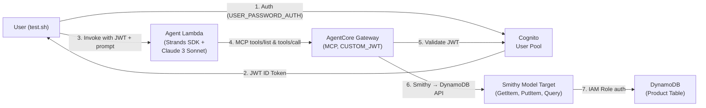

# Design Document: AgentCore Smithy DynamoDB

## Overview

This design describes a serverless AI agent that exposes DynamoDB operations (GetItem, PutItem, Query) through AWS Bedrock AgentCore Gateway using a Smithy model target. The agent uses the Strands SDK with Bedrock Claude 3 Sonnet to interpret natural language requests and translate them into DynamoDB operations via MCP protocol. Authentication is handled by Cognito JWT tokens validated by a CUSTOM_JWT authorizer on the gateway. The gateway uses GATEWAY_IAM_ROLE credentials to access DynamoDB directly, eliminating API keys or credential provider configuration.

The key differentiator from the API Gateway variant is the Smithy model target type: instead of routing through API Gateway, the gateway interprets a Smithy 2.0 model definition to directly invoke DynamoDB operations. This simplifies the deployment (no API Gateway resources, no secrets, no credential provider dance) while keeping the agent code completely target-type agnostic.

### Design Decisions

1. **Inline Smithy Model**: The Smithy model is embedded as an InlinePayload in CloudFormation rather than uploaded to S3, since the DynamoDB operations model is well under the 10MB limit. This keeps deployment self-contained in a single template.

2. **GATEWAY_IAM_ROLE over API_KEY**: Since DynamoDB is an AWS service using IAM auth, GATEWAY_IAM_ROLE is the natural credential type. This eliminates the credential provider CLI commands, Secrets Manager secrets, and stack re-update steps required by the API Gateway variant.

3. **Reusable Agent Code**: The agent handler, processor, MCP client, and shared modules are identical to the API Gateway project. They connect to AgentCore Gateway via MCP and are unaware of the target type behind the gateway.

4. **Single CloudFormation Template**: All infrastructure (DynamoDB table, AgentCore Gateway, GatewayTarget, Cognito, Lambda, IAM roles) is defined in one template for atomic deployment and teardown.

## Architecture



### Request Flow

1. User authenticates with Cognito via `USER_PASSWORD_AUTH` to get a JWT ID token
2. User invokes the Agent Lambda with the JWT token and a natural language prompt
3. Lambda validates the JWT, creates a Strands Agent with MCP client connected to the gateway
4. The LLM (Claude 3 Sonnet) analyzes the prompt and selects the appropriate DynamoDB tool
5. The MCP client sends a `tools/call` request to the gateway
6. The gateway validates the JWT via CUSTOM_JWT authorizer (Cognito OIDC discovery)
7. The gateway translates the MCP call to a DynamoDB API request using the Smithy model
8. The gateway assumes the execution role (GATEWAY_IAM_ROLE) to authenticate with DynamoDB
9. DynamoDB returns the result, which flows back through the gateway → MCP → Agent → User

## Components and Interfaces

### 1. CloudFormation Template (`infrastructure/cloudformation-template.yaml`)

Single template defining all resources:

| Resource | Type | Purpose |
|----------|------|---------|
| `ProductTable` | `AWS::DynamoDB::Table` | Product data store with partition key + sort key |
| `AgentCoreGateway` | `AWS::BedrockAgentCore::Gateway` | MCP gateway with CUSTOM_JWT auth |
| `SmithyTarget` | `AWS::BedrockAgentCore::GatewayTarget` | Smithy model target for DynamoDB ops |
| `CognitoUserPool` | `AWS::Cognito::UserPool` | User authentication |
| `CognitoUserPoolClient` | `AWS::Cognito::UserPoolClient` | Client for USER_PASSWORD_AUTH flow |
| `AgentLambdaFunction` | `AWS::Lambda::Function` | Strands SDK agent |
| `AgentLambdaRole` | `AWS::IAM::Role` | Lambda execution role (Bedrock + AgentCore + Logs) |
| `GatewayExecutionRole` | `AWS::IAM::Role` | Gateway role (4 ARN patterns + DynamoDB) |

### 2. Smithy Model (Inline in CloudFormation)

The Smithy 2.0 JSON model defines three DynamoDB operations under the `aws.protocols#restJson1` protocol:

```
Service: example.dynamodb#DynamoDBProductService (restJson1)
├── GetItem    — POST /getitem    — Retrieve single item by TableName + Key
├── PutItem    — POST /putitem    — Create/update item by TableName + Item
└── Query      — POST /query      — Query by TableName + KeyConditionExpression
```

Each operation has:
- `smithy.api#http` trait (POST method, URI path)
- `smithy.api#documentation` traits on service, operations, and all members (for LLM tool selection)
- `smithy.api#required` traits on mandatory input members
- Input/output structures matching DynamoDB API shapes

### 3. Agent Lambda (`src/agent/`)

| Module | Responsibility |
|--------|---------------|
| `handler.py` | Lambda entry point; extracts JWT, creates UserContext, delegates to agent_processor |
| `agent_processor.py` | Creates MCP client, Strands Agent; manages session lifecycle in try/finally |
| `strands_client.py` | Factory functions for MCP client and Bedrock model configuration |

All modules are target-type agnostic — reused from the API Gateway project without modification.

### 4. Shared Modules (`src/shared/`)

| Module | Responsibility |
|--------|---------------|
| `models.py` | Data classes: `UserContext`, `AgentRequest`, `AgentResponse` |
| `jwt_utils.py` | JWT validation: accepts `token_use: access` and `id`, disables `verify_aud`, extracts `cognito:username` |
| `error_utils.py` | Standardized error response formatting |
| `logging_utils.py` | Structured logging with correlation IDs |

### 5. Deploy Script (`scripts/deploy.sh`)

Orchestrates the full deployment lifecycle:

```
1. Validate CloudFormation template
2. Deploy stack (create or update, detect via DOES_NOT_EXIST)
3. Package Lambda (two-step pip3 install)
4. Deploy Lambda code (S3 fallback if >50MB)
5. Seed DynamoDB with sample products
6. Create Cognito test user
7. Generate scripts/test.sh with baked-in values
```

### 6. Test Script (`scripts/test.sh` — generated)

Generated by deploy.sh with baked-in gateway endpoint, Cognito pool ID, client ID, username, and password. Accepts optional natural language prompt as CLI argument.

### Interface: Agent Lambda ↔ AgentCore Gateway

- Protocol: MCP (Model Context Protocol)
- Operations: `tools/list` (discover available tools), `tools/call` (invoke a tool)
- Authentication: JWT ID token passed in MCP session headers
- The gateway translates MCP tool calls to DynamoDB API calls using the Smithy model

### Interface: AgentCore Gateway ↔ DynamoDB

- Authentication: GATEWAY_IAM_ROLE (gateway assumes execution role)
- Operations: `dynamodb:GetItem`, `dynamodb:PutItem`, `dynamodb:Query`
- The Smithy model defines the request/response shapes; the gateway handles serialization

## Data Models

### DynamoDB Product Table Schema

| Attribute | Type | Key | Description |
|-----------|------|-----|-------------|
| `category` | String (S) | Partition Key (HASH) | Product category (e.g., "Electronics", "Books") |
| `productId` | String (S) | Sort Key (RANGE) | Unique product identifier within category |
| `name` | String (S) | — | Product display name |
| `price` | Number (N) | — | Product price |
| `description` | String (S) | — | Product description |
| `inStock` | Boolean (BOOL) | — | Availability flag |

Billing mode: `PAY_PER_REQUEST`

### Sample Seed Data

```json
[
  {"category": "Electronics", "productId": "ELEC-001", "name": "Wireless Mouse", "price": 29.99, "description": "Ergonomic wireless mouse", "inStock": true},
  {"category": "Electronics", "productId": "ELEC-002", "name": "USB-C Hub", "price": 49.99, "description": "7-port USB-C hub", "inStock": true},
  {"category": "Books", "productId": "BOOK-001", "name": "Python Cookbook", "price": 39.99, "description": "Advanced Python recipes", "inStock": true},
  {"category": "Books", "productId": "BOOK-002", "name": "Cloud Architecture", "price": 54.99, "description": "Designing cloud systems", "inStock": false}
]
```

This covers multiple categories (for Query demonstrations), multiple items per category (for GetItem demonstrations), and varied attributes (for PutItem demonstrations).

### Smithy Model Input/Output Structures

**GetItem**:
- Input: `TableName` (required, string), `Key` (required, map of string → AttributeValue)
- Output: `Item` (map of string → AttributeValue)

**PutItem**:
- Input: `TableName` (required, string), `Item` (required, map of string → AttributeValue)
- Output: `Attributes` (map of string → AttributeValue)

**Query**:
- Input: `TableName` (required, string), `KeyConditionExpression` (required, string), `ExpressionAttributeValues` (required, map of string → AttributeValue)
- Output: `Items` (list of map of string → AttributeValue), `Count` (integer)

### Application Data Models (`src/shared/models.py`)

```python
@dataclass
class UserContext:
    username: str
    token: str

@dataclass
class AgentRequest:
    prompt: str
    user_context: UserContext

@dataclass
class AgentResponse:
    success: bool
    response: str
    error: Optional[str] = None
```

### IAM Role Structures

**GatewayExecutionRole** trust policy:
- Principal: `bedrock-agentcore.amazonaws.com`
- Policies:
  - AgentCore access (4 ARN patterns with `bedrock-agentcore:*`)
  - DynamoDB access (`dynamodb:GetItem`, `dynamodb:PutItem`, `dynamodb:Query` on ProductTable ARN)

**AgentLambdaRole** trust policy:
- Principal: `lambda.amazonaws.com`
- Policies:
  - Bedrock access (`bedrock:InvokeModel`, `bedrock:InvokeModelWithResponseStream`, `bedrock:Converse`, `bedrock:ConverseStream`)
  - AgentCore access (`bedrock-agentcore:InvokeGateway`)
  - CloudWatch Logs (`logs:CreateLogGroup`, `logs:CreateLogStream`, `logs:PutLogEvents`)


## Correctness Properties

*A property is a characteristic or behavior that should hold true across all valid executions of a system — essentially, a formal statement about what the system should do. Properties serve as the bridge between human-readable specifications and machine-verifiable correctness guarantees.*

### Property 1: Smithy operation structure completeness

*For all* operations defined in the Smithy model, each operation must have a valid input structure with all mandatory members marked with the `smithy.api#required` trait, and a valid output structure that captures the DynamoDB response shape.

**Validates: Requirements 1.5, 1.6**

### Property 2: Smithy documentation coverage

*For all* shapes in the Smithy model (service, operations, input/output structures, and their members), each shape must include a `smithy.api#documentation` trait with a non-empty string value.

**Validates: Requirements 1.7**

### Property 3: No streaming or custom protocols in Smithy model

*For all* operations in the Smithy model, none shall have streaming traits (`smithy.api#streaming`) or use protocols other than `aws.protocols#restJson1`.

**Validates: Requirements 1.9**

### Property 4: JWT validation accepts both token_use values

*For any* valid JWT token with `token_use` claim set to either `"access"` or `"id"`, the JWT validation function shall accept the token without raising a validation error.

**Validates: Requirements 4.4**

### Property 5: Username extraction from cognito:username claim

*For any* JWT ID token containing a `cognito:username` claim, the username extraction function shall return the value of the `cognito:username` claim (not the `username` or `sub` claim).

**Validates: Requirements 4.6**

### Property 6: No API Gateway resources in CloudFormation template

*For all* resources defined in the CloudFormation template, none shall have a resource type matching `AWS::ApiGateway::*` or `AWS::ApiGatewayV2::*`.

**Validates: Requirements 7.4**

### Property 7: Deploy script uses pip3 exclusively

*For all* pip install commands in the deploy script, each command shall use `pip3` (not `pip`) as the executable name.

**Validates: Requirements 9.7**

### Property 8: Agent code is target-type agnostic

*For all* source files in `src/agent/` and `src/shared/`, none shall contain references to DynamoDB-specific identifiers (e.g., `dynamodb`, `DynamoDB`, `GetItem`, `PutItem`, `Query`, `TableName`) or Smithy-specific identifiers (e.g., `smithy`, `SmithyModel`, `InlinePayload`).

**Validates: Requirements 11.1**

## Error Handling

### Agent Lambda Error Handling

| Error Scenario | Handling Strategy |
|----------------|-------------------|
| Missing/invalid JWT token | Return 401 with "Unauthorized" message; log the validation failure |
| Expired JWT token | Return 401 with "Token expired" message |
| MCP connection failure | Return 500 with "Gateway connection error"; log full exception in structured format |
| LLM invocation failure | Return 500 with "Model invocation error"; retry is handled by Strands SDK internally |
| MCP tools/call failure | Return 500 with "Tool execution error"; include tool name in error context |
| Missing environment variables | Fail fast at Lambda cold start with descriptive error message |
| Lambda timeout (>120s) | Strands SDK handles graceful shutdown; partial response returned if possible |

### MCP Session Lifecycle

The agent processor manages the MCP session in a `try/finally` block (not a `with` context manager):

```python
mcp_client = create_mcp_client(gateway_url, token)
try:
    agent = Agent(model=bedrock_model, tools=[mcp_client])
    result = agent(prompt)
    return AgentResponse(success=True, response=str(result))
finally:
    mcp_client.cleanup()
```

This ensures cleanup happens even if the LLM or tool invocation raises an exception.

### CloudFormation Deployment Errors

| Error Scenario | Handling Strategy |
|----------------|-------------------|
| Template validation failure | Script exits with error message before attempting deployment |
| Stack creation failure | CloudFormation rolls back automatically; script reports the failure |
| Stack update with no changes | Script detects "No updates are to be performed" and continues |
| Lambda package >50MB | Script falls back to S3 upload; requires pre-existing S3 bucket |

### DynamoDB Error Handling (Gateway-Side)

The gateway handles DynamoDB errors and translates them to MCP error responses. The agent code does not handle DynamoDB errors directly since it communicates via MCP protocol only.

## Testing Strategy

### Dual Testing Approach

This project uses both unit tests and property-based tests for comprehensive coverage:

- **Unit tests**: Verify specific examples, edge cases, CloudFormation template structure, and script correctness
- **Property-based tests**: Verify universal properties across generated inputs (Smithy model validity, JWT handling, code agnosticism)

### Property-Based Testing Configuration

- **Library**: [Hypothesis](https://hypothesis.readthedocs.io/) for Python
- **Minimum iterations**: 100 per property test
- **Tag format**: `Feature: agentcore-smithy-dynamodb, Property {number}: {property_text}`
- Each correctness property is implemented by a single property-based test

### Unit Tests

| Test Area | What to Test |
|-----------|-------------|
| CloudFormation template structure | Gateway uses ProtocolType: MCP, CUSTOM_JWT authorizer, RoleArn (not ExecutionRoleArn), AllowedAudience (not Audience), CustomJWTAuthorizer casing, DiscoveryUrl suffix |
| Gateway execution role | All 4 ARN patterns present, DynamoDB permissions present, no apigateway:GET |
| Smithy model structure | Service has restJson1 trait, all 3 operations defined with POST method, InlinePayload nesting |
| Lambda configuration | Python 3.12, x86_64, timeout ≥120s, memory ≥1024MB, correct IAM permissions |
| Cognito configuration | USER_PASSWORD_AUTH flow, User Pool Client association |
| Deploy script | Two-step pip3 install, no .dist-info removal, DOES_NOT_EXIST check, S3 fallback logic, no credential provider commands |
| Test script | No nested JSON echo, executable permissions, default prompt handling, auth before invoke |
| JWT validation | Accepts token_use: id, accepts token_use: access, verify_aud disabled, cognito:username extraction |
| Data models | UserContext, AgentRequest, AgentResponse serialization |

### Property-Based Tests

| Property | Test Description | Generator Strategy |
|----------|-----------------|-------------------|
| Property 1: Smithy operation structure completeness | Parse Smithy model, verify all operations have valid input/output structures with required traits | Generate random operation names and member sets; verify structural invariants hold |
| Property 2: Smithy documentation coverage | Parse Smithy model, verify all shapes have documentation traits | Generate random Smithy shapes; verify documentation trait presence |
| Property 3: No streaming in Smithy model | Parse Smithy model, verify no streaming traits | Generate random operation trait sets; verify streaming traits are absent |
| Property 4: JWT accepts both token_use values | Generate JWTs with random claims including token_use: access or id | Generate random JWT payloads with varying claims; verify acceptance |
| Property 5: Username from cognito:username | Generate JWTs with cognito:username claim; verify extraction | Generate random usernames; verify cognito:username is extracted over username |
| Property 6: No API Gateway resources | Parse CloudFormation template; verify no API Gateway resource types | Generate random resource type strings; verify API Gateway types are filtered |
| Property 7: pip3 exclusively | Parse deploy script; verify all pip commands use pip3 | Generate random pip command variations; verify pip3 detection |
| Property 8: Agent code target-agnostic | Scan source files for DynamoDB/Smithy identifiers | Generate random identifier strings; verify DynamoDB/Smithy terms are detected |

### Test File Organization

```
tests/
├── unit/
│   ├── test_cloudformation_template.py    # Template structure validation
│   ├── test_smithy_model.py               # Smithy model structure
│   ├── test_jwt_utils.py                  # JWT validation logic
│   ├── test_models.py                     # Data model tests
│   ├── test_deploy_script.py              # Deploy script pattern checks
│   └── test_test_script.py                # Generated test script checks
├── property/
│   ├── test_smithy_properties.py          # Properties 1, 2, 3
│   ├── test_jwt_properties.py             # Properties 4, 5
│   ├── test_template_properties.py        # Property 6
│   ├── test_script_properties.py          # Property 7
│   └── test_agnostic_properties.py        # Property 8
└── conftest.py                            # Shared fixtures
```

### Integration Testing

Integration tests are run manually via the generated `scripts/test.sh` after deployment. They exercise the full flow:
1. Authenticate with Cognito to get JWT ID token
2. Invoke Agent Lambda with natural language prompts
3. Verify the agent correctly routes to GetItem, PutItem, or Query operations
4. Verify DynamoDB data is returned/modified as expected

Example test prompts:
- `"Show me all Electronics products"` → triggers Query
- `"Get details for product ELEC-001 in Electronics"` → triggers GetItem
- `"Add a new product called Headphones for $79.99 in Electronics"` → triggers PutItem
