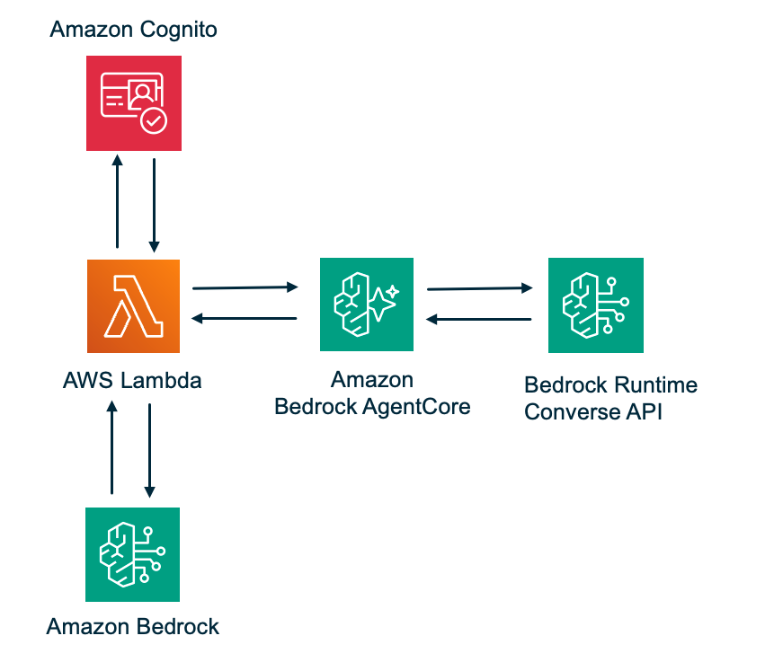

# Strands Agent on Lambda with AgentCore Smithy Bedrock Target

A serverless AI agent that uses AWS Bedrock AgentCore Gateway with a Smithy model target to call Bedrock Runtime. The agent (Claude Sonnet 4.6) calls another model (Claude Haiku 4.5) as a tool via the gateway's Converse API.

## Architecture



```
User → test.sh → Agent Lambda ──────────────→ AgentCore Gateway (MCP) ──────────→ Bedrock Runtime
                      │                               │                                   │
               Strands Agent                  CUSTOM_JWT Auth                    GATEWAY_IAM_ROLE
               + BedrockModel                 (Cognito JWKS)                     (IAM role signs
               (Sonnet 4.6)                   + MCP Protocol                     requests — no
               + MCPClient                    + Tool Discovery                    API key needed)
                      │                       + SmithyModel target                      │
               Cognito JWT                      (loaded from S3)               Converse API call
               validated                                                        → Claude Haiku 4.5
```

## How It Works

1. User authenticates with Cognito and invokes the Lambda with a natural language prompt
2. The Lambda runs a Strands SDK agent with Claude Sonnet 4.6 as the LLM
3. The agent connects to AgentCore Gateway via MCP and discovers available tools
4. The gateway reads the official Bedrock Runtime Smithy model (from S3) and exposes operations as MCP tools
5. Sonnet decides to call the Converse tool, passing the user's prompt to Claude Haiku 4.5
6. The gateway assumes its IAM execution role, signs the request, and calls Bedrock Runtime
7. Haiku's response flows back through the gateway → MCP → agent → user

## Deploy

### Step 1: Prerequisites

- AWS CLI v2
- AWS SAM CLI
- Python 3.12+
- pip3
- `make` (used by the SAM Makefile build — no Docker required)
- AWS account with Bedrock and AgentCore enabled in `us-east-1`
- Bedrock model access enabled for Claude Sonnet 4.6 and Claude Haiku 4.5

### Step 2: Open a Terminal

Open a terminal on your machine and navigate to where you want to clone the project.

### Step 3: Clone the Repository

```bash
git clone https://github.com/aws-samples/serverless-patterns
cd serverless-patterns/strands-agentcore-smithy
```

### Step 4: Deploy

One command deploys everything:

```bash
bash scripts/deploy.sh
```

This will:
1. Validate the SAM template (`sam validate`)
2. Download the official Bedrock Runtime Smithy model and upload to S3
3. Build the Lambda with `sam build` (Makefile build — two-step pip3 install, no Docker)
4. Deploy the stack with `sam deploy` (Gateway, Cognito, Lambda, IAM roles)
5. Create a Cognito test user
6. Generate `scripts/test.sh` with baked-in config values

## Test

After deployment, test with:

```bash
./scripts/test.sh "Ask Haiku to write a short poem about the Beatles"
```

Or use the default prompt:

```bash
./scripts/test.sh
```

## Project Structure

```
├── infrastructure/
│   ├── template.yaml                      # SAM template (all AWS resources)
│   └── bedrock-runtime-2023-09-30.json    # Official Smithy model (for tests)
├── Makefile                               # SAM Makefile build (no Docker)
├── scripts/
│   ├── deploy.sh                          # Full deployment script (SAM)
│   └── test.sh                            # Generated by deploy.sh
├── src/
│   ├── agent/
│   │   ├── handler.py                     # Lambda entry point
│   │   ├── agent_processor.py             # Strands Agent + MCP lifecycle
│   │   └── strands_client.py              # MCP client + Bedrock model factories
│   └── shared/
│       ├── models.py                      # UserContext, AgentRequest, AgentResponse
│       ├── jwt_utils.py                   # JWT validation (Cognito ID tokens)
│       ├── error_utils.py                 # Error response formatting
│       └── logging_utils.py              # Structured logging
├── tests/
│   ├── unit/                              # Unit tests
│   └── property/                          # Property-based tests (Hypothesis)
├── requirements.txt                       # Lambda runtime dependencies
└── README.md
```

## Changing the Outer Agent Model

The outer agent model is set in `src/agent/strands_client.py`:

```python
# Default Bedrock model ID for Claude Sonnet 4.6
DEFAULT_MODEL_ID = "us.anthropic.claude-sonnet-4-6"
```

To use a different model, update `DEFAULT_MODEL_ID` to any Bedrock cross-region inference profile ID you have access to. For example:

```python
DEFAULT_MODEL_ID = "us.anthropic.claude-3-5-sonnet-20241022-v2:0"
```

Make sure the model is enabled in your AWS account under **Bedrock → Model access** before deploying.

> **Note:** The inner model (the one the agent calls as a tool) is separate — it's configured in the `SYSTEM_PROMPT` string in `src/agent/agent_processor.py`. See [Changing the Inner Model](#changing-the-inner-model) and [Key Design Decisions](#key-design-decisions) for more detail.

## Changing the Inner Model

The inner model is the one the outer agent calls *as a tool* via the AgentCore Gateway. It's configured inside the `SYSTEM_PROMPT` string in `src/agent/agent_processor.py`:

```python
SYSTEM_PROMPT = """You have access to Bedrock Runtime tools via MCP. Use the Converse tool (not InvokeModel) to call another model.

When using bedrock-runtime-target___Converse:
- Set modelId to: anthropic.claude-haiku-4-5-20251001-v1:0
...
```

To use a different model, replace the `modelId` value in that instruction:

```python
- Set modelId to: anthropic.claude-haiku-4-5-20251001-v1:0
```

A few things to keep in mind:

- The model ID here is passed as a parameter in the MCP tool call, not used directly by the Lambda — so it must be a valid Bedrock `modelId` (not a cross-region inference profile).
- Make sure the model supports the **Converse API** (most Claude models do, but check the [Bedrock docs](https://docs.aws.amazon.com/bedrock/latest/userguide/conversation-inference-supported-models-features.html)).
- Enable the model in your AWS account under **Bedrock → Model access** before deploying.

## Key Design Decisions

### Official Smithy Model (not custom)
Custom Smithy models don't work for AWS service targets — the gateway needs the full endpoint resolution metadata (`aws.api#service` trait, partition data, FIPS/DualStack logic) that only official models have. The deploy script downloads the official model from the [AWS API Models repo](https://github.com/aws/api-models-aws).

### Converse API (not InvokeModel)
The `InvokeModel` operation uses a `Blob` with `httpPayload` trait for the request body, which doesn't map to MCP tool input parameters. `Converse` has structured `messages` and `modelId` fields that map cleanly.

### GATEWAY_IAM_ROLE (not API_KEY)
Since the target is an AWS service (Bedrock Runtime), the gateway uses its IAM execution role to sign requests. No API keys, no Secrets Manager secrets, no credential provider CLI commands.

### Agent code is target-agnostic
All code in `src/agent/` and `src/shared/` connects to the gateway via MCP and doesn't reference Bedrock, DynamoDB, or any specific target. The same code works with any gateway target type.

## Teardown

```bash
aws cloudformation delete-stack --stack-name agentcore-smithy-bedrock --region us-east-1
aws s3 rb s3://agentcore-smithy-bedrock-smithy-models --force --region us-east-1
```

## Run Tests

```bash
python -m pytest tests/ -v
```

---

Copyright 2026 Amazon.com, Inc. or its affiliates. All Rights Reserved.  
SPDX-License-Identifier: MIT-0
