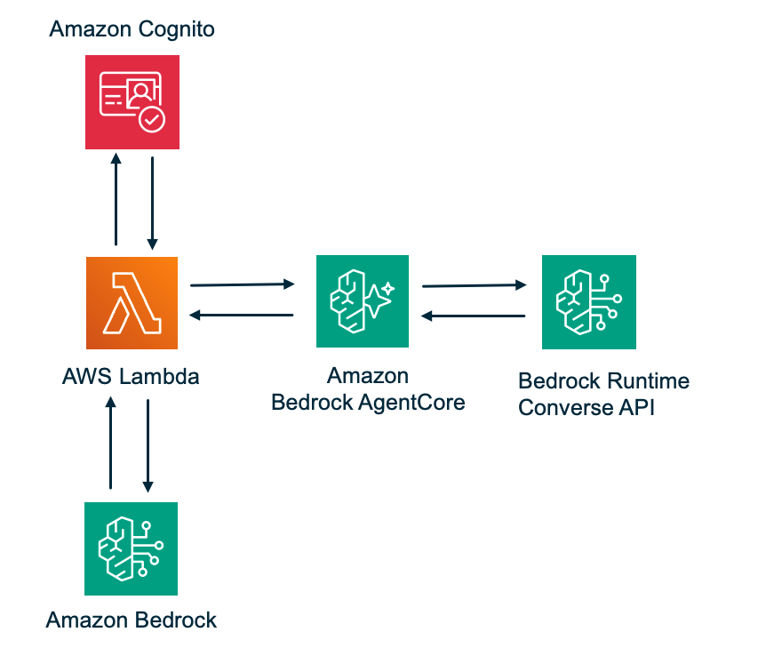

# AgentCore Smithy Amazon Bedrock Runtime

A serverless AI agent that uses Amazon Bedrock AgentCore Gateway with a Smithy model target to call Amazon Bedrock Runtime. The agent (Claude Sonnet 5) calls another model (Claude Haiku 4.5) as a tool via the gateway's Converse API.

> **Important:** This application uses various AWS services and there are costs associated with these services after the Free Tier usage — please see the [AWS Pricing page](https://aws.amazon.com/pricing/) for details. You are responsible for any AWS costs incurred. No warranty is implied in this example.

## Architecture



```
User → test.sh → Agent Lambda ──────────────→ AgentCore Gateway (MCP) ──────────→ Bedrock Runtime
                      │                               │                                   │
               Strands Agent                  CUSTOM_JWT Auth                    GATEWAY_IAM_ROLE
               + BedrockModel                 (Cognito JWKS)                     (IAM role signs
               (Sonnet 5)                     + MCP Protocol                     requests — no
               + MCPClient                    + Tool Discovery                    API key needed)
                      │                       + SmithyModel target                      │
               Cognito JWT                      (loaded from S3)               Converse API call
               validated                                                        → Claude Haiku 4.5
```

## How It Works

1. User authenticates with Cognito and invokes the Lambda with a natural language prompt
2. The Lambda runs a Strands SDK agent with Claude Sonnet 5 as the LLM
3. The agent connects to AgentCore Gateway via MCP and discovers available tools
4. The gateway reads the official Bedrock Runtime Smithy model (from S3) and exposes operations as MCP tools
5. Sonnet decides to call the Converse tool, passing the user's prompt to Claude Haiku 4.5
6. The gateway assumes its IAM execution role, signs the request, and calls Bedrock Runtime
7. Haiku's response flows back through the gateway → MCP → agent → user

## Prerequisites

- AWS CLI v2
- AWS SAM CLI
- Python 3.13+
- pip3
- `make` (used by the SAM Makefile build — no Docker required)
- AWS account with Amazon Bedrock and Amazon Bedrock AgentCore enabled in `us-east-1`
- Amazon Bedrock model access enabled for Claude Sonnet 5 and Claude Haiku 4.5
- AWS credentials with permissions to create and manage: SAM stacks, IAM roles, Lambda functions, S3 buckets, Cognito user pools, and Amazon Bedrock AgentCore Gateways

## Deploy

### Step 1: Open a Terminal

Open a terminal on your machine and navigate to where you want to clone the project.

### Step 2: Clone the Repository

```bash
git clone https://github.com/aws-samples/serverless-patterns
cd serverless-patterns/strands-agentcore-smithy
```

### Step 3: Deploy

One command deploys everything:

```bash
bash scripts/deploy.sh
```

This will:
1. Validate the SAM template (`sam validate`)
2. Download the official Bedrock Runtime Smithy model and upload to S3
3. Build and deploy the stack with SAM (Gateway, Cognito, Lambda, IAM roles)
4. Create a Cognito test user
5. Generate `scripts/test.sh` with baked-in config values

## Test

After deployment, test with:

```bash
./scripts/test.sh "Ask Haiku to write a short poem about the Beatles"
```

Or use the default prompt:

```bash
./scripts/test.sh
```

## Project Structure

```
├── infrastructure/
│   ├── template.yaml                      # SAM template (all AWS resources)
│   └── bedrock-runtime-2023-09-30.json    # Official Smithy model (for tests)
├── Makefile                               # SAM Makefile build (no Docker)
├── scripts/
│   ├── deploy.sh                          # Full deployment script (SAM)
│   └── test.sh                            # Generated by deploy.sh
├── src/
│   ├── agent/
│   │   ├── handler.py                     # Lambda entry point
│   │   ├── agent_processor.py             # Strands Agent + MCP lifecycle
│   │   └── strands_client.py              # MCP client + Bedrock model factories
│   └── shared/
│       ├── models.py                      # UserContext, AgentRequest, AgentResponse
│       ├── jwt_utils.py                   # JWT validation (Cognito ID tokens)
│       ├── error_utils.py                 # Error response formatting
│       └── logging_utils.py              # Structured logging
├── tests/
│   ├── unit/                              # Unit tests
│   └── property/                          # Property-based tests (Hypothesis)
├── requirements.txt                       # Lambda runtime dependencies
├── requirements-dev.txt                   # Test dependencies
└── README.md
```

## Key Design Decisions

### Official Smithy Model (not custom)
Custom Smithy models don't work for AWS service targets — the gateway needs the full endpoint resolution metadata (`aws.api#service` trait, partition data, FIPS/DualStack logic) that only official models have. The deploy script downloads the official model from the [AWS API Models repo](https://github.com/aws/api-models-aws).

### Converse API (not InvokeModel)
The `InvokeModel` operation uses a `Blob` with `httpPayload` trait for the request body, which doesn't map to MCP tool input parameters. `Converse` has structured `messages` and `modelId` fields that map cleanly.

### GATEWAY_IAM_ROLE (not API_KEY)
Since the target is an AWS service (Bedrock Runtime), the gateway uses its IAM execution role to sign requests. No API keys, no Secrets Manager secrets, no credential provider CLI commands.

### Agent code is target-agnostic
All code in `src/agent/` and `src/shared/` connects to the gateway via MCP and doesn't reference Bedrock, DynamoDB, or any specific target. The same code works with any gateway target type.

## Run Tests

Install test dependencies then run:

```bash
pip3 install -r requirements-dev.txt
python3 -m pytest tests/ -v
```

## Teardown

```bash
aws cloudformation delete-stack --stack-name agentcore-smithy-bedrock --region us-east-1
aws s3 rb s3://agentcore-smithy-bedrock-smithy-$(aws sts get-caller-identity --query Account --output text) --force --region us-east-1
```

The Lambda function's CloudWatch Logs log group is not deleted automatically. Remove it to avoid ongoing storage charges:

```bash
aws logs delete-log-group --log-group-name /aws/lambda/agentcore-smithy-bedrock-AgentFunction --region us-east-1
```

---

Copyright 2026 Amazon.com, Inc. or its affiliates. All Rights Reserved.  
SPDX-License-Identifier: MIT-0
