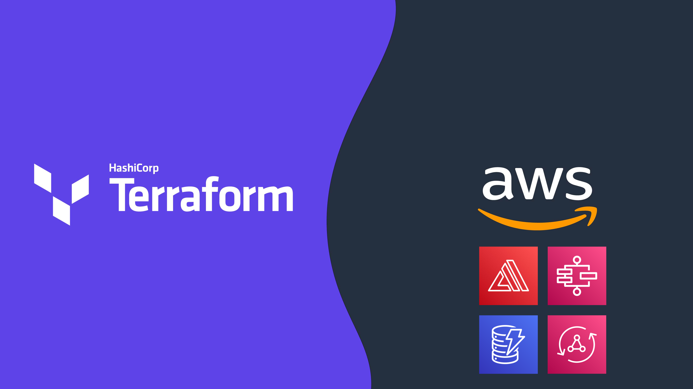

# Automating Deployment of AWS Amplify Apps with Terraform 🎉
#### Created by:
[Kevon Mayers](https://www.linkedin.com/in/kevonmayers)

This workshop is a guided example of how you can leverage Terraform and the **[AWS Amplify Libraries for JavaScript](https://docs.amplify.aws/lib/q/platform/js/)** to build fullstack AWS Amplify Apps. With this process, you can have full control over your backend resources, while gaining the benefits of what Amplify can help automate for you.

For getting started quickly, check out some of our provided **[code examples](https://github.com/novekm/amplify-with-terraform/tree/main/terraform-deployment/examples)**.

For detailed information and step-by-step-guidance, check out the full workshop on **[AWS Workshop Studio](https://catalog.workshops.aws/amplify-with-terraform)**.

