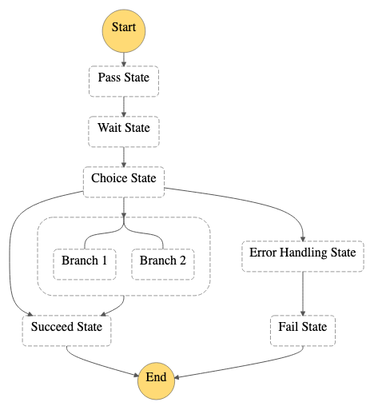

# Invoke an AWS Step Functions workflow from AWS Lambda

The pattern creates a Lambda function, and a Step Functions workflow, a Log group and the IAM resources required to run the application.

A Lambda function uses the AWS SDK to asyncronously invoke the Step Function workflow, passing the event body. The Step Function workflow showcasing the different States.



## Getting started with Terraform Serverless Patterns

Read more about general requirements and deployment instructions for Terraform Serverless Patterns [here](https://github.com/aws-samples/serverless-patterns/blob/main/terraform-fixtures/docs/README.md).

## Testing

After deployment, invoke Lambda function with multiple inputs, and go to the Step Function Console and view the different invocations to note the different behavior with the different inputs.

To do this, you can run these commands in the terminal (replace `<function-name>` with the value returned in `lambda_function_name`):

```shell
aws lambda invoke --function-name <function-name> --payload '{"Choice": "A"}' response.json
aws lambda invoke --function-name <function-name> --payload '{"Choice": "B"}' response.json
aws lambda invoke --function-name <function-name> --payload '{"Choice": "C"}' response.json
```

<!-- BEGINNING OF PRE-COMMIT-TERRAFORM DOCS HOOK -->
## Requirements

| Name | Version |
|------|---------|
| <a name="requirement_terraform"></a> [terraform](#requirement\_terraform) | >= 1.0 |
| <a name="requirement_aws"></a> [aws](#requirement\_aws) | >= 4.9 |
| <a name="requirement_random"></a> [random](#requirement\_random) | >= 2.0 |

## Providers

| Name | Version |
|------|---------|
| <a name="provider_aws"></a> [aws](#provider\_aws) | >= 4.9 |
| <a name="provider_random"></a> [random](#provider\_random) | >= 2.0 |

## Modules

| Name | Source | Version |
|------|--------|---------|
| <a name="module_lambda_function"></a> [lambda\_function](#module\_lambda\_function) | terraform-aws-modules/lambda/aws | ~> 4.0 |
| <a name="module_step_function"></a> [step\_function](#module\_step\_function) | terraform-aws-modules/step-functions/aws | ~> 2.0 |

## Resources

| Name | Type |
|------|------|
| [random_pet.this](https://registry.terraform.io/providers/hashicorp/random/latest/docs/resources/pet) | resource |
| [aws_region.current](https://registry.terraform.io/providers/hashicorp/aws/latest/docs/data-sources/region) | data source |

## Inputs

No inputs.

## Outputs

| Name | Description |
|------|-------------|
| <a name="output_lambda_function_arn"></a> [lambda\_function\_arn](#output\_lambda\_function\_arn) | The ARN of the Lambda Function |
| <a name="output_lambda_function_arn_static"></a> [lambda\_function\_arn\_static](#output\_lambda\_function\_arn\_static) | The static ARN of the Lambda Function. Use this to avoid cycle errors between resources (e.g., Step Functions) |
| <a name="output_lambda_function_invoke_arn"></a> [lambda\_function\_invoke\_arn](#output\_lambda\_function\_invoke\_arn) | The Invoke ARN of the Lambda Function |
| <a name="output_lambda_function_name"></a> [lambda\_function\_name](#output\_lambda\_function\_name) | The name of the Lambda Function |
| <a name="output_lambda_function_qualified_arn"></a> [lambda\_function\_qualified\_arn](#output\_lambda\_function\_qualified\_arn) | The ARN identifying your Lambda Function Version |
| <a name="output_lambda_function_version"></a> [lambda\_function\_version](#output\_lambda\_function\_version) | Latest published version of Lambda Function |
| <a name="output_lambda_role_arn"></a> [lambda\_role\_arn](#output\_lambda\_role\_arn) | The ARN of the IAM role created for the Lambda Function |
| <a name="output_state_machine_arn"></a> [state\_machine\_arn](#output\_state\_machine\_arn) | The ARN of the State Machine |
| <a name="output_state_machine_id"></a> [state\_machine\_id](#output\_state\_machine\_id) | The ARN of the State Machine |
| <a name="output_step_function_role_arn"></a> [step\_function\_role\_arn](#output\_step\_function\_role\_arn) | The ARN of the IAM role created for the State Machine |
| <a name="output_step_function_role_name"></a> [step\_function\_role\_name](#output\_step\_function\_role\_name) | The name of the IAM role created for the State Machine |
<!-- END OF PRE-COMMIT-TERRAFORM DOCS HOOK -->
