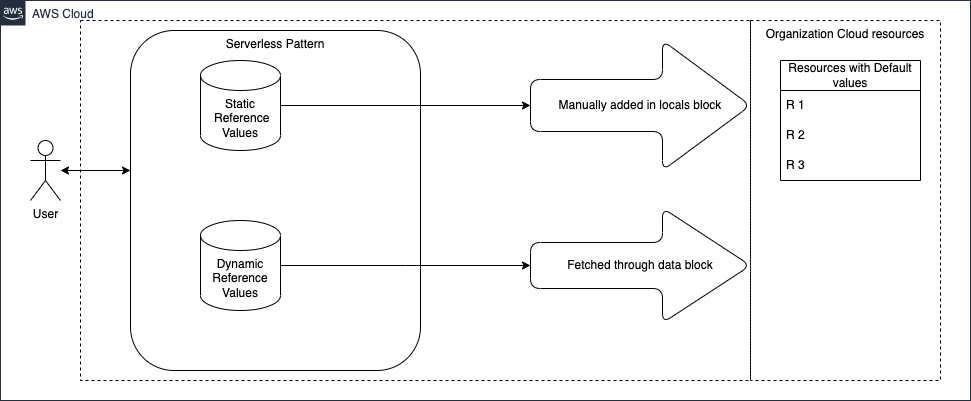

# Organization Resource Default Value Fetcher



This pattern helps to fetch the organization-recommended default resource values. These default values can be:

1. **Defined statically** in the `locals.tf` file.
2. **Dynamically fetched** from AWS infrastructure, based on conditions defined in the `data.tf` file.
3. The user Terraform caller will consume the `default-module` and retrieve the default values from the `output.tf` file.
4. The `default-module` is restricted from any modification other than by the organization governance team.

By referencing these default resource values, users can adhere to the organization's governance and compliance processes, ensuring consistency across the organization.

## Getting Started with Terraform Serverless Patterns

Read more about general requirements and deployment instructions for Terraform Serverless Patterns [here](https://github.com/aws-samples/serverless-patterns/blob/main/terraform-fixtures/docs/README.md).

<!-- BEGINNING OF PRE-COMMIT-TERRAFORM DOCS HOOK -->
## Requirements

| Name | Version |
|------|---------|
| [terraform](#requirement_terraform) | >= 1.0 |
| [aws](#requirement_aws) | >= 4.9 |

## Modules

| Name        | Source           | Version |
|-------------|------------------|---------|
| Default Module | ./default-module | N/A     |

## Inputs

The `default-module` will input to the user module.

## Outputs

A list of the organization's default resource names will be displayed.

## Sample Output

```shell
amis = {
  "amzn2" = "ami-01b799c439fd5516a"
}
ec2_user_ssh = "Test-key-value"
kms_s3_server_side = "ARN:kms:us-east-1:123456789:key/1234567-1234-4480-bd89-ebf400ef88c3"
subnet_cidr_blocks = [
  "10.0.0.0/18"
]
```
<!-- END OF PRE-COMMIT-TERRAFORM DOCS HOOK -->
