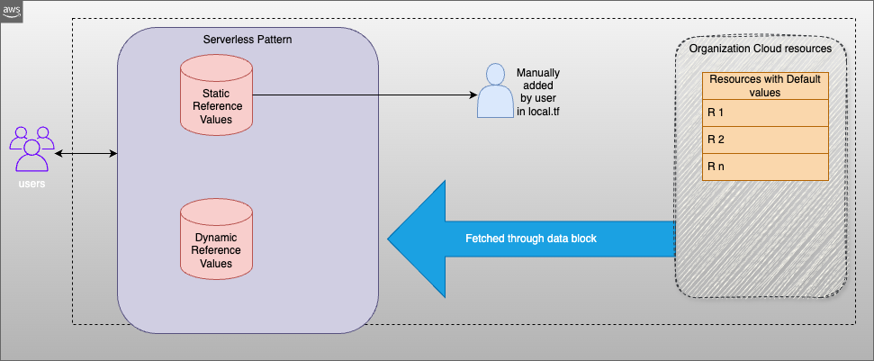

# Organization Resource Value Defaults

This pattern fetches the the default recommened resource default values. The default values are either defined in the 'locals.tf' file or dynamically fetched from from AWS infra as per condition defined in the 'data.tf' file
Hence this pattern helps as part of organization governance process to refer the recommened resource values.
Users can customize the locals.tf and data.tf to suit to their requirements

## Getting started with Terraform Serverless Patterns

Read more about general requirements and deployment instructions for Terraform Serverless Patterns [here](https://github.com/aws-samples/serverless-patterns/blob/main/terraform-fixtures/docs/README.md).

<!-- BEGINNING OF PRE-COMMIT-TERRAFORM DOCS HOOK -->
## Requirements

| Name | Version |
|------|---------|
| <a name="requirement_terraform"></a> [terraform](#requirement\_terraform) | >= 1.0 |
| <a name="requirement_aws"></a> [aws](#requirement\_aws) | >= 4.9 |

## Modules

| Name | Source | Version |
|------|--------|---------|
| <a name="default_module></a> [lambda\_function](#module\_lambda\_function) | terraform-aws-modules/lambda/aws | ~> 4.0 |

## Inputs

No inputs.

## Outputs

# Sample output

```shell
amis = {
  "amzn2" = "ami-01b799c439fd5516a"
}
ec2_user_ssh = "Test-key-value"
kms_s3_server_side = "aaws:lkms:aus-east-1:856812069958:key/dac5e760-5228-4480-bd89-ebf400ef88c3"
subnet_cidr_blocks = [
  "10.0.0.0/18"
]
```
<!-- END OF PRE-COMMIT-TERRAFORM DOCS HOOK -->
